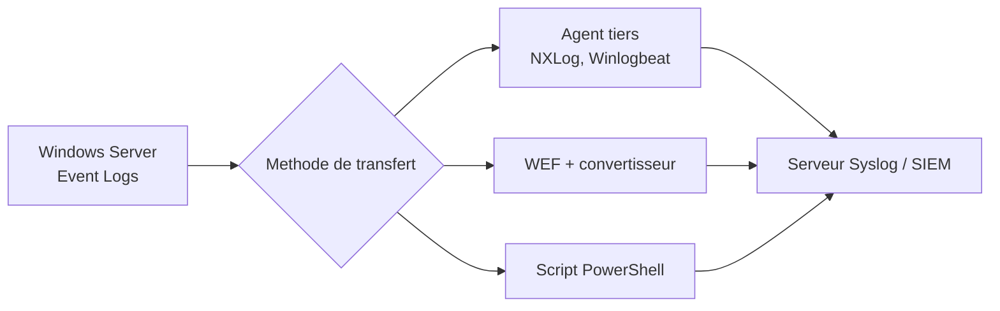
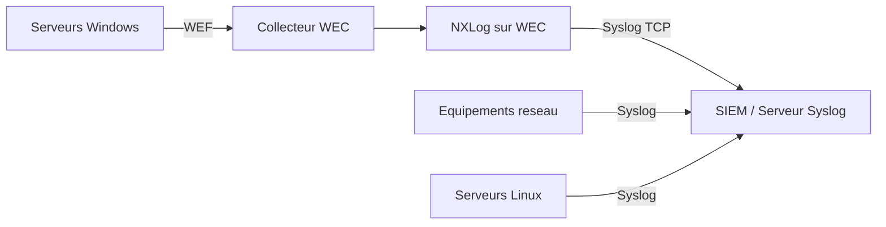

<!--
  Copyright 2026 Julien Bombled

  Licensed under the Apache License, Version 2.0 (the "License");
  you may not use this file except in compliance with the License.
  You may obtain a copy of the License at

      http://www.apache.org/licenses/LICENSE-2.0

  Unless required by applicable law or agreed to in writing, software
  distributed under the License is distributed on an "AS IS" BASIS,
  WITHOUT WARRANTIES OR CONDITIONS OF ANY KIND, either express or implied.
  See the License for the specific language governing permissions and
  limitations under the License.
-->

# Syslog sur Windows

<span class="level-intermediate">Intermediaire</span> · Temps estime : 20 minutes

## Presentation

Le protocole **Syslog** (RFC 5424) est le standard de journalisation dans les environnements Linux et les equipements reseau. Windows Server n'integre pas nativement de client Syslog, mais plusieurs approches permettent de rediriger les evenements Windows vers un serveur Syslog ou un SIEM.



!!! example "Analogie"

    Imaginez que chaque appareil de votre maison (frigo, lave-linge, thermostat) tient son propre journal de bord. Syslog, c'est comme installer une boite aux lettres centrale : tous ces appareils y deposent leurs messages dans un format commun, et vous n'avez qu'un seul endroit a consulter pour savoir ce qui se passe.

## Pourquoi integrer Syslog ?

| Besoin | Explication |
|--------|-------------|
| **Centralisation heterogene** | Agreger les logs Windows, Linux, reseau dans un meme outil |
| **SIEM** | Alimenter un SIEM (Splunk, Elastic SIEM, Graylog, Wazuh) |
| **Conformite** | Repondre aux exigences de conservation et d'audit (PCI-DSS, ISO 27001) |
| **Correlation** | Correler les evenements Windows avec d'autres sources |
| **Retention longue** | Stocker les logs au-dela de la capacite native des Event Logs |

## Comparaison des approches

| Approche | Complexite | Performance | Fiabilite | Cout |
|----------|-----------|-------------|-----------|------|
| **NXLog Community** | Moyenne | Elevee | Elevee | Gratuit |
| **Winlogbeat (Elastic)** | Moyenne | Elevee | Elevee | Gratuit |
| **Syslog via script PowerShell** | Faible | Faible | Moyenne | Gratuit |
| **WEF + convertisseur Syslog** | Elevee | Elevee | Elevee | Variable |
| **Agent SIEM proprietaire** | Faible | Elevee | Elevee | Licence |

## NXLog Community Edition

NXLog est un agent de collecte de logs multiplateforme, tres utilise pour transferer les Event Logs Windows vers des serveurs Syslog.

### Installation

1. Telecharger NXLog Community Edition depuis le site officiel
2. Installer avec les options par defaut
3. Le service `nxlog` est cree automatiquement

### Configuration de base

Le fichier de configuration se trouve dans `C:\Program Files\nxlog\conf\nxlog.conf` :

```xml
## NXLog configuration - Forward Windows events to Syslog

define ROOT C:\Program Files\nxlog
define CERTDIR %ROOT%\cert
define CONFDIR %ROOT%\conf
define LOGDIR %ROOT%\data
define LOGFILE %LOGDIR%\nxlog.log

Moduledir %ROOT%\modules
CacheDir  %ROOT%\data
Pidfile   %ROOT%\data\nxlog.pid
SpoolDir  %ROOT%\data

<Extension _syslog>
    Module  xm_syslog
</Extension>

# Input: Windows Event Log
<Input eventlog>
    Module  im_msvistalog
    Query   <QueryList>\
                <Query Id="0">\
                    <Select Path="Security">*</Select>\
                    <Select Path="System">*[System[(Level=1 or Level=2 or Level=3)]]</Select>\
                    <Select Path="Application">*[System[(Level=1 or Level=2 or Level=3)]]</Select>\
                </Query>\
            </QueryList>
</Input>

# Output: Syslog server via UDP
<Output syslog_udp>
    Module  om_udp
    Host    192.168.10.50
    Port    514
    Exec    to_syslog_bsd();
</Output>

# Output: Syslog server via TCP (more reliable)
<Output syslog_tcp>
    Module  om_tcp
    Host    192.168.10.50
    Port    1514
    Exec    to_syslog_bsd();
</Output>

# Route: connect input to output
<Route eventlog_to_syslog>
    Path    eventlog => syslog_tcp
</Route>
```

### Gestion du service

```powershell
# Start NXLog service
Start-Service nxlog

# Check service status
Get-Service nxlog

# Restart after configuration change
Restart-Service nxlog

# Check NXLog logs for errors
Get-Content "C:\Program Files\nxlog\data\nxlog.log" -Tail 20
```

Resultat :

```text
Status   Name               DisplayName
------   ----               -----------
Running  nxlog              nxlog

2026-02-20 08:14:32 INFO nxlog-4.9.4454 started
2026-02-20 08:14:32 INFO connecting to 10.0.0.50:1514
2026-02-20 08:14:32 INFO successfully connected to 10.0.0.50:1514
2026-02-20 08:14:33 INFO module eventlog started, reading from checkpoint
2026-02-20 08:14:35 INFO 47 events forwarded since startup
```

## Winlogbeat (Elastic Stack)

Winlogbeat est l'agent officiel d'Elastic pour collecter les Event Logs Windows. Il envoie directement vers Elasticsearch, Logstash ou un serveur Syslog.

### Configuration de base

Fichier `winlogbeat.yml` :

```yaml
# Winlogbeat configuration
winlogbeat.event_logs:
  - name: Security
    event_id: 4624, 4625, 4720, 4726, 4732, 4672
  - name: System
    level: critical, error, warning
  - name: Application
    level: critical, error

# Output to Logstash
output.logstash:
  hosts: ["192.168.10.50:5044"]

# Alternative: output to Elasticsearch directly
# output.elasticsearch:
#   hosts: ["192.168.10.50:9200"]
```

### Gestion du service

```powershell
# Install Winlogbeat as a service
.\winlogbeat.exe install

# Start the service
Start-Service winlogbeat

# Test the configuration
.\winlogbeat.exe test config -e
```

Resultat :

```text
winlogbeat    8.12.0  Configuration OK
2026-02-20T08:22:11.804+0100    INFO    beat/beat.go:714    Home path: [C:\winlogbeat-8.12.0]
2026-02-20T08:22:11.805+0100    INFO    eslegclient/connection.go:100    Attempting to connect to Logstash: 10.0.0.50:5044
2026-02-20T08:22:12.011+0100    INFO    publisher/pipeline.go:178    Connection to backoff(logstash(10.0.0.50:5044)) established
```

## Envoi Syslog via PowerShell

Pour les environnements simples ou les tests, un script PowerShell peut envoyer des evenements au format Syslog.

```powershell
# Simple Syslog sender function (UDP)
function Send-SyslogMessage {
    param(
        [string]$Server,
        [int]$Port = 514,
        [int]$Facility = 1,
        [int]$Severity = 6,
        [string]$Message
    )

    $priority = ($Facility * 8) + $Severity
    $timestamp = Get-Date -Format "MMM dd HH:mm:ss"
    $hostname = $env:COMPUTERNAME
    $syslogMessage = "<$priority>$timestamp $hostname $Message"

    $udpClient = New-Object System.Net.Sockets.UdpClient
    $bytes = [System.Text.Encoding]::ASCII.GetBytes($syslogMessage)
    $udpClient.Send($bytes, $bytes.Length, $Server, $Port) | Out-Null
    $udpClient.Close()
}

# Forward recent security events to Syslog
$events = Get-WinEvent -FilterHashtable @{
    LogName = 'Security'
    Id = 4625
    StartTime = (Get-Date).AddMinutes(-5)
} -ErrorAction SilentlyContinue

foreach ($event in $events) {
    $message = "EventID=$($event.Id) Source=$($event.ProviderName) $($event.Message -replace '\r?\n',' ')"
    Send-SyslogMessage -Server "192.168.10.50" -Port 514 -Severity 4 -Message $message
}
```

Resultat :

```text
# Aucune sortie si les evenements sont envoyes avec succes.
# Pour verifier la reception, consulter les logs du serveur Syslog cible :
# Feb 20 08:31:05 SRV-DC01 EventID=4625 Source=Microsoft-Windows-Security-Auditing Account failed to log on...
# Feb 20 08:31:07 SRV-DC01 EventID=4625 Source=Microsoft-Windows-Security-Auditing Account failed to log on...
```

!!! warning "Limitations du script"

    Cette approche par script est adaptee aux tests ou au transfert d'evenements specifiques.
    Pour la production, privilegiez un agent comme NXLog ou Winlogbeat qui gerent la mise en
    tampon, les reconnexions et la garantie de livraison.

## Architecture avec collecteur intermediaire

Pour les grands environnements, combiner WEF/WEC avec un convertisseur Syslog :



Cette architecture offre :

- Centralisation Windows native (WEF) avant la conversion
- Un seul point de conversion Syslog (le collecteur WEC)
- Reduction de la charge reseau (filtrage en amont par WEF)

## Protocoles de transport

| Protocole | Port | Fiabilite | Usage |
|-----------|------|-----------|-------|
| **UDP** | 514 | Faible (pas d'acquittement) | Tests, reseaux locaux fiables |
| **TCP** | 1514 / 6514 | Moyenne (acquittement TCP) | Production |
| **TLS/TCP** | 6514 | Elevee (chiffre + acquitte) | Production securisee |

!!! tip "Recommandation"

    Utilisez **TCP** ou **TLS/TCP** en production pour garantir la livraison des evenements.
    Le UDP peut perdre des messages en cas de congestion reseau.

!!! example "Scenario pratique"

    **Context :** Thomas, administrateur systeme chez une PME, doit centraliser les logs de securite de trois serveurs Windows (SRV-DC01, SRV-01, SRV-WEB01) vers un SIEM Graylog existant qui ecoute en TCP sur 10.0.0.50:1514.

    **Etape 1 : Installer NXLog sur SRV-DC01 (premier serveur pilote)**

    Thomas telecharge NXLog Community Edition et installe avec les options par defaut. Il edite ensuite `C:\Program Files\nxlog\conf\nxlog.conf` :

    ```xml
    <Input eventlog>
        Module im_msvistalog
        Query <QueryList><Query Id="0"><Select Path="Security">*[System[(EventID=4624 or EventID=4625 or EventID=4720 or EventID=4740)]]</Select></Query></QueryList>
    </Input>
    <Output syslog_graylog>
        Module om_tcp
        Host 10.0.0.50
        Port 1514
        Exec to_syslog_bsd();
    </Output>
    <Route sec_to_graylog>
        Path eventlog => syslog_graylog
    </Route>
    ```

    **Etape 2 : Demarrer NXLog et verifier**

    ```powershell
    Restart-Service nxlog
    Get-Service nxlog
    Get-Content "C:\Program Files\nxlog\data\nxlog.log" -Tail 10
    ```

    **Etape 3 : Valider dans Graylog**

    Thomas ouvre l'interface Graylog (http://10.0.0.50:9000) et lance une recherche sur `source:SRV-DC01`. Les evenements de securite arrivent bien en temps reel.

    **Etape 4 : Deployer sur les autres serveurs**

    Il copie le fichier `nxlog.conf` sur SRV-01 et SRV-WEB01 (via PSRemoting), puis installe et demarre le service sur chacun :

    ```powershell
    $servers = @("SRV-01", "SRV-WEB01")
    foreach ($srv in $servers) {
        Invoke-Command -ComputerName $srv -ScriptBlock {
            Restart-Service nxlog
        }
    }
    ```

    En moins d'une heure, les trois serveurs alimentent le SIEM. Thomas configure ensuite une alerte Graylog sur les EventID 4625 superieurs a 10 occurrences en 5 minutes pour detecter les tentatives de force brute.

!!! danger "Erreurs courantes"

    **Oublier d'ouvrir le pare-feu sur le serveur Syslog cible.** Si le port 514/UDP ou 1514/TCP n'est pas ouvert, NXLog se connecte mais les messages sont silencieusement abandonnes. Verifier avec `Test-NetConnection -ComputerName 10.0.0.50 -Port 1514`.

    **Utiliser UDP en production.** Le protocole UDP n'accuse pas reception. En cas de congestion reseau ou de redemarrage du serveur Syslog, des evenements sont perdus sans aucune indication. Utiliser TCP ou TLS/TCP.

    **Confondre les niveaux de verbosité dans les queries WinEvent.** `Level=1` correspond a "Critical", `Level=2` a "Error", `Level=3` a "Warning". Filtrer trop large (par exemple inclure Level=4 "Information") peut saturer le canal reseau avec des dizaines de milliers d'evenements par heure.

    **Envoyer les logs de securite depuis chaque DC individuellement.** Pour les environnements avec plusieurs controleurs de domaine, il est plus efficace de combiner WEF (les DC envoient vers un collecteur WEC) puis NXLog sur le collecteur WEC transfère vers le SIEM. Cela evite de multiplier les configurations NXLog.

    **Ne pas conserver la passphrase ou les credentials du compte de service NXLog.** Si le compte de service utilise pour lire les journaux Security perd ses droits (changement de mot de passe, expiration), NXLog s'arrete silencieusement de lire les evenements de securite.

## Points cles a retenir

- Windows Server n'integre pas de client Syslog natif ; un agent tiers est necessaire
- **NXLog** et **Winlogbeat** sont les agents les plus utilises, gratuits et fiables
- Pour les grands environnements, combiner WEF (centralisation Windows) + agent Syslog sur le collecteur
- Utiliser TCP ou TLS pour le transport Syslog en production (eviter UDP)
- L'integration Syslog est essentielle pour les SIEM et la correlation multi-sources
- Un script PowerShell suffit pour les tests mais ne convient pas a la production

## Pour aller plus loin

- [Windows Event Forwarding (WEF/WEC)](wef-wec.md) pour la centralisation native Windows
- [Observateur d'evenements](../surveillance/event-viewer.md) pour configurer les filtres d'evenements
- [Politique d'audit](../../securite/audit/politique-audit.md) pour generer les evenements de securite

