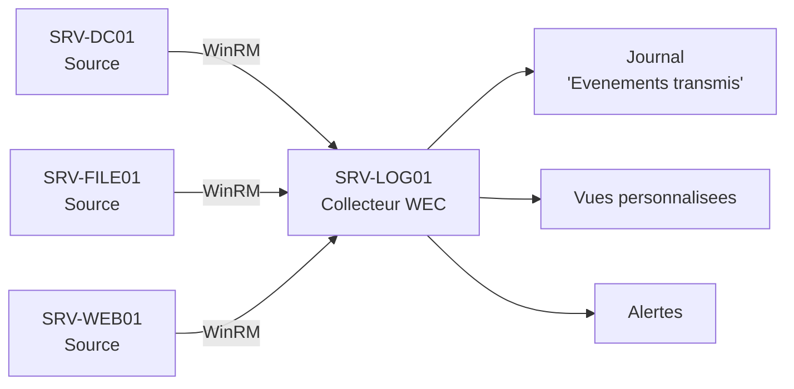

<!--
  Copyright 2026 Julien Bombled

  Licensed under the Apache License, Version 2.0 (the "License");
  you may not use this file except in compliance with the License.
  You may obtain a copy of the License at

      http://www.apache.org/licenses/LICENSE-2.0

  Unless required by applicable law or agreed to in writing, software
  distributed under the License is distributed on an "AS IS" BASIS,
  WITHOUT WARRANTIES OR CONDITIONS OF ANY KIND, either express or implied.
  See the License for the specific language governing permissions and
  limitations under the License.
-->

# Windows Event Forwarding (WEF/WEC)

<span class="level-intermediate">Intermediaire</span> · Temps estime : 35 minutes

## Presentation

Windows Event Forwarding (WEF) est le mecanisme natif de Windows pour centraliser les journaux d'evenements de plusieurs serveurs vers un point unique. Il repose sur le protocole **WinRM** (Windows Remote Management) et ne necessite aucun agent tiers.

| Composant | Role |
|-----------|------|
| **WEF** (Windows Event Forwarding) | Mecanisme de transfert des evenements |
| **WEC** (Windows Event Collector) | Serveur collecteur qui recoit et stocke les evenements |
| **Source** (Forwarder) | Serveur qui envoie ses evenements au collecteur |



!!! example "Analogie"

    WEF/WEC fonctionne comme un **systeme postal centralise**. Chaque serveur (bureau local)
    envoie ses rapports importants au siege (le collecteur WEC). Au lieu de se deplacer dans
    chaque bureau pour lire le courrier, le directeur (l'administrateur) consulte tout depuis
    un point unique. Le mode "initie par la source" est comme un abonnement postal automatique :
    chaque bureau envoie sans qu'on le lui demande.

## Modes de fonctionnement

### Initie par le collecteur (Collector-Initiated)

Le collecteur se connecte aux sources pour recuperer les evenements.

| Avantage | Inconvenient |
|----------|-------------|
| Configuration centralisee sur le collecteur | Le collecteur doit connaitre chaque source |
| Pas besoin de GPO | Ne passe pas a l'echelle (> 50 sources) |
| Test rapide | Necessite des droits d'administration sur les sources |

### Initie par la source (Source-Initiated)

Les sources se connectent au collecteur et lui envoient les evenements. Configuration deployee par GPO.

| Avantage | Inconvenient |
|----------|-------------|
| Passe a l'echelle (milliers de sources) | Configuration GPO necessaire |
| Les nouvelles machines s'inscrivent automatiquement | Configuration initiale plus complexe |
| Pas besoin d'enumerer chaque source | - |

!!! tip "Recommandation"

    En production, utilisez le mode **initie par la source** avec deploiement par GPO.
    Le mode initie par le collecteur convient uniquement aux petits environnements ou aux tests.

## Prerequis

### Sur le serveur collecteur (WEC)

```powershell
# Enable the Windows Event Collector service
wecutil qc /q

# Verify the service is running
Get-Service WecSvc | Select-Object Name, Status, StartType

# Enable WinRM (should already be enabled on Server 2022)
Enable-PSRemoting -Force
```

### Sur les serveurs sources

```powershell
# Enable WinRM
winrm quickconfig /q

# Verify WinRM is running
Get-Service WinRM | Select-Object Name, Status, StartType
```

### Permissions

Pour le mode **initie par le collecteur** :

- Le compte du collecteur doit etre dans le groupe **Event Log Readers** sur chaque source

Pour le mode **initie par la source** :

- Le compte machine de chaque source doit avoir les droits d'envoyer au collecteur
- Par defaut, le groupe **Network Service** est utilise

```powershell
# Add the collector's computer account to Event Log Readers on sources
# (for collector-initiated mode)
Add-LocalGroupMember -Group "Event Log Readers" -Member "WINOPSLAB\SRV-LOG01$"
```

## Configuration mode initie par le collecteur

### Creer un abonnement via l'interface

1. Sur le collecteur, ouvrir `eventvwr.msc`
2. Clic droit sur **Abonnements** > **Creer un abonnement**
3. Configurer :
    - **Nom** : nom descriptif (ex. : `Security-Events-DCs`)
    - **Journal de destination** : Evenements transmis
    - **Type** : Initie par le collecteur
    - **Ordinateurs sources** : ajouter les serveurs
    - **Evenements a collecter** : definir le filtre (Event IDs, niveaux, journaux)

### Creer un abonnement en ligne de commande

Creer un fichier XML de definition :

```xml
<!-- C:\Subscriptions\security-events.xml -->
<Subscription xmlns="http://schemas.microsoft.com/2006/03/windows/events/subscription">
    <SubscriptionId>Security-Events-DCs</SubscriptionId>
    <SubscriptionType>CollectorInitiated</SubscriptionType>
    <Description>Collect security events from domain controllers</Description>
    <Enabled>true</Enabled>
    <Uri>http://schemas.microsoft.com/wbem/wsman/1/windows/EventLog</Uri>
    <ConfigurationMode>Normal</ConfigurationMode>
    <Delivery Mode="Push">
        <Batching>
            <MaxLatencyTime>900000</MaxLatencyTime>
        </Batching>
    </Delivery>
    <Query>
        <![CDATA[
            <QueryList>
                <Query Id="0">
                    <Select Path="Security">
                        *[System[(EventID=4624 or EventID=4625 or EventID=4720
                        or EventID=4726 or EventID=4732 or EventID=4756
                        or EventID=4672 or EventID=4648)]]
                    </Select>
                </Query>
            </QueryList>
        ]]>
    </Query>
    <ReadExistingEvents>false</ReadExistingEvents>
    <TransportName>HTTP</TransportName>
    <EventSources>
        <EventSource Enabled="true">
            <Address>SRV-DC01.winopslab.local</Address>
        </EventSource>
        <EventSource Enabled="true">
            <Address>SRV-DC02.winopslab.local</Address>
        </EventSource>
    </EventSources>
</Subscription>
```

```powershell
# Create the subscription
wecutil cs "C:\Subscriptions\security-events.xml"

# Verify the subscription status
wecutil gs "Security-Events-DCs"

# List all subscriptions
wecutil es

# Get runtime status of a subscription
wecutil gr "Security-Events-DCs"

# Retry a subscription (force reconnection)
wecutil rs "Security-Events-DCs"

# Delete a subscription
wecutil ds "Security-Events-DCs"
```

Resultat :

```text
# wecutil gs "Security-Events-DCs"
Subscription Id: Security-Events-DCs
SubscriptionType: CollectorInitiated
Description: Collect security events from domain controllers
Enabled: true
Uri: http://schemas.microsoft.com/wbem/wsman/1/windows/EventLog
ConfigurationMode: Normal
DeliveryMode: Push
DeliveryMaxLatencyTime: 900000

# wecutil es
Security-Events-DCs
All-Servers-Security

# wecutil gr "Security-Events-DCs"
Subscription: Security-Events-DCs
    RunTimeStatus: Active
    LastError: 0
    EventSources:
        SRV-DC01.lab.local
            RunTimeStatus: Active
            LastHeartbeatTime: 2026-02-20T14:30:00.000
        SRV-DC02.lab.local
            RunTimeStatus: Active
            LastHeartbeatTime: 2026-02-20T14:28:15.000
```

## Configuration mode initie par la source (GPO)

### Etape 1 : Configurer le collecteur

```powershell
# Enable the WEC service
wecutil qc /q
```

### Etape 2 : Creer l'abonnement sur le collecteur

```xml
<!-- C:\Subscriptions\all-servers-security.xml -->
<Subscription xmlns="http://schemas.microsoft.com/2006/03/windows/events/subscription">
    <SubscriptionId>All-Servers-Security</SubscriptionId>
    <SubscriptionType>SourceInitiated</SubscriptionType>
    <Description>Security events from all domain servers</Description>
    <Enabled>true</Enabled>
    <Uri>http://schemas.microsoft.com/wbem/wsman/1/windows/EventLog</Uri>
    <ConfigurationMode>Normal</ConfigurationMode>
    <Delivery Mode="Push">
        <Batching>
            <MaxLatencyTime>900000</MaxLatencyTime>
        </Batching>
    </Delivery>
    <Query>
        <![CDATA[
            <QueryList>
                <Query Id="0">
                    <Select Path="Security">
                        *[System[(Level=1 or Level=2 or Level=3)
                        or (EventID=4624 or EventID=4625 or EventID=4720
                        or EventID=4726 or EventID=4732)]]
                    </Select>
                    <Select Path="System">
                        *[System[(Level=1 or Level=2)]]
                    </Select>
                </Query>
            </QueryList>
        ]]>
    </Query>
    <ReadExistingEvents>false</ReadExistingEvents>
    <TransportName>HTTP</TransportName>
    <AllowedSourceNonDomainComputers></AllowedSourceNonDomainComputers>
    <AllowedSourceDomainComputers>
        O:NSG:NSD:(A;;GA;;;DC)(A;;GA;;;NS)
    </AllowedSourceDomainComputers>
</Subscription>
```

```powershell
# Create the source-initiated subscription
wecutil cs "C:\Subscriptions\all-servers-security.xml"
```

### Etape 3 : Deployer la GPO sur les sources

Creer une GPO qui configure les serveurs sources pour envoyer au collecteur :

**Computer Configuration** > **Administrative Templates** > **Windows Components** > **Event Forwarding** :

- **Configure target Subscription Manager** : activer et ajouter :

```
Server=http://SRV-LOG01.winopslab.local:5985/wsman/SubscriptionManager/WEC,Refresh=60
```

```powershell
# Alternatively, configure via registry on each source
$regPath = "HKLM:\SOFTWARE\Policies\Microsoft\Windows\EventLog\EventForwarding\SubscriptionManager"
New-Item -Path $regPath -Force
New-ItemProperty -Path $regPath -Name "1" -PropertyType String `
    -Value "Server=http://SRV-LOG01.winopslab.local:5985/wsman/SubscriptionManager/WEC,Refresh=60"
```

### Etape 4 : Forcer l'application sur les sources

```powershell
# Force GPO update on source servers
gpupdate /force

# Restart WinRM service
Restart-Service WinRM
```

## Modes de livraison

| Mode | Latence | Usage |
|------|---------|-------|
| **Normal** | 15 minutes max | Usage general, economise la bande passante |
| **Minimize Bandwidth** | 6 heures max | Connexions lentes (WAN, VPN) |
| **Minimize Latency** | 30 secondes max | Evenements critiques de securite |
| **Custom** | Configurable | Besoins specifiques |

```powershell
# Modify delivery optimization for an existing subscription
wecutil ss "Security-Events-DCs" /cm:MinLatency
```

## Verification et depannage

```powershell
# Check subscription status on the collector
wecutil gr "All-Servers-Security"

# Check if events are being received
Get-WinEvent -LogName "ForwardedEvents" -MaxEvents 10

# On a source server, check WinRM connectivity
Test-WSMan -ComputerName SRV-LOG01

# Check event forwarding plugin on a source
wevtutil gl "ForwardedEvents"

# Debug: check WinRM logs on the source
Get-WinEvent -LogName "Microsoft-Windows-Forwarding/Operational" -MaxEvents 20
```

Resultat :

```text
# wecutil gr "All-Servers-Security"
Subscription: All-Servers-Security
    RunTimeStatus: Active
    EventSources:
        SRV-DC01.lab.local      RunTimeStatus: Active
        SRV-01.lab.local        RunTimeStatus: Active
        SRV-WEB01.lab.local     RunTimeStatus: Inactive (Error: 0x138C)

# Get-WinEvent -LogName "ForwardedEvents" -MaxEvents 10
TimeCreated           Id ProviderName              MachineName       Message
-----------           -- ------------              -----------       -------
2026-02-20 14:35:10 4625 Microsoft-Windows-Security SRV-DC01.lab.local An account failed to log on...
2026-02-20 14:32:45 4624 Microsoft-Windows-Security SRV-01.lab.local   An account was successfully logged on...
2026-02-20 14:30:22 7034 Service Control Manager    SRV-DC01.lab.local The DNS service terminated unexpectedly...

# Test-WSMan -ComputerName SRV-LOG01
wsmid           : http://schemas.dmtf.org/wbem/wsman/identity/1/wsmanidentity.xsd
ProtocolVersion : http://schemas.dmtf.org/wbem/wsman/1/wsman.xsd
ProductVendor   : Microsoft Corporation
ProductVersion  : OS: 10.0.20348 SP: 0.0 Stack: 3.0
```

### Problemes courants

| Probleme | Cause | Solution |
|----------|-------|----------|
| Source affiche "Error" | WinRM non configure | `winrm quickconfig /q` sur la source |
| Pas d'evenements recus | Pare-feu bloque le port 5985 | Ouvrir le port WinRM (TCP 5985) |
| Acces refuse | Permissions insuffisantes | Ajouter le compte au groupe Event Log Readers |
| Delai de reception eleve | Mode Normal (15 min) | Passer en mode MinLatency |

## Dimensionnement du journal

```powershell
# Increase ForwardedEvents log size on the collector (default: 20 MB)
wevtutil sl ForwardedEvents /ms:1073741824  # 1 GB

# Enable auto-backup when full
wevtutil sl ForwardedEvents /rt:true /ab:true
```

!!! warning "Production"

    Sur un collecteur centralisant des dizaines de serveurs, le journal **ForwardedEvents**
    doit etre dimensionne a plusieurs Go. Prevoyez un disque dedie pour les journaux.

!!! danger "Erreurs courantes"

    1. **Ne pas configurer WinRM sur le collecteur.** WEF repose sur WinRM pour le transport. Si le service WinRM est arrete ou mal configure sur le collecteur (WEC), les sources ne peuvent pas envoyer leurs evenements. Verifier avec `Get-Service WinRM` et configurer avec `winrm quickconfig /q` sur le collecteur.

    2. **Utiliser le mode "initie par le collecteur" en production.** Ce mode necessite d'enumerer chaque source manuellement et ne passe pas a l'echelle. Au-dela de 50 serveurs, privilegier le mode "initie par la source" avec deploiement GPO pour que les nouvelles machines s'inscrivent automatiquement.

    3. **Laisser la taille par defaut du journal ForwardedEvents (20 Mo).** Avec une dizaine de sources envoyant des evenements de securite, le journal de 20 Mo se remplit en quelques heures et les anciens evenements sont ecrases. Dimensionner a 1 Go minimum avec `wevtutil sl ForwardedEvents /ms:1073741824`.

    4. **Ne pas filtrer les evenements dans l'abonnement.** Collecter tous les evenements de tous les journaux (`*`) genere un volume enorme et noie les evenements importants. Filtrer par Event ID pertinents (4624, 4625, 4720, 4726, 7034) et par niveaux de gravite (Critical, Error, Warning) dans la requete XPath de l'abonnement.

## Points cles a retenir

- WEF/WEC est la solution native Microsoft pour centraliser les journaux sans agent tiers
- Le mode **initie par la source** (avec GPO) est recommande en production pour la montee en charge
- Le protocole **WinRM** (port TCP 5985/5986) est utilise pour le transport
- Les filtres XPath dans l'abonnement permettent de ne collecter que les evenements pertinents
- Le mode de livraison **MinLatency** est recommande pour les evenements critiques de securite
- Le journal **ForwardedEvents** sur le collecteur doit etre dimensionne en consequence

!!! example "Scenario pratique"

    **Contexte :** La collecte WEF est configuree depuis 2 jours. Les ordinateurs sources ont
    recu la GPO "Event Log Readers" et le mode initie par la source est en place. Pourtant,
    le journal "Forwarded Events" sur le collecteur SRV-WEC-01 reste vide.

    **Symptomes :**

    - Le journal `ForwardedEvents` contient 0 evenements
    - `wecutil gr "All-Servers-Security"` montre les sources en etat "Inactive"
    - Aucun evenement n'arrive depuis 2 jours

    **Diagnostic :**

    ```powershell
    # Check the ForwardedEvents log record count on the collector
    Get-WinEvent -ComputerName SRV-WEC-01 -ListLog "ForwardedEvents" |
        Select-Object LogName, RecordCount
    ```

    Resultat :

    ```text
    LogName         RecordCount
    -------         -----------
    ForwardedEvents           0
    ```

    Verification du journal operationnel de la transmission sur un client source :

    ```powershell
    # Check forwarding operational log on a source server
    Get-WinEvent -ComputerName SRV-DC01 -LogName "Microsoft-Windows-Forwarding/Operational" `
        -MaxEvents 5 | Select-Object TimeCreated, LevelDisplayName, Message
    ```

    Resultat :

    ```text
    TimeCreated           LevelDisplayName Message
    -----------           ---------------- -------
    2026-02-20 08:15:44   Error            The WS-Management service cannot complete the
                                           operation within the time specified. [...]
    ```

    Le service WinRM est inaccessible sur le collecteur. Verification :

    ```powershell
    # Check WinRM service on the WEC collector
    Get-Service WinRM -ComputerName SRV-WEC-01
    ```

    Resultat :

    ```text
    Status   Name    DisplayName
    ------   ----    -----------
    Stopped  WinRM   Windows Remote Management (WS-Management)
    ```

    **Solution :**

    ```powershell
    # Start WinRM on the collector and configure it
    Start-Service WinRM -ComputerName SRV-WEC-01
    Invoke-Command -ComputerName SRV-WEC-01 -ScriptBlock { winrm quickconfig /q }

    # Verify the WinRM listener is active on the collector
    Get-WSManInstance winrm/config/listener -ComputerName SRV-WEC-01 |
        Select-Object Transport, Address, Port, Enabled
    ```

    Resultat :

    ```text
    Transport Address Port Enabled
    --------- ------- ---- -------
    HTTP      *       5985 true
    ```

    Apres demarrage de WinRM sur le collecteur, les sources detecent automatiquement le
    collecteur accessible dans les 60 secondes (parametre Refresh de la GPO SubscriptionManager).
    Le journal `ForwardedEvents` commence a recevoir des evenements. `wecutil gr` confirme
    le passage des sources en etat "Active".

## Pour aller plus loin

- [Observateur d'evenements](../surveillance/event-viewer.md) pour maitriser les requetes et filtres
- [Syslog sur Windows](syslog.md) pour l'integration avec des collecteurs tiers
- [Politique d'audit](../../securite/audit/politique-audit.md) pour generer les bons evenements de securite

