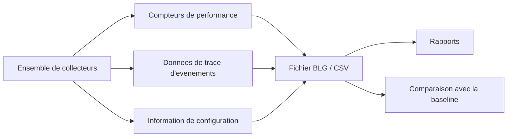
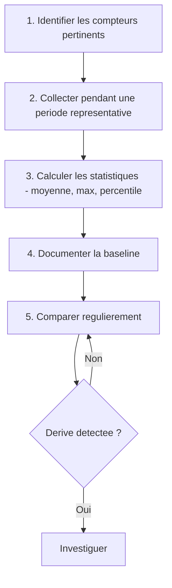

# Ensembles de collecteurs de donnees

!!! info "Niveau : Intermediaire"

    Temps estime : 30 minutes

## Presentation

Les ensembles de collecteurs de donnees (Data Collector Sets) permettent de configurer, planifier et automatiser la collecte de compteurs de performance, de traces d'evenements et d'informations de configuration systeme. Ils constituent la base pour etablir des **baselines** (references) et detecter les derives de performances.



## Types de collecteurs

| Type | Description | Format de sortie |
|------|-------------|-----------------|
| **Compteur de performance** | Collecte des valeurs de compteurs a intervalle regulier | BLG, CSV, TSV, SQL |
| **Donnees de trace d'evenements** (ETW) | Capture des evenements de providers ETW | ETL |
| **Configuration** | Capture l'etat des cles de registre et de la configuration WMI | XML |
| **Alerte du compteur de performance** | Surveille un seuil et declenche une action | Journal d'evenements |

## Ensembles predefinis

Windows Server inclut des ensembles predefinis dans **Ensembles de collecteurs de donnees** > **Systeme** :

| Ensemble | Description |
|----------|-------------|
| **Active Directory Diagnostics** | Collecte les metriques AD DS (replication, LDAP, Kerberos) |
| **System Diagnostics** | Diagnostic complet du systeme (CPU, memoire, disque, reseau, services) |
| **System Performance** | Collecte axee sur les performances systeme globales |
| **LAN Diagnostics** | Diagnostic reseau (interfaces, TCP, UDP, ICMP) |

```powershell
# List all predefined data collector sets
logman query -s localhost

# Start a predefined data collector set
logman start "System Performance"

# Stop a data collector set
logman stop "System Performance"
```

## Creer un ensemble personnalise

### Via l'interface graphique

1. Ouvrir `perfmon.msc`
2. Developper **Ensembles de collecteurs de donnees** > **Defini par l'utilisateur**
3. Clic droit > **Nouveau** > **Ensemble de collecteurs de donnees**
4. Nommer l'ensemble (ex. : `Baseline-Mensuelle`)
5. Choisir **Creer manuellement (avance)**
6. Cocher **Compteur de performance**
7. Ajouter les compteurs souhaites
8. Definir l'intervalle d'echantillonnage (ex. : 15 secondes)
9. Choisir le repertoire de stockage
10. Definir les credentials d'execution

### Via PowerShell (logman)

```powershell
# Create a new data collector set with essential counters
logman create counter "Baseline-Server" `
    -c "\Processor(_Total)\% Processor Time" `
       "\Memory\Available MBytes" `
       "\Memory\Pages/sec" `
       "\PhysicalDisk(_Total)\Avg. Disk Queue Length" `
       "\PhysicalDisk(_Total)\Avg. Disk sec/Read" `
       "\PhysicalDisk(_Total)\Avg. Disk sec/Write" `
       "\Network Interface(*)\Bytes Total/sec" `
       "\System\Processor Queue Length" `
    -si 15 `
    -o "C:\PerfLogs\Baseline" `
    -f bincirc `
    -max 512 `
    -v mmddhhmm
```

| Parametre | Description |
|-----------|-------------|
| `-c` | Liste des compteurs a collecter |
| `-si` | Intervalle d'echantillonnage (en secondes) |
| `-o` | Repertoire de sortie |
| `-f` | Format : `bin` (binaire), `bincirc` (binaire circulaire), `csv`, `tsv`, `sql` |
| `-max` | Taille maximale du fichier en Mo |
| `-v` | Format du suffixe de version dans le nom de fichier |

### Via PowerShell natif

```powershell
# Create a data collector set using CIM/WMI
$counterPaths = @(
    "\Processor(_Total)\% Processor Time"
    "\Memory\Available MBytes"
    "\Memory\Pages/sec"
    "\PhysicalDisk(_Total)\Avg. Disk Queue Length"
    "\PhysicalDisk(_Total)\% Disk Time"
    "\Network Interface(*)\Bytes Total/sec"
    "\System\Processor Queue Length"
)

# Collect 15-second samples for 4 hours
$samples = Get-Counter -Counter $counterPaths -SampleInterval 15 -MaxSamples 960

# Export to BLG
$samples | Export-Counter -Path "C:\PerfLogs\Baseline-$(Get-Date -Format 'yyyyMMdd').blg"

# Export to CSV for analysis in Excel
$samples | Export-Counter -Path "C:\PerfLogs\Baseline-$(Get-Date -Format 'yyyyMMdd').csv" -FileFormat CSV
```

## Planifier la collecte

### Planification via l'interface

1. Proprietes de l'ensemble > onglet **Planification**
2. Cliquer **Ajouter**
3. Definir :
    - **Date de debut**
    - **Jour(s) de la semaine**
    - **Heure de demarrage**
4. Onglet **Condition d'arret** : definir la duree ou la taille maximale

### Planification via logman

```powershell
# Schedule: start Monday to Friday at 08:00, stop after 10 hours
logman update "Baseline-Server" -b 01/01/2026 08:00:00 -e 01/01/2026 18:00:00 -rf 36000

# Start the collector set manually
logman start "Baseline-Server"

# Stop the collector set
logman stop "Baseline-Server"

# Delete a data collector set
logman delete "Baseline-Server"
```

### Planification via tache planifiee

```powershell
# Create a scheduled task to start the collector every weekday at 8 AM
$action = New-ScheduledTaskAction -Execute "logman" -Argument 'start "Baseline-Server"'
$trigger = New-ScheduledTaskTrigger -Weekly -DaysOfWeek Monday,Tuesday,Wednesday,Thursday,Friday -At "08:00"
$principal = New-ScheduledTaskPrincipal -UserId "SYSTEM" -LogonType ServiceAccount

Register-ScheduledTask -TaskName "Start-BaselineCollector" `
    -Action $action -Trigger $trigger -Principal $principal `
    -Description "Start performance baseline data collection"

# Create a corresponding stop task at 6 PM
$stopAction = New-ScheduledTaskAction -Execute "logman" -Argument 'stop "Baseline-Server"'
$stopTrigger = New-ScheduledTaskTrigger -Weekly -DaysOfWeek Monday,Tuesday,Wednesday,Thursday,Friday -At "18:00"

Register-ScheduledTask -TaskName "Stop-BaselineCollector" `
    -Action $stopAction -Trigger $stopTrigger -Principal $principal `
    -Description "Stop performance baseline data collection"
```

## Analyser les rapports

### Rapport automatique

Lorsqu'un ensemble predefini (System Diagnostics, System Performance) termine sa collecte, un rapport est automatiquement genere dans **Rapports** > **Systeme**.

Le rapport **System Diagnostics** inclut :

- Resume de l'etat du systeme (erreurs, avertissements)
- Verification des ressources materielles
- Analyse des services et pilotes
- Diagnostic du sous-systeme disque
- Utilisation CPU et memoire
- Configuration reseau

### Analyser les fichiers BLG

```powershell
# Import a BLG file and display in Performance Monitor
perfmon /openlog "C:\PerfLogs\Baseline\Baseline-Server_000001.blg"

# Import and analyze via PowerShell
$data = Import-Counter -Path "C:\PerfLogs\Baseline\Baseline-Server_000001.blg"

# Get statistics for CPU usage
$cpuSamples = $data | ForEach-Object {
    $_.CounterSamples | Where-Object { $_.Path -like "*Processor*% Processor Time*" }
}

$stats = $cpuSamples | Measure-Object -Property CookedValue -Average -Maximum -Minimum
Write-Output "CPU - Min: $([math]::Round($stats.Minimum,2))% | Avg: $([math]::Round($stats.Average,2))% | Max: $([math]::Round($stats.Maximum,2))%"
```

## Etablir une baseline

Une baseline est une reference des performances normales du serveur. Elle sert a detecter les anomalies par comparaison.

### Methodologie



### Compteurs recommandes pour une baseline

```powershell
# Comprehensive baseline counter set
$baselineCounters = @(
    # CPU
    "\Processor(_Total)\% Processor Time"
    "\System\Processor Queue Length"
    "\System\Context Switches/sec"
    # Memory
    "\Memory\Available MBytes"
    "\Memory\Pages/sec"
    "\Memory\% Committed Bytes In Use"
    # Disk
    "\PhysicalDisk(_Total)\Avg. Disk Queue Length"
    "\PhysicalDisk(_Total)\Avg. Disk sec/Read"
    "\PhysicalDisk(_Total)\Avg. Disk sec/Write"
    "\PhysicalDisk(_Total)\Disk Reads/sec"
    "\PhysicalDisk(_Total)\Disk Writes/sec"
    "\LogicalDisk(*)\% Free Space"
    # Network
    "\Network Interface(*)\Bytes Total/sec"
    "\Network Interface(*)\Output Queue Length"
    # System
    "\System\System Up Time"
    "\Server\Bytes Total/sec"
)

# Create the data collector set
logman create counter "Monthly-Baseline" `
    -c $baselineCounters `
    -si 30 `
    -o "C:\PerfLogs\Monthly-Baseline" `
    -f bin `
    -v nnnnnn
```

!!! tip "Duree de collecte recommandee"

    Pour une baseline fiable, collectez sur au moins **une semaine** en incluant les heures de pointe
    et les heures creuses. Repetez la collecte chaque mois pour suivre l'evolution.

## Gestion a distance

```powershell
# Create a data collector set on a remote server
logman create counter "Baseline-Remote" `
    -c "\Processor(_Total)\% Processor Time" "\Memory\Available MBytes" `
    -si 15 `
    -o "C:\PerfLogs\Baseline" `
    -s SRV-DC01

# Start the collector on the remote server
logman start "Baseline-Remote" -s SRV-DC01

# Query all collectors on a remote server
logman query -s SRV-DC01
```

## Points cles a retenir

- Les ensembles de collecteurs de donnees automatisent la collecte de compteurs de performance
- Les ensembles predefinis (**System Diagnostics**, **System Performance**) fournissent un diagnostic complet
- `logman` est l'outil en ligne de commande pour creer, demarrer et gerer les collecteurs
- Le format **BLG** (binaire) est le plus compact ; le format **CSV** facilite l'analyse dans Excel
- Etablir une **baseline** sur une semaine typique est essentiel pour detecter les anomalies
- La planification via taches planifiees ou via l'interface permet une collecte reguliere sans intervention
- Les collecteurs peuvent etre geres a distance avec le parametre `-s`

## Pour aller plus loin

- [Analyseur de performances](performance-monitor.md) pour comprendre les compteurs individuels
- [Resource Monitor](resource-monitor.md) pour un diagnostic instantane
- [Methodologie de depannage](../depannage/methodologie.md) pour utiliser les donnees collectees
