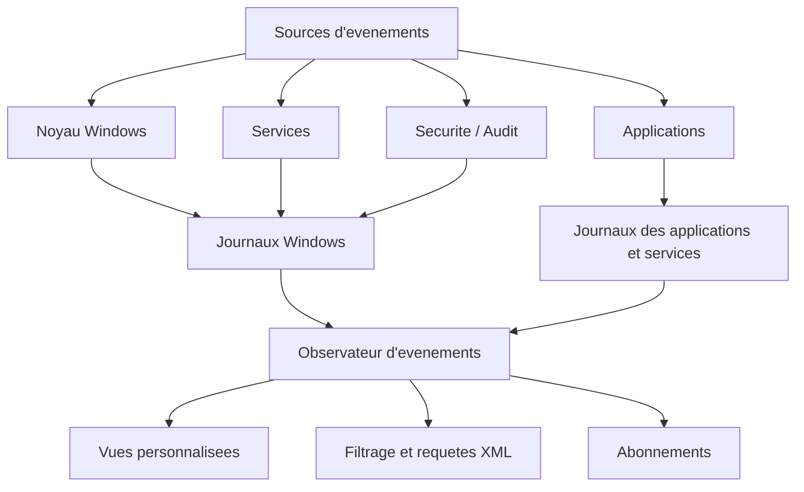
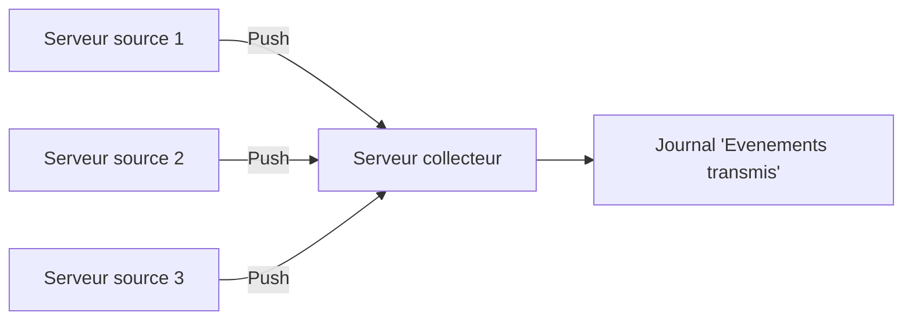

# Observateur d'evenements (Event Viewer)

!!! info "Niveau : Intermediaire"

    Temps estime : 35 minutes

## Presentation

L'Observateur d'evenements (`eventvwr.msc`) est l'outil central de journalisation de Windows Server. Chaque action significative du systeme, des services et des applications genere un evenement consigne dans un journal. Savoir exploiter ces journaux est une competence fondamentale pour tout administrateur.



## Lancer l'Observateur d'evenements

```powershell
# Launch Event Viewer
eventvwr.msc

# Open Event Viewer for a remote server
eventvwr.msc /s:SRV-DC01
```

## Types de journaux

### Journaux Windows (principaux)

| Journal | Description | Exemples d'evenements |
|---------|-------------|----------------------|
| **Application** | Evenements des applications installees | Erreurs SQL, avertissements IIS, messages .NET |
| **Securite** | Evenements d'audit et de securite | Connexions, acces aux fichiers, modifications de privileges |
| **Systeme** | Evenements du noyau et des services Windows | Demarrage/arret de services, erreurs de pilotes |
| **Installation** | Evenements lies aux installations de roles/fonctionnalites | Installation de mises a jour, ajout de roles |
| **Evenements transmis** | Evenements collectes depuis d'autres serveurs via WEF | Centralisation des logs |

### Journaux des applications et services

Ces journaux sont specifiques a des composants ou roles :

- **Microsoft/Windows/DNS-Server** : evenements du service DNS
- **Microsoft/Windows/GroupPolicy** : evenements de traitement des GPO
- **Microsoft/Windows/Hyper-V-VMMS** : evenements Hyper-V
- **Microsoft/Windows/TaskScheduler** : evenements du Planificateur de taches
- **Directory Service** : evenements Active Directory

## Niveaux de gravite

| Niveau | Icone | Signification |
|--------|-------|---------------|
| **Critique** | :material-close-circle: | Erreur fatale, arret du systeme ou du service |
| **Erreur** | :material-alert-circle: | Probleme significatif, perte de fonctionnalite |
| **Avertissement** | :material-alert: | Situation anormale, probleme potentiel |
| **Information** | :material-information: | Fonctionnement normal, evenement attendu |
| **Audit reussi** | :material-check-circle: | Action auditee effectuee avec succes |
| **Echec de l'audit** | :material-lock: | Action auditee echouee (acces refuse, etc.) |

## Anatomie d'un evenement

Chaque evenement contient les champs suivants :

| Champ | Description |
|-------|-------------|
| **Nom du journal** | Journal d'appartenance (System, Security, etc.) |
| **Source** | Composant qui a genere l'evenement |
| **Event ID** | Identifiant numerique unique par source |
| **Niveau** | Gravite (Critical, Error, Warning, Information) |
| **Utilisateur** | Compte associe a l'evenement |
| **OpCode** | Code d'operation |
| **Tache** | Categorie de la tache |
| **Mots cles** | Classification supplementaire |
| **Date et heure** | Horodatage precis |
| **Ordinateur** | Nom du serveur source |
| **Description** | Message detaille en clair |
| **Donnees XML** | Representation structuree complete de l'evenement |

## Evenements importants a connaitre

### Securite (journal Security)

| Event ID | Description |
|----------|-------------|
| **4624** | Ouverture de session reussie |
| **4625** | Echec d'ouverture de session |
| **4634** | Fermeture de session |
| **4648** | Connexion avec des identifiants explicites (RunAs) |
| **4720** | Creation d'un compte utilisateur |
| **4726** | Suppression d'un compte utilisateur |
| **4732** | Ajout d'un membre a un groupe local |
| **4756** | Ajout d'un membre a un groupe universel |
| **4672** | Privileges speciaux attribues a une session |

### Systeme (journal System)

| Event ID | Source | Description |
|----------|--------|-------------|
| **6005** | EventLog | Demarrage du service de journalisation (= demarrage du serveur) |
| **6006** | EventLog | Arret du service de journalisation (= arret du serveur) |
| **6008** | EventLog | Arret inattendu (crash, coupure de courant) |
| **7036** | Service Control Manager | Changement d'etat d'un service |
| **7045** | Service Control Manager | Installation d'un nouveau service |
| **1074** | User32 | Arret/redemarrage initie par un utilisateur |

## Vues personnalisees

Les vues personnalisees permettent de creer des filtres permanents qui regroupent les evenements selon vos criteres.

### Creer une vue personnalisee via l'interface

1. Clic droit sur **Vues personnalisees** > **Creer une vue personnalisee**
2. Definir les filtres :
    - **Consigne** : periode (derniere heure, 24h, 7 jours, etc.)
    - **Niveau d'evenement** : cocher les niveaux souhaites
    - **Par journal** ou **Par source** : selectionner les sources
    - **ID d'evenements** : saisir les Event IDs (separes par des virgules)
3. Nommer et enregistrer la vue

### Exemples de vues utiles

**Erreurs et critiques des 24 dernieres heures :**

```powershell
# Query critical and error events from the last 24 hours
Get-WinEvent -FilterHashtable @{
    LogName = 'System','Application'
    Level = 1,2  # 1=Critical, 2=Error
    StartTime = (Get-Date).AddDays(-1)
}
```

**Connexions echouees :**

```powershell
# Query failed logon events
Get-WinEvent -FilterHashtable @{
    LogName = 'Security'
    Id = 4625
    StartTime = (Get-Date).AddHours(-12)
} | Select-Object TimeCreated,
    @{N='TargetUser';E={$_.Properties[5].Value}},
    @{N='SourceIP';E={$_.Properties[19].Value}},
    @{N='FailureReason';E={$_.Properties[8].Value}}
```

## Filtrage avance avec XML (XPath)

L'onglet **XML** du filtre personnalise permet d'ecrire des requetes XPath pour un filtrage precis.

### Syntaxe de base

```xml
<QueryList>
  <Query Id="0" Path="Security">
    <Select Path="Security">
      *[System[(EventID=4625) and TimeCreated[timediff(@SystemTime) &lt;= 86400000]]]
    </Select>
  </Query>
</QueryList>
```

### Exemples de requetes XML

**Evenements d'un utilisateur specifique :**

```xml
<QueryList>
  <Query Id="0" Path="Security">
    <Select Path="Security">
      *[System[(EventID=4624)]]
      and
      *[EventData[Data[@Name='TargetUserName']='j.bombled']]
    </Select>
  </Query>
</QueryList>
```

**Evenements de plusieurs journaux :**

```xml
<QueryList>
  <Query Id="0">
    <Select Path="System">
      *[System[(Level=1 or Level=2)]]
    </Select>
    <Select Path="Application">
      *[System[(Level=1 or Level=2)]]
    </Select>
  </Query>
</QueryList>
```

!!! tip "Recuperer la requete XML"

    Creez un filtre via l'assistant graphique, puis basculez sur l'onglet **XML** pour
    voir la requete generee. Vous pouvez la modifier directement en cochant
    **Modifier la requete manuellement**.

## Requetes PowerShell avancees

```powershell
# Query with XPath filter
Get-WinEvent -LogName Security -FilterXPath `
    "*[System[EventID=4625] and EventData[Data[@Name='TargetUserName']='Administrateur']]"

# Query using FilterHashtable (more performant)
Get-WinEvent -FilterHashtable @{
    LogName = 'Security'
    Id = 4624
    StartTime = (Get-Date).AddDays(-7)
} -MaxEvents 100

# Query events on a remote server
Get-WinEvent -ComputerName "SRV-DC01" -FilterHashtable @{
    LogName = 'System'
    Level = 1,2
    StartTime = (Get-Date).AddDays(-1)
}

# Export events to CSV
Get-WinEvent -FilterHashtable @{
    LogName = 'Application'
    Level = 1,2,3
    StartTime = (Get-Date).AddDays(-7)
} | Select-Object TimeCreated, Id, LevelDisplayName, ProviderName, Message |
    Export-Csv -Path "C:\Logs\app-events-7days.csv" -NoTypeInformation -Encoding UTF8
```

## Abonnements (Event Subscriptions)

Les abonnements permettent de collecter automatiquement des evenements depuis des serveurs distants vers un serveur collecteur.

### Architecture



| Mode | Description | Usage |
|------|-------------|-------|
| **Initie par le collecteur (Pull)** | Le collecteur interroge les sources | Petit nombre de sources |
| **Initie par la source (Push)** | Les sources envoient au collecteur | Grand nombre de sources, via GPO |

### Configuration rapide

```powershell
# On the COLLECTOR server: enable Windows Event Collector service
wecutil qc /q

# On each SOURCE server: enable Windows Remote Management
winrm quickconfig /q

# Create a subscription (collector-initiated)
wecutil cs C:\Subscriptions\my-subscription.xml
```

!!! info "Pour aller plus loin"

    La configuration detaillee des abonnements WEF/WEC est traitee dans la page
    [Windows Event Forwarding](../logs/wef-wec.md).

## Gestion de la taille des journaux

```powershell
# Check current log size and limits
Get-WinEvent -ListLog System | Select-Object LogName, MaximumSizeInBytes,
    FileSize, RecordCount, LogMode

# Increase the maximum size of the Security log to 1 GB
wevtutil sl Security /ms:1073741824

# Set log retention policy: AutoBackup (archive when full)
wevtutil sl Security /rt:true /ab:true

# Clear a log (with backup)
wevtutil cl System /bu:"C:\LogBackups\System-$(Get-Date -Format 'yyyyMMdd').evtx"

# Export a log to EVTX file
wevtutil epl Security "C:\LogBackups\Security-export.evtx"
```

| Strategie | Valeur `/rt` | Comportement |
|-----------|-------------|--------------|
| **Remplacer si necessaire** | `false` | Les evenements anciens sont ecrases (defaut) |
| **Archiver quand plein** | `true` + `/ab:true` | Le journal est archive puis un nouveau commence |
| **Ne pas remplacer** | `true` + `/ab:false` | L'ecriture s'arrete quand le journal est plein |

!!! danger "Production"

    En production, le journal **Security** doit etre dimensionne genereusement (minimum 1 Go)
    et configure en mode archivage. La perte d'evenements de securite est un risque majeur
    de conformite.

## Points cles a retenir

- L'Observateur d'evenements est l'outil fondamental pour le diagnostic et l'audit sur Windows Server
- Les journaux principaux sont **System**, **Application**, **Security** et **Setup**
- Chaque evenement est identifie par un **Event ID** unique par source
- Les **vues personnalisees** et les **requetes XPath/XML** permettent un filtrage precis
- `Get-WinEvent` avec `-FilterHashtable` est la methode PowerShell la plus performante
- Les abonnements (WEF) permettent de centraliser les journaux de plusieurs serveurs
- La taille et la politique de retention des journaux doivent etre configurees selon les besoins

## Pour aller plus loin

- [Windows Event Forwarding (WEF/WEC)](../logs/wef-wec.md) pour la centralisation des logs
- [Ensembles de collecteurs de donnees](data-collector-sets.md) pour la collecte planifiee de metriques
- [Politique d'audit](../../securite/audit/politique-audit.md) pour configurer les evenements de securite
