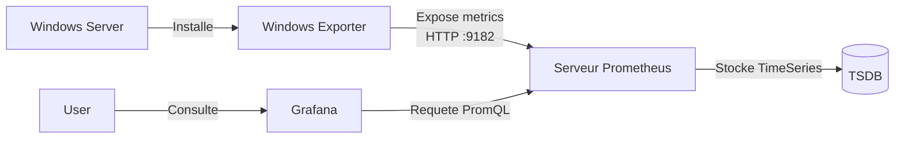

<!--
  Copyright 2026 Julien Bombled

  Licensed under the Apache License, Version 2.0 (the "License");
  you may not use this file except in compliance with the License.
  You may obtain a copy of the License at

      http://www.apache.org/licenses/LICENSE-2.0

  Unless required by applicable law or agreed to in writing, software
  distributed under the License is distributed on an "AS IS" BASIS,
  WITHOUT WARRANTIES OR CONDITIONS OF ANY KIND, either express or implied.
  See the License for the specific language governing permissions and
  limitations under the License.
-->

# Supervision Moderne avec Prometheus et Grafana

<span class="level-advanced">Avance</span> · Temps estime : 45 minutes

!!! example "Analogie"

    Passer de PerfMon a Prometheus/Grafana, c'est comme remplacer un **thermometre a mercure** par une **station meteo connectee**. Le thermometre vous donne la temperature de la piece ou vous etes (un serveur a la fois). La station meteo collecte les donnees de tous les capteurs de la maison, les historise sur des mois, affiche des graphiques en temps reel, et vous alerte si la temperature d'une piece depasse un seuil — meme quand vous n'etes pas chez vous.

## Pourquoi moderniser ?

Les outils natifs comme **Performance Monitor** (PerfMon) et **Event Viewer** sont excellents pour le depannage ponctuel, mais limites pour la surveillance proactive d'un parc de serveurs.

La stack moderne (Prometheus + Grafana) offre :
*   **Historisation** : Garder des mois de metriques (vs quelques jours pour PerfMon).
*   **Visualisation** : Dashboards dynamiques et unifies (plusieurs serveurs sur un ecran).
*   **Alerting** : Alertes intelligentes basees sur des tendances (ex: "Disque plein dans 4 heures").

## Architecture



## Etape 1 : Installation de Windows Exporter

Sur chaque serveur Windows a surveiller (`DC-01`, `SRV-01`), nous installons **windows_exporter**. C'est un agent leger qui collecte les compteurs de performance et les expose format "Prometheus".

1.  Telechargez le dernier MSI depuis [GitHub](https://github.com/prometheus-community/windows_exporter/releases).
2.  Installez-le via PowerShell :

```powershell
msiexec /i windows_exporter-0.25.1-amd64.msi ENABLED_COLLECTORS="cpu,cs,logical_disk,net,os,service,system,memory" LISTEN_PORT=9182
```

3.  Verifiez que les metriques sont exposees :
    *   Ouvrez un navigateur sur `http://localhost:9182/metrics`
    *   Vous devriez voir une longue liste de cles/valeurs.

## Etape 2 : Serveur Prometheus (Docker)

Pour ce lab, nous allons deployer la stack de supervision sur une machine Linux ou via Docker Desktop sur Windows.

`prometheus.yml` :
```yaml
global:
  scrape_interval: 15s

scrape_configs:
  - job_name: 'windows-lab'
    static_configs:
      - targets: ['10.0.0.10:9182', '10.0.0.20:9182'] # IPs de vos serveurs Windows
```

Lancement via Docker :
```bash
docker run -d -p 9090:9090 -v ${PWD}/prometheus.yml:/etc/prometheus/prometheus.yml prom/prometheus
```

## Etape 3 : Visualisation dans Grafana

1.  Lancez Grafana :
    ```bash
    docker run -d -p 3000:3000 grafana/grafana
    ```
2.  Connectez-vous sur `http://localhost:3000` (admin/admin).
3.  Ajoutez une **Data Source** de type **Prometheus**.
    *   URL : `http://ip-de-votre-machine-docker:9090`
4.  Importez un Dashboard communautaire.
    *   ID recommande pour Windows : **14694** ("Windows Exporter Dashboard").

## Resultat

Vous disposez maintenant d'un tableau de bord temps reel affichant CPU, RAM, Disque et Reseau de tout votre parc Windows Server, avec un historique consultable.

## TP : Creer une alerte CPU

1.  Dans Grafana, editez le panneau CPU.
2.  Allez dans l'onglet **Alert**.
3.  Creez une regle : "Si CPU > 90% pendant 5 minutes".
4.  Simulez une charge sur le serveur Windows :
    ```powershell
    # Script de stress CPU
    $result = 1; foreach ($number in 1..2147483647) {$result = $result * $number}
    ```
5.  Observez l'alerte se declencher dans Grafana.

!!! example "Scenario pratique"

    **Contexte :** Prometheus ne collecte plus les metriques du serveur SRV-MONITOR-01. Le
    dashboard Grafana affiche "No data" depuis 2 heures sur tous les panneaux concernant
    ce serveur.

    **Symptomes :**

    - Tous les panneaux Grafana relatifs a SRV-MONITOR-01 affichent "No data"
    - Les autres serveurs supervises sont toujours visibles
    - Aucune alerte n'a ete declenchee dans Alertmanager

    **Diagnostic :**

    ```powershell
    # Test the metrics endpoint from the Prometheus server
    Invoke-WebRequest http://SRV-MONITOR-01:9182/metrics -UseBasicParsing
    ```

    Resultat :

    ```text
    Invoke-WebRequest : Unable to connect to the remote server
    At line:1 char:1
    + Invoke-WebRequest http://SRV-MONITOR-01:9182/metrics
    ```

    La connexion est refusee. Verification de l'etat du service windows_exporter :

    ```powershell
    # Check windows_exporter service on the monitored server
    Get-Service windows_exporter -ComputerName SRV-MONITOR-01
    ```

    Resultat :

    ```text
    Status   Name               DisplayName
    ------   ----               -----------
    Stopped  windows_exporter   windows_exporter
    ```

    Le service windows_exporter s'est arrete. Consultation des journaux pour identifier la cause :

    ```powershell
    # Check system events around the time the data disappeared
    Get-WinEvent -ComputerName SRV-MONITOR-01 -FilterHashtable @{
        LogName = 'System'
        Id      = 7036
        StartTime = (Get-Date).AddHours(-3)
    } | Where-Object { $_.Message -like "*windows_exporter*" } |
        Select-Object TimeCreated, Message
    ```

    Resultat :

    ```text
    TimeCreated           Message
    -----------           -------
    2026-02-20 10:14:22   The windows_exporter service entered the stopped state.
    ```

    **Solution :**

    ```powershell
    # Restart the windows_exporter service and set it to Automatic startup
    Start-Service windows_exporter -ComputerName SRV-MONITOR-01
    Set-Service windows_exporter -StartupType Automatic -ComputerName SRV-MONITOR-01

    # Verify the endpoint is reachable again
    Invoke-WebRequest http://SRV-MONITOR-01:9182/metrics -UseBasicParsing | Select-Object StatusCode
    ```

    Resultat :

    ```text
    StatusCode
    ----------
           200
    ```

    Le service est redemarre, l'endpoint repond. Les metriques reapparaissent dans Grafana dans
    le cycle de scrape suivant (15 secondes). Pour eviter la recidive, une regle Alertmanager
    est ajoutee pour surveiller l'etat du service windows_exporter lui-meme via la metrique
    `windows_service_state{name="windows_exporter"}`.

!!! danger "Erreurs courantes"

    1. **Ne pas ouvrir le port 9182 dans le pare-feu Windows.** Apres installation de windows_exporter, les metriques sont exposees sur le port 9182 mais le pare-feu Windows bloque l'acces par defaut. Prometheus ne peut pas scraper et aucune alerte n'est generee. Creer une regle `New-NetFirewallRule -DisplayName "Windows Exporter" -Direction Inbound -Protocol TCP -LocalPort 9182 -Action Allow`.

    2. **Utiliser le scrape interval par defaut sur un grand parc.** Avec 50+ serveurs et un intervalle de 15 secondes, Prometheus genere une charge importante (metriques, stockage, reseau). Augmenter l'intervalle a 30s ou 60s pour les serveurs non critiques et garder 15s uniquement pour les machines critiques.

    3. **Ignorer la retention des donnees.** Par defaut, Prometheus conserve les metriques 15 jours. Sur un lab, c'est suffisant. En production, il faut configurer `--storage.tsdb.retention.time=90d` et prevoir l'espace disque correspondant (environ 1-2 Go par serveur et par mois).

    4. **Deployer windows_exporter sans collecteurs specifiques.** L'installation par defaut active tous les collecteurs, generant des milliers de metriques inutiles. Specifier explicitement les collecteurs necessaires avec `ENABLED_COLLECTORS="cpu,cs,logical_disk,net,os,service,system,memory"` pour reduire le bruit et la charge.

## Pour aller plus loin

- [Performance Monitor](performance-monitor.md) pour la supervision native Windows
- [Data Collector Sets](data-collector-sets.md) pour les collecteurs de donnees integres
- [Event Viewer](event-viewer.md) pour la consultation des journaux d'evenements
