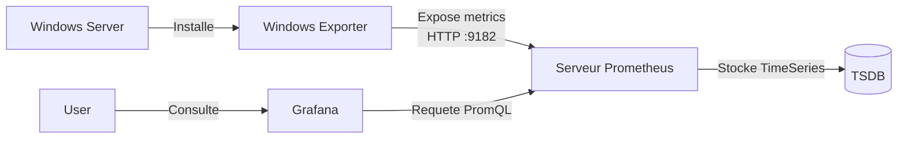

<!--
  Copyright 2026 Julien Bombled

  Licensed under the Apache License, Version 2.0 (the "License");
  you may not use this file except in compliance with the License.
  You may obtain a copy of the License at

      http://www.apache.org/licenses/LICENSE-2.0

  Unless required by applicable law or agreed to in writing, software
  distributed under the License is distributed on an "AS IS" BASIS,
  WITHOUT WARRANTIES OR CONDITIONS OF ANY KIND, either express or implied.
  See the License for the specific language governing permissions and
  limitations under the License.
-->
---
title: Supervision Moderne (Prometheus / Grafana)
description: Moderniser la supervision Windows Server en remplacant PerfMon par la stack Prometheus, Windows Exporter et Grafana.
tags:
  - supervision
  - prometheus
  - grafana
  - monitoring
  - moderne
---

# Supervision Moderne avec Prometheus et Grafana

<span class="level-advanced">Avance</span> · Temps estime : 45 minutes

## Pourquoi moderniser ?

Les outils natifs comme **Performance Monitor** (PerfMon) et **Event Viewer** sont excellents pour le depannage ponctuel, mais limites pour la surveillance proactive d'un parc de serveurs.

La stack moderne (Prometheus + Grafana) offre :
*   **Historisation** : Garder des mois de metriques (vs quelques jours pour PerfMon).
*   **Visualisation** : Dashboards dynamiques et unifies (plusieurs serveurs sur un ecran).
*   **Alerting** : Alertes intelligentes basees sur des tendances (ex: "Disque plein dans 4 heures").

## Architecture



## Etape 1 : Installation de Windows Exporter

Sur chaque serveur Windows a surveiller (`DC-01`, `SRV-01`), nous installons **windows_exporter**. C'est un agent leger qui collecte les compteurs de performance et les expose format "Prometheus".

1.  Telechargez le dernier MSI depuis [GitHub](https://github.com/prometheus-community/windows_exporter/releases).
2.  Installez-le via PowerShell :

```powershell
msiexec /i windows_exporter-0.25.1-amd64.msi ENABLED_COLLECTORS="cpu,cs,logical_disk,net,os,service,system,memory" LISTEN_PORT=9182
```

3.  Verifiez que les metriques sont exposees :
    *   Ouvrez un navigateur sur `http://localhost:9182/metrics`
    *   Vous devriez voir une longue liste de cles/valeurs.

## Etape 2 : Serveur Prometheus (Docker)

Pour ce lab, nous allons deployer la stack de supervision sur une machine Linux ou via Docker Desktop sur Windows.

`prometheus.yml` :
```yaml
global:
  scrape_interval: 15s

scrape_configs:
  - job_name: 'windows-lab'
    static_configs:
      - targets: ['10.0.0.10:9182', '10.0.0.20:9182'] # IPs de vos serveurs Windows
```

Lancement via Docker :
```bash
docker run -d -p 9090:9090 -v ${PWD}/prometheus.yml:/etc/prometheus/prometheus.yml prom/prometheus
```

## Etape 3 : Visualisation dans Grafana

1.  Lancez Grafana :
    ```bash
    docker run -d -p 3000:3000 grafana/grafana
    ```
2.  Connectez-vous sur `http://localhost:3000` (admin/admin).
3.  Ajoutez une **Data Source** de type **Prometheus**.
    *   URL : `http://ip-de-votre-machine-docker:9090`
4.  Importez un Dashboard communautaire.
    *   ID recommande pour Windows : **14694** ("Windows Exporter Dashboard").

## Resultat

Vous disposez maintenant d'un tableau de bord temps reel affichant CPU, RAM, Disque et Reseau de tout votre parc Windows Server, avec un historique consultable.

## TP : Creer une alerte CPU

1.  Dans Grafana, editez le panneau CPU.
2.  Allez dans l'onglet **Alert**.
3.  Creez une regle : "Si CPU > 90% pendant 5 minutes".
4.  Simulez une charge sur le serveur Windows :
    ```powershell
    # Script de stress CPU
    $result = 1; foreach ($number in 1..2147483647) {$result = $result * $number}
    ```
5.  Observez l'alerte se declencher dans Grafana.
