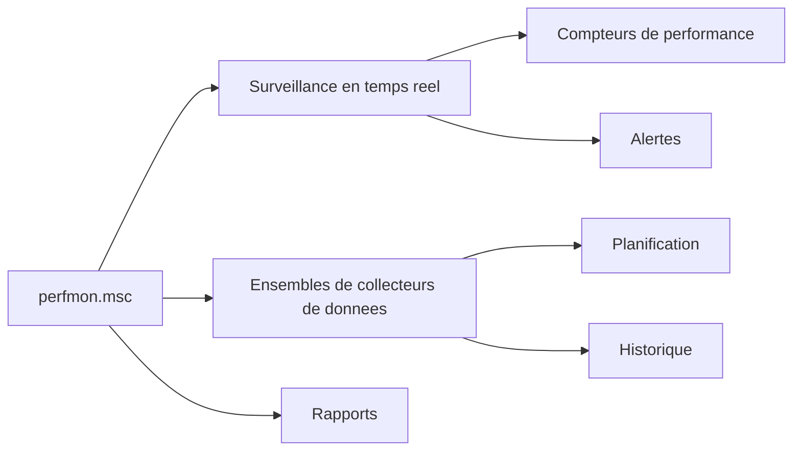

# Analyseur de performances (perfmon)

<span class="level-intermediate">Intermediaire</span> · Temps estime : 30 minutes

## Presentation

L'Analyseur de performances (`perfmon.msc`) est l'outil natif de Windows Server pour surveiller en temps reel les metriques systeme. Il permet de collecter, afficher et analyser des compteurs de performance couvrant le processeur, la memoire, les disques et le reseau.



!!! example "Analogie"

    L'Analyseur de performances est comparable au **tableau de bord d'une voiture**. Les compteurs
    (vitesse, temperature, niveau d'huile) vous informent en permanence de l'etat du vehicule.
    Si un voyant passe au rouge (seuil depasse), vous savez qu'il faut intervenir avant la panne.

## Lancer l'Analyseur de performances

Plusieurs methodes pour ouvrir l'outil :

```powershell
# Launch Performance Monitor
perfmon.msc

# Launch directly in standalone mode
perfmon /sys

# Launch the resource overview (legacy)
perfmon /res
```

Depuis l'interface graphique : ++win+r++ puis taper `perfmon.msc`.

## Compteurs de performance

### Concepts fondamentaux

Un **compteur de performance** est une mesure numerique d'un aspect specifique du systeme. Chaque compteur appartient a une **categorie** (ou objet de performance) et peut avoir plusieurs **instances**.

| Element | Description | Exemple |
|---------|-------------|---------|
| Categorie (Objet) | Groupe logique de compteurs | `Processor`, `Memory`, `PhysicalDisk` |
| Compteur | Metrique specifique | `% Processor Time`, `Available MBytes` |
| Instance | Occurrence specifique | `_Total`, `0`, `1` (numeros de CPU) |

### Ajouter des compteurs

1. Ouvrir `perfmon.msc`
2. Cliquer sur **Analyseur de performances** dans le volet gauche
3. Cliquer sur le bouton **+** (vert) dans la barre d'outils
4. Selectionner la categorie, le compteur et l'instance
5. Cliquer sur **Ajouter** puis **OK**

```powershell
# List all available performance counter categories
Get-Counter -ListSet * | Select-Object CounterSetName | Sort-Object CounterSetName

# List counters in a specific category
Get-Counter -ListSet "Processor" | Select-Object -ExpandProperty Counter

# Read a specific counter value
Get-Counter "\Processor(_Total)\% Processor Time"

# Continuous monitoring (5 samples, 2-second interval)
Get-Counter "\Processor(_Total)\% Processor Time" -SampleInterval 2 -MaxSamples 5
```

Resultat :

```text
# Get-Counter -ListSet * (extrait)
CounterSetName
--------------
Memory
Network Interface
PhysicalDisk
Processor
System
TCPv4

# Get-Counter "\Processor(_Total)\% Processor Time"
Timestamp                 CounterSamples
---------                 --------------
2026-02-20 14:35:12       \\SRV-01\processor(_total)\% processor time : 23.4521

# Continuous monitoring (5 samples)
Timestamp                 CounterSamples
---------                 --------------
2026-02-20 14:35:14       \\SRV-01\processor(_total)\% processor time : 18.2301
2026-02-20 14:35:16       \\SRV-01\processor(_total)\% processor time : 42.8754
2026-02-20 14:35:18       \\SRV-01\processor(_total)\% processor time : 35.1092
2026-02-20 14:35:20       \\SRV-01\processor(_total)\% processor time : 27.6438
2026-02-20 14:35:22       \\SRV-01\processor(_total)\% processor time : 21.9876
```

### Compteurs essentiels par categorie

#### Processeur (CPU)

| Compteur | Seuil d'alerte | Description |
|----------|---------------|-------------|
| `\Processor(_Total)\% Processor Time` | > 85% soutenu | Utilisation globale du CPU |
| `\Processor(_Total)\% Privileged Time` | > 30% | Temps passe en mode noyau |
| `\Processor(_Total)\% User Time` | Variable | Temps passe en mode utilisateur |
| `\System\Processor Queue Length` | > 2 x nb coeurs | Threads en attente de CPU |

!!! tip "Interpretation"

    Un `Processor Queue Length` eleve combine a un `% Processor Time` a 100% indique un goulot d'etranglement CPU.
    Si le `% Privileged Time` est dominant, le probleme vient probablement d'un pilote ou du sous-systeme E/S.

#### Memoire (RAM)

| Compteur | Seuil d'alerte | Description |
|----------|---------------|-------------|
| `\Memory\Available MBytes` | < 10% de la RAM totale | Memoire physique disponible |
| `\Memory\Pages/sec` | > 1000 soutenu | Activite de pagination |
| `\Memory\% Committed Bytes In Use` | > 80% | Ratio memoire engagee/limite |
| `\Memory\Pool Nonpaged Bytes` | Croissance continue | Memoire noyau non paginable |

!!! warning "Attention"

    Un `Pages/sec` constamment eleve avec un `Available MBytes` faible indique un manque de RAM physique.
    Le serveur compense en utilisant le fichier d'echange, ce qui degrade fortement les performances.

#### Disque

| Compteur | Seuil d'alerte | Description |
|----------|---------------|-------------|
| `\PhysicalDisk(_Total)\% Disk Time` | > 90% soutenu | Taux d'occupation du disque |
| `\PhysicalDisk(_Total)\Avg. Disk Queue Length` | > 2 par disque | Files d'attente d'E/S |
| `\PhysicalDisk(_Total)\Avg. Disk sec/Read` | > 20 ms | Latence en lecture |
| `\PhysicalDisk(_Total)\Avg. Disk sec/Write` | > 20 ms | Latence en ecriture |
| `\LogicalDisk(*)\% Free Space` | < 15% | Espace libre restant |

#### Reseau

| Compteur | Seuil d'alerte | Description |
|----------|---------------|-------------|
| `\Network Interface(*)\Bytes Total/sec` | > 70% de la bande passante | Debit total |
| `\Network Interface(*)\Output Queue Length` | > 2 | File d'attente de sortie |
| `\Network Interface(*)\Packets Outbound Errors` | > 0 soutenu | Erreurs d'emission |
| `\TCPv4\Connections Established` | Variable | Connexions TCP actives |

## Alertes de performance

Les alertes permettent de declencher une action lorsqu'un compteur depasse un seuil defini.

### Creer une alerte via l'interface

1. Dans `perfmon.msc`, developper **Ensembles de collecteurs de donnees**
2. Clic droit sur **Defini par l'utilisateur** > **Nouveau** > **Ensemble de collecteurs de donnees**
3. Choisir **Alerte du compteur de performance**
4. Ajouter les compteurs et definir les seuils
5. Configurer l'action (journaliser, executer une commande, demarrer un collecteur)

### Creer une alerte en PowerShell

```powershell
# Monitor CPU and trigger action when above 90%
$counterPath = "\Processor(_Total)\% Processor Time"

# Continuous check loop (production: use a scheduled task instead)
while ($true) {
    $value = (Get-Counter $counterPath).CounterSamples[0].CookedValue
    if ($value -gt 90) {
        Write-EventLog -LogName Application -Source "PerfMonAlert" `
            -EventId 9001 -EntryType Warning `
            -Message "CPU usage exceeded 90%: $([math]::Round($value,2))%"
    }
    Start-Sleep -Seconds 30
}
```

## Vues et affichage

L'Analyseur de performances propose trois modes d'affichage :

| Mode | Utilisation |
|------|------------|
| **Ligne** (defaut) | Suivi en temps reel, comparaison de compteurs |
| **Barre d'histogramme** | Comparaison instantanee entre instances |
| **Rapport** | Valeurs numeriques precises, export facile |

!!! tip "Astuce"

    Utilisez ++ctrl+h++ pour activer le mode surbrillance. Le compteur selectionne passe en blanc gras,
    ce qui facilite l'identification dans un graphique charge.

## Surveillance a distance

```powershell
# Read performance counters on a remote server
Get-Counter -ComputerName "SRV-DC01" "\Processor(_Total)\% Processor Time"

# Monitor multiple servers simultaneously
$servers = @("SRV-DC01", "SRV-FILE01", "SRV-WEB01")
Get-Counter -ComputerName $servers "\Memory\Available MBytes" -SampleInterval 5 -MaxSamples 3
```

Resultat :

```text
# Remote single server
Timestamp                 CounterSamples
---------                 --------------
2026-02-20 14:40:05       \\SRV-DC01\processor(_total)\% processor time : 12.3456

# Multiple servers
Timestamp                 CounterSamples
---------                 --------------
2026-02-20 14:40:10       \\SRV-DC01\memory\available mbytes : 6234
                          \\SRV-FILE01\memory\available mbytes : 3102
                          \\SRV-WEB01\memory\available mbytes : 1847
```

!!! warning "Prerequis reseau"

    La surveillance a distance necessite :

    - Le service **Remote Registry** demarre sur la cible
    - Les regles de pare-feu pour **Performance Logs and Alerts** activees
    - Des droits d'administration sur le serveur cible

## Exporter et analyser les donnees

```powershell
# Export counter data to CSV
Get-Counter "\Processor(_Total)\% Processor Time", "\Memory\Available MBytes" `
    -SampleInterval 5 -MaxSamples 60 |
    Export-Counter -Path "C:\PerfLogs\baseline.csv" -FileFormat CSV

# Export to BLG format (binary, more compact)
Get-Counter "\Processor(_Total)\% Processor Time" `
    -SampleInterval 2 -MaxSamples 100 |
    Export-Counter -Path "C:\PerfLogs\baseline.blg"

# Import and analyze previously collected data
Import-Counter -Path "C:\PerfLogs\baseline.blg" |
    ForEach-Object { $_.CounterSamples } |
    Select-Object Timestamp, Path, CookedValue
```

## Points cles a retenir

- `perfmon.msc` est l'outil central pour la surveillance des performances sur Windows Server
- Les quatre categories essentielles a surveiller : **CPU**, **memoire**, **disque** et **reseau**
- Chaque compteur a des seuils d'alerte reconnus qui indiquent un goulot d'etranglement
- `Get-Counter` permet d'automatiser la collecte et l'export en PowerShell
- Etablir une **baseline** (reference) en periode normale est indispensable pour detecter les anomalies
- La surveillance a distance necessite le service Remote Registry et des regles de pare-feu

!!! example "Scenario pratique"

    **Contexte :** Marc, administrateur systeme, constate que le serveur SRV-WEB01 devient
    tres lent tous les jours entre 14h et 15h. Les utilisateurs se plaignent de temps de
    reponse degrades sur l'intranet.

    **Diagnostic :**

    1. Marc lance une collecte de compteurs cibles sur la periode suspecte :

    ```powershell
    Get-Counter -ComputerName SRV-WEB01 `
        "\Processor(_Total)\% Processor Time",
        "\Memory\Available MBytes",
        "\PhysicalDisk(_Total)\Avg. Disk Queue Length",
        "\System\Processor Queue Length" `
        -SampleInterval 10 -MaxSamples 360 |
        Export-Counter -Path "C:\PerfLogs\SRV-WEB01-debug.csv" -FileFormat CSV
    ```

    2. L'analyse du CSV revele que `% Processor Time` monte a 98% et `Processor Queue Length` atteint 12 (pour 4 coeurs)
    3. Marc identifie un goulot d'etranglement CPU. En croisant avec le Gestionnaire des taches, il decouvre qu'une tache planifiee de compression de logs se declenche a 14h00

    **Resolution :** Marc replanifie la tache de compression a 3h du matin, en dehors des heures de pointe. Le CPU reste sous 45% durant les heures de bureau.

!!! danger "Erreurs courantes"

    - **Ne pas etablir de baseline** : sans reference de fonctionnement normal, impossible de
      savoir si une valeur est anormale. Collectez une baseline sur une semaine avant de diagnostiquer
    - **Confondre un pic ponctuel avec un probleme** : un CPU a 100% pendant 2 secondes est normal.
      C'est un CPU a 90%+ **soutenu** pendant plusieurs minutes qui indique un probleme
    - **Oublier le Processor Queue Length** : un CPU a 85% avec une file d'attente a 1 est correct,
      mais un CPU a 85% avec une file a 20 signifie que le serveur est sous-dimensionne
    - **Surveiller uniquement le CPU** : les quatre piliers (CPU, memoire, disque, reseau) sont
      interdependants. Un manque de RAM genere de la pagination qui surcharge le disque

## Pour aller plus loin

- [Resource Monitor](resource-monitor.md) pour une vue synthetique en temps reel
- [Ensembles de collecteurs de donnees](data-collector-sets.md) pour la collecte planifiee
- [Observateur d'evenements](event-viewer.md) pour correler avec les journaux
