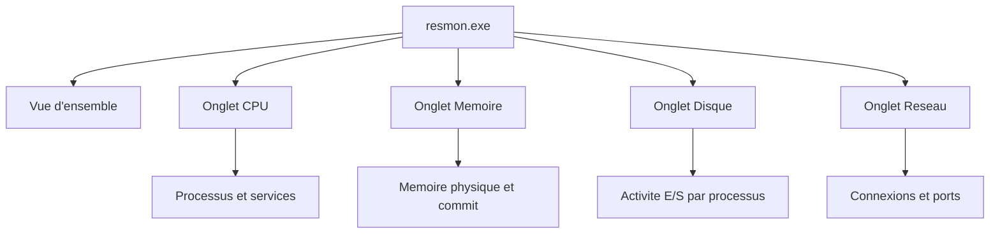

<!--
  Copyright 2026 Julien Bombled

  Licensed under the Apache License, Version 2.0 (the "License");
  you may not use this file except in compliance with the License.
  You may obtain a copy of the License at

      http://www.apache.org/licenses/LICENSE-2.0

  Unless required by applicable law or agreed to in writing, software
  distributed under the License is distributed on an "AS IS" BASIS,
  WITHOUT WARRANTIES OR CONDITIONS OF ANY KIND, either express or implied.
  See the License for the specific language governing permissions and
  limitations under the License.
-->
---
title: "Resource Monitor (resmon)"
description: Utiliser le Moniteur de ressources pour identifier les goulots d'etranglement en temps reel sur Windows Server 2022.
tags:
  - supervision
  - surveillance
  - debutant
---

# Resource Monitor (resmon)

<span class="level-beginner">Debutant</span> · Temps estime : 20 minutes

## Presentation

Le Moniteur de ressources (`resmon.exe`) offre une vue synthetique et en temps reel de l'utilisation des ressources systeme. Contrairement a l'Analyseur de performances qui travaille avec des compteurs individuels, `resmon` presente une vue consolidee par processus, ce qui facilite l'identification rapide de la source d'un probleme.



!!! example "Analogie"

    Le Moniteur de ressources est comme une **camera de surveillance en direct** dans un entrepot.
    Vous voyez en temps reel qui (quel processus) utilise quel espace (memoire), quel chariot
    (disque) et quelle porte de sortie (reseau). En un coup d'oeil, vous identifiez le responsable
    d'un embouteillage.

## Lancer le Moniteur de ressources

```powershell
# Launch Resource Monitor
resmon.exe

# Alternative: from Task Manager > Performance tab > "Open Resource Monitor"
```

Accessible egalement via : ++win+r++ puis `resmon`, ou depuis le **Gestionnaire des taches** > onglet **Performance** > lien **Ouvrir le Moniteur de ressources**.

## Onglet Vue d'ensemble

La vue d'ensemble affiche simultanement les quatre categories de ressources avec des graphiques en temps reel sur le cote droit.

| Section | Contenu affiche |
|---------|----------------|
| **CPU** | Processus actifs, utilisation par processus, services associes |
| **Disque** | Activite de lecture/ecriture par processus |
| **Reseau** | Activite reseau par processus |
| **Memoire** | Allocation memoire par processus |

!!! tip "Filtrage par processus"

    Cochez la case a cote d'un processus dans la section **CPU** pour filtrer toutes les autres
    sections (disque, reseau, memoire) sur ce processus uniquement. C'est extremement utile pour
    isoler l'impact d'une application specifique.

## Onglet CPU

L'onglet CPU affiche trois sections detaillees :

### Processus

Liste tous les processus en cours avec :

- **Image** : nom de l'executable
- **PID** : identifiant du processus
- **Description** : nom convivial
- **Threads** : nombre de threads
- **CPU** : utilisation instantanee en pourcentage
- **CPU moyen** : moyenne glissante

### Handles associes

Lorsqu'un processus est selectionne, cette section affiche les handles (fichiers, cles de registre, objets systeme) ouverts par le processus.

!!! tip "Trouver quel processus verrouille un fichier"

    Utilisez le champ **Rechercher les handles** pour saisir un nom de fichier.
    `resmon` identifiera le processus qui detient un verrou sur ce fichier.
    Cette fonctionnalite remplace des outils tiers comme Handle.exe dans de nombreux cas.

### Modules associes

Affiche les DLL et modules charges par le processus selectionne.

## Onglet Memoire

### Barre de memoire physique

L'onglet memoire affiche une barre horizontale coloree representant l'etat de la memoire physique :

| Couleur | Etat | Description |
|---------|------|-------------|
| **Bleu (En cours d'utilisation)** | Utilisee | Pages activement referees par des processus |
| **Bleu clair (Modifiee)** | Modifiee | Pages modifiees non encore ecrites sur disque |
| **Vert (En attente)** | Standby | Pages en cache, reutilisables rapidement |
| **Bleu fonce (Libre)** | Libre | Pages non utilisees et non mises en cache |

### Processus

Pour chaque processus, l'onglet affiche :

- **Plage de travail (Ko)** : memoire physique utilisee
- **Ensemble partage (Ko)** : memoire partagee avec d'autres processus
- **Ensemble prive (Ko)** : memoire exclusive au processus
- **Validation (Ko)** : memoire virtuelle engagee (physique + fichier d'echange)

!!! warning "Attention"

    Un serveur dont la memoire est principalement en **Bleu (En cours d'utilisation)** avec tres peu de
    **Vert (En attente)** et de **Libre** indique une pression memoire. Si la barre **Modifiee** grandit,
    le systeme a du mal a ecrire les pages sur disque.

## Onglet Disque

### Processus avec activite de disque

Affiche pour chaque processus :

- **Lecture (o/s)** : debit de lecture en octets par seconde
- **Ecriture (o/s)** : debit d'ecriture en octets par seconde
- **Total (o/s)** : debit combine
- **Priorite d'E/S** : Normal, Low, Very Low

### Activite du disque

Detail fichier par fichier de l'activite E/S :

- **Fichier** : chemin complet du fichier accede
- **Temps de reponse (ms)** : latence d'acces

!!! tip "Diagnostic de lenteur disque"

    Si un fichier specifique affiche un **temps de reponse** superieur a 20 ms de maniere
    constante, cela indique un probleme de performances disque (fragmentation, disque sature,
    ou sous-dimensionnement du stockage).

### Stockage

Resume par disque physique :

- **Espace disque** : graphique d'utilisation
- **Longueur de file d'attente** : nombre de requetes E/S en attente

## Onglet Reseau

### Processus avec activite reseau

| Colonne | Description |
|---------|-------------|
| **Image** | Processus generant du trafic |
| **Envoi (o/s)** | Debit d'emission |
| **Reception (o/s)** | Debit de reception |
| **Total (o/s)** | Debit combine |

### Activite reseau

Detail des connexions par processus avec les adresses et ports de destination.

### Connexions TCP

Liste toutes les connexions TCP actives avec :

- **Adresse locale / Port local**
- **Adresse distante / Port distant**
- **Etat** : Established, Time_Wait, Close_Wait, etc.
- **Perte de paquets (%)** : indicateur de qualite reseau
- **Latence (ms)** : temps de reponse

!!! tip "Identifier les connexions suspectes"

    Triez par **Adresse distante** pour reperer des connexions inattendues.
    Filtrez un processus specifique pour voir toutes ses communications reseau.
    Utile pour le diagnostic de securite et de performance applicative.

### Ports d'ecoute

Liste les ports ouverts en ecoute avec le processus associe. Equivalent graphique de `netstat -anob`.

## Cas d'utilisation courants

### Identifier un processus consommateur de CPU

1. Ouvrir `resmon.exe`
2. Onglet **CPU**, trier par colonne **CPU** decroissant
3. Identifier le processus en tete de liste
4. Cocher ce processus pour filtrer les autres onglets

### Trouver pourquoi un fichier est verrouille

1. Onglet **CPU**, section **Handles associes**
2. Saisir le nom du fichier dans le champ de recherche
3. Le processus detenant le verrou apparait

### Diagnostiquer une lenteur reseau

1. Onglet **Reseau**, section **Connexions TCP**
2. Observer la colonne **Latence (ms)**
3. Verifier la colonne **Perte de paquets (%)**
4. Identifier les connexions avec des valeurs anormalement elevees

### Verifier la pression memoire

1. Onglet **Memoire**, observer la barre de memoire physique
2. Si le **Vert (En attente)** est quasi inexistant, la memoire est insuffisante
3. Trier les processus par **Ensemble prive** pour identifier le plus gourmand

## Comparaison avec d'autres outils

| Fonctionnalite | resmon | perfmon | Task Manager |
|----------------|:------:|:-------:|:------------:|
| Vue par processus | :material-check: | :material-close: | :material-check: |
| Compteurs detailles | Partiel | :material-check: | :material-close: |
| Historique long | :material-close: | :material-check: | :material-close: |
| Recherche de handles | :material-check: | :material-close: | :material-close: |
| Connexions TCP | :material-check: | :material-close: | :material-close: |
| Planification | :material-close: | :material-check: | :material-close: |

## Points cles a retenir

- `resmon.exe` est l'outil ideal pour un diagnostic rapide et visuel des ressources systeme
- Le filtrage par processus (case a cocher) permet d'isoler l'impact d'une application sur toutes les ressources
- La recherche de handles dans l'onglet CPU permet de trouver quel processus verrouille un fichier
- La barre de memoire physique coloree donne une lecture immediate de l'etat de la RAM
- L'onglet reseau fournit des informations detaillees sur les connexions TCP (latence, perte de paquets)
- `resmon` est complementaire de `perfmon` : l'un pour le diagnostic instantane, l'autre pour la collecte sur la duree

!!! example "Scenario pratique"

    **Contexte :** Laura, technicienne support, recoit un ticket : impossible de supprimer un
    fichier de rapport Excel sur le partage `\\SRV-01\Rapports`. Le message d'erreur indique
    que le fichier est utilise par un autre processus.

    **Diagnostic :**

    1. Laura ouvre `resmon.exe` sur SRV-01
    2. Dans l'onglet **CPU**, section **Handles associes**, elle saisit le nom du fichier : `rapport-financier-Q4.xlsx`
    3. Le Moniteur de ressources identifie le processus `EXCEL.EXE` (PID 4872) avec l'utilisateur `lab\p.martin`

    **Resolution :** Laura contacte Pierre Martin qui avait laisse le fichier ouvert. Apres fermeture du fichier, la suppression fonctionne. Pour prevenir ce probleme, Laura configure les cliches instantanes (shadow copies) sur le partage.

!!! danger "Erreurs courantes"

    - **Confondre memoire utilisee et memoire disponible** : la barre verte (En attente/Standby)
      n'est pas de la memoire perdue. Windows l'utilise comme cache et la libere instantanement
      si un processus en a besoin
    - **Ne pas utiliser le filtrage par processus** : cocher la case d'un processus dans la
      section CPU filtre toutes les sections. Sans cette astuce, l'analyse est beaucoup plus longue
    - **Ignorer la colonne Temps de reponse (ms)** dans l'onglet Disque : c'est l'indicateur
      le plus fiable de la sante du stockage. Au-dessus de 20 ms, il y a un probleme de performance disque
    - **Oublier que resmon est un outil temps reel uniquement** : il ne conserve aucun historique.
      Pour un suivi dans le temps, utilisez `perfmon.msc` avec des ensembles de collecteurs

## Pour aller plus loin

- [Analyseur de performances](performance-monitor.md) pour une surveillance approfondie avec compteurs
- [Ensembles de collecteurs de donnees](data-collector-sets.md) pour la collecte planifiee
- [Outils systeme de depannage](../depannage/outils-systeme.md) pour les autres outils de diagnostic

