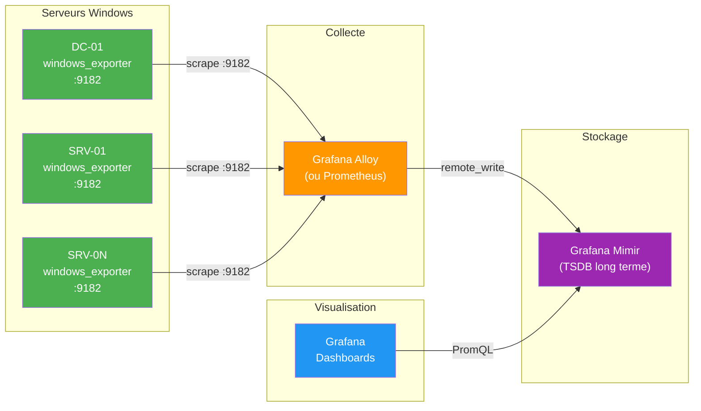

<!--
  Copyright 2026 Julien Bombled

  Licensed under the Apache License, Version 2.0 (the "License");
  you may not use this file except in compliance with the License.
  You may obtain a copy of the License at

      http://www.apache.org/licenses/LICENSE-2.0

  Unless required by applicable law or agreed to in writing, software
  distributed under the License is distributed on an "AS IS" BASIS,
  WITHOUT WARRANTIES OR CONDITIONS OF ANY KIND, either express or implied.
  See the License for the specific language governing permissions and
  limitations under the License.
-->

# Deploiement windows_exporter avec Ansible et Mimir

<span class="level-advanced">Avance</span> · Temps estime : 35 minutes

!!! example "Analogie"

    Imaginez que chaque serveur Windows est equipe d'une **sonde meteorologique** qui mesure en permanence la temperature (CPU), la pression (memoire), l'humidite (disque) et le vent (reseau). Le role Ansible est le **technicien** qui installe et calibre chaque sonde de maniere identique sur tous les sites. **Grafana Mimir** est la **station meteo centrale** qui collecte toutes les donnees, les stocke sur le long terme et permet de visualiser la meteo de l'ensemble du parc depuis un seul ecran.

## Architecture



!!! info "Pourquoi Mimir ?"

    **Grafana Mimir** est un backend de stockage de metriques compatible Prometheus, concu pour le long terme et le multi-tenant. Contrairement a Prometheus seul (retention limitee, mono-instance), Mimir offre une retention illimitee, une haute disponibilite native et une scalabilite horizontale. C'est le choix recommande quand le parc depasse quelques serveurs.

## Collectors disponibles

### Collectors standard (tous les serveurs)

| Collector | Description | Metriques cles |
|---|---|---|
| `cpu` | Utilisation processeur | `windows_cpu_time_total` |
| `cs` | Informations systeme | `windows_cs_physical_memory_bytes` |
| `logical_disk` | Espace disque et I/O | `windows_logical_disk_free_bytes` |
| `memory` | Memoire physique et virtuelle | `windows_memory_available_bytes` |
| `net` | Interfaces reseau | `windows_net_bytes_total` |
| `os` | Version et uptime | `windows_os_info` |
| `service` | Etat des services Windows | `windows_service_state` |
| `system` | Threads, processus, contexte | `windows_system_context_switches_total` |
| `process` | Metriques par processus | `windows_process_cpu_time_total` |
| `thermalzone` | Temperature | `windows_thermalzone_temperature_celsius` |

### Collectors Active Directory (controleurs de domaine)

| Collector | Description | Metriques cles |
|---|---|---|
| `ad` | Replication, authentification AD | `windows_ad_replication_sync_requests_total` |
| `dns` | Requetes et zones DNS | `windows_dns_queries_total` |
| `dhcp` | Baux et scopes DHCP | `windows_dhcp_acks_total` |

!!! tip "Collectors AD automatiques"

    Le role Ansible detecte automatiquement si le serveur appartient au groupe d'inventaire `dc` et ajoute les collectors AD. Aucune configuration manuelle necessaire.

## Role Ansible windows_exporter

Le role `windows_exporter` du depot WinOpsLab automatise l'integalite du deploiement :

1. **Installation** via Chocolatey (`prometheus-windows-exporter.install`)
2. **Configuration** des collectors et du repertoire textfile
3. **Firewall** : ouverture du port 9182/TCP
4. **Service** : demarrage automatique

### Variables du role

| Variable | Defaut | Description |
|---|---|---|
| `winexp_version` | `0.29.2` | Version du package Chocolatey |
| `winexp_listen_port` | `9182` | Port d'ecoute HTTP |
| `winexp_listen_address` | `0.0.0.0` | Adresse d'ecoute |
| `winexp_collectors` | `cpu,cs,logical_disk,...` | Collectors standard |
| `winexp_collectors_ad` | `ad,dns,dhcp` | Collectors AD (DC uniquement) |
| `winexp_textfile_dir` | `C:\Program Files\windows_exporter\textfile_inputs` | Repertoire textfile collector |
| `winexp_firewall_profiles` | `[Domain, Private]` | Profils firewall |

### Deploiement complet

```bash
# Deploy windows_exporter to all Windows hosts
ansible-playbook -i inventory/hosts.yml playbooks/base.yml
```

### Deploiement par tags

```bash
# Install only (skip configure and firewall)
ansible-playbook -i inventory/hosts.yml playbooks/base.yml --tags install

# Reconfigure collectors without reinstalling
ansible-playbook -i inventory/hosts.yml playbooks/base.yml --tags configure

# Update firewall rules only
ansible-playbook -i inventory/hosts.yml playbooks/base.yml --tags firewall
```

### Cibler un serveur specifique

```bash
# Deploy on DC-01 only
ansible-playbook -i inventory/hosts.yml playbooks/base.yml --limit DC-01
```

## Verification du deploiement

Apres le deploiement Ansible, verifiez que windows_exporter fonctionne sur chaque serveur :

```powershell
# Check service status
Get-Service windows_exporter

# Test metrics endpoint locally
Invoke-WebRequest -Uri "http://localhost:9182/metrics" -UseBasicParsing | Select-Object -First 20

# Test from remote (replace with server IP)
Invoke-WebRequest -Uri "http://10.0.0.10:9182/metrics" -UseBasicParsing | Select-Object StatusCode
```

!!! tip "Verification Ansible"

    Pour verifier en masse, utilisez un module ad hoc :

    ```bash
    # Check service status on all hosts
    ansible windows -i inventory/hosts.yml -m ansible.windows.win_service \
      -a "name=windows_exporter" | grep -E "name|state|start_mode"
    ```

## Architecture Mimir

### Configuration Grafana Alloy

Grafana Alloy (successeur de Grafana Agent) scrape les metriques windows_exporter et les envoie vers Mimir via `remote_write` :

```hcl
// Grafana Alloy configuration
prometheus.scrape "windows_lab" {
  targets = [
    {"__address__" = "10.0.0.10:9182", "instance" = "DC-01"},
    {"__address__" = "10.0.0.20:9182", "instance" = "SRV-01"},
    {"__address__" = "10.0.0.21:9182", "instance" = "SRV-02"},
  ]
  forward_to = [prometheus.remote_write.mimir.receiver]
  scrape_interval = "15s"
}

prometheus.remote_write "mimir" {
  endpoint {
    url = "http://mimir.monitoring.local/api/v1/push"
  }
}
```

### Configuration Prometheus alternative

Si vous utilisez Prometheus au lieu de Grafana Alloy :

```yaml
# prometheus.yml
global:
  scrape_interval: 15s

scrape_configs:
  - job_name: 'windows-lab'
    static_configs:
      - targets:
          - '10.0.0.10:9182'
          - '10.0.0.20:9182'
          - '10.0.0.21:9182'

remote_write:
  - url: "http://mimir.monitoring.local/api/v1/push"
```

### Grafana : data source Mimir

Dans Grafana, configurez Mimir comme source de donnees :

1. **Settings** > **Data Sources** > **Add data source**
2. Selectionnez **Prometheus**
3. URL : `http://mimir.monitoring.local/prometheus`
4. Activez **Custom query parameters** : `X-Scope-OrgID=winopslab`

## Scenario pratique

!!! example "Deployer windows_exporter sur 5 serveurs d'une succursale"

    **Contexte** : Votre entreprise ouvre une succursale avec 5 serveurs Windows Server 2022 (1 DC, 2 serveurs de fichiers, 2 serveurs web). Vous devez deployer la supervision via Ansible.

    **Etapes** :

    1. Ajoutez les serveurs a l'inventaire Ansible :

        ```yaml
        # inventory/hosts.yml
        all:
          children:
            windows:
              children:
                dc:
                  hosts:
                    BRANCH-DC01:
                      ansible_host: 192.168.10.10
                servers:
                  hosts:
                    BRANCH-FS01:
                      ansible_host: 192.168.10.20
                    BRANCH-FS02:
                      ansible_host: 192.168.10.21
                    BRANCH-WEB01:
                      ansible_host: 192.168.10.30
                    BRANCH-WEB02:
                      ansible_host: 192.168.10.31
        ```

    2. Lancez le deploiement :

        ```bash
        ansible-playbook -i inventory/hosts.yml playbooks/base.yml --limit "BRANCH-*"
        ```

    3. Verifiez les metriques :

        ```bash
        # Quick check on all branch servers
        for host in 192.168.10.{10,20,21,30,31}; do
          echo "--- $host ---"
          curl -s "http://$host:9182/metrics" | head -5
        done
        ```

    4. Le DC (`BRANCH-DC01`) aura automatiquement les collectors AD actives en plus des collectors standard.

??? success "Resultat attendu"

    - 5 services `windows_exporter` en cours d'execution
    - Le DC expose les metriques `windows_ad_*`, `windows_dns_*` et `windows_dhcp_*`
    - Les 4 autres serveurs exposent uniquement les collectors standard
    - Le port 9182 est ouvert sur les profils Domain et Private

## Erreurs courantes

!!! failure "Chocolatey absent ou inaccessible"

    **Symptome** : Le task `Install windows_exporter via Chocolatey` echoue avec `chocolatey not found`.

    **Cause** : Chocolatey n'est pas installe sur le serveur cible.

    **Solution** : Le module `community.chocolatey.win_chocolatey` installe automatiquement Chocolatey si absent. Verifiez que le serveur a acces a Internet ou a un repository Chocolatey interne.

    ```powershell
    # Check if Chocolatey is available
    choco --version
    ```

!!! failure "Port 9182 bloque par le firewall"

    **Symptome** : Le service tourne mais `curl http://server:9182/metrics` echoue depuis le serveur Prometheus.

    **Cause** : La regle firewall n'est pas appliquee ou le profil actif ne correspond pas.

    **Solution** : Verifiez le profil reseau actif et les regles firewall :

    ```powershell
    # Check active network profile
    Get-NetConnectionProfile | Select-Object Name, NetworkCategory

    # Check firewall rule
    Get-NetFirewallRule -DisplayName "*windows_exporter*" | Format-List
    ```

!!! failure "Collectors AD actives sur un serveur non-DC"

    **Symptome** : Le service windows_exporter echoue ou des erreurs apparaissent dans les logs sur un serveur membre.

    **Cause** : Les collectors `ad`, `dns` ou `dhcp` sont actives manuellement sur un serveur qui n'a pas les roles AD/DNS/DHCP.

    **Solution** : Le role Ansible gere ce cas automatiquement (collectors AD uniquement pour le groupe `dc`). Si vous avez configure manuellement, retirez ces collectors :

    ```powershell
    # Check current collectors
    Get-ItemProperty -Path "HKLM:\SYSTEM\CurrentControlSet\Services\windows_exporter" |
      Select-Object ImagePath
    ```

!!! failure "Mismatch de version entre serveurs"

    **Symptome** : Certains serveurs exposent des metriques differentes ou des dashboards Grafana affichent des lacunes.

    **Cause** : Des versions differentes de windows_exporter sont installees (upgrade partiel).

    **Solution** : Utilisez Ansible pour uniformiser la version sur tout le parc :

    ```bash
    # Force reinstall at specific version
    ansible-playbook -i inventory/hosts.yml playbooks/base.yml --tags install
    ```

!!! failure "Erreur remote_write vers Mimir"

    **Symptome** : Prometheus/Alloy demarre mais les metriques n'apparaissent pas dans Grafana.

    **Cause** : L'URL `remote_write` est incorrecte ou Mimir n'est pas accessible.

    **Solution** : Verifiez la connectivite et l'URL :

    ```bash
    # Test Mimir endpoint
    curl -v http://mimir.monitoring.local/api/v1/push

    # Check Alloy/Prometheus logs for remote_write errors
    journalctl -u alloy -f | grep -i "remote"
    ```

## Pour aller plus loin

- :material-link: [Supervision Moderne avec Prometheus et Grafana](monitoring-moderne.md) -- installation manuelle de windows_exporter et Prometheus
- :material-link: [Ansible pour Windows Server](../../automatisation/iac/ansible-windows.md) -- configuration WinRM, inventaire et playbooks
- :material-link: [windows_exporter GitHub](https://github.com/prometheus-community/windows_exporter) -- documentation officielle et liste complete des collectors
- :material-link: [Grafana Mimir documentation](https://grafana.com/docs/mimir/latest/) -- architecture et configuration Mimir
