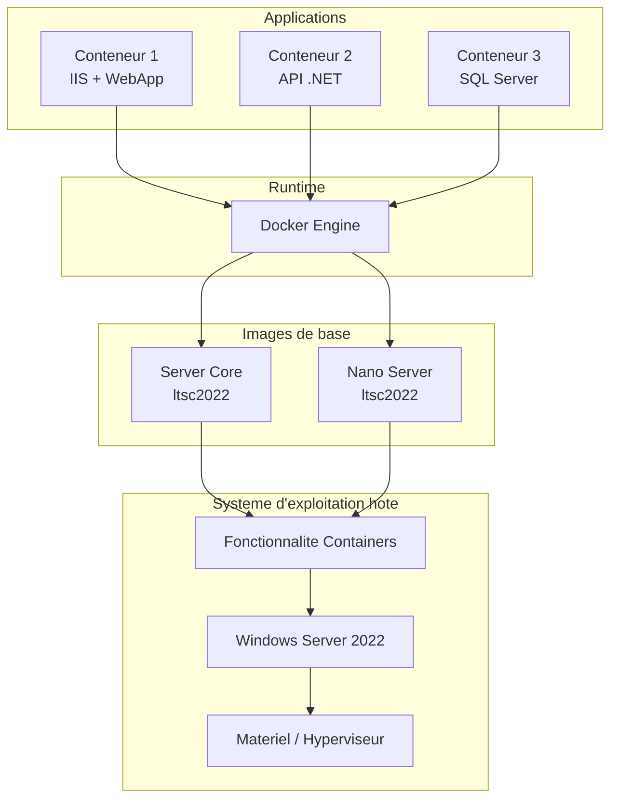

<!--
  Copyright 2026 Julien Bombled

  Licensed under the Apache License, Version 2.0 (the "License");
  you may not use this file except in compliance with the License.
  You may obtain a copy of the License at

      http://www.apache.org/licenses/LICENSE-2.0

  Unless required by applicable law or agreed to in writing, software
  distributed under the License is distributed on an "AS IS" BASIS,
  WITHOUT WARRANTIES OR CONDITIONS OF ANY KIND, either express or implied.
  See the License for the specific language governing permissions and
  limitations under the License.
-->
---
title: "Docker sur Windows Server"
description: "Installation et utilisation de Docker sur Windows Server 2022 : configuration, images, execution de conteneurs et creation de Dockerfiles."
tags:
  - virtualisation
  - conteneurs
  - docker
  - dockerfile
  - windows-server
---

# Docker sur Windows Server

<span class="level-intermediate">Intermediaire</span> · Temps estime : 35 minutes

Docker est le runtime de conteneurs le plus utilise. Sur Windows Server 2022, Docker permet de construire, distribuer et executer des applications conteneurisees avec les images Windows et Linux (via WSL2 ou des conteneurs Linux en mode isolation Hyper-V).

---

## Architecture des conteneurs Windows avec Docker



!!! example "Analogie"

    Docker, c'est comme un systeme de livraison standardise avec des boites en carton identiques. Peu importe ce qu'il y a dedans (une application .NET, un serveur web, une API), la boite a toujours la meme forme et les memes etiquettes. Le transporteur (Docker Engine) sait comment manipuler n'importe quelle boite sans avoir besoin de savoir ce qu'elle contient. Chaque boite contient tout ce dont l'application a besoin pour fonctionner — si ca tourne dans la boite de test, ca tournera de la meme facon en production.

## Installation de Docker

### Etape 1 : installer la fonctionnalite Containers

```powershell
# Install the Containers feature
Install-WindowsFeature -Name Containers -Restart
```

### Etape 2 : installer Docker Engine

```powershell
# Install the Docker provider
Install-Module -Name DockerMsftProvider -Repository PSGallery -Force

# Install Docker Engine
Install-Package -Name docker -ProviderName DockerMsftProvider -Force

# Restart to complete installation
Restart-Computer
```

### Etape 3 : verifier l'installation

```powershell
# Verify Docker is running
Get-Service docker | Select-Object Name, Status, StartType

# Start Docker if not running
Start-Service docker

# Verify Docker version
docker version

# Verify Docker info
docker info
```

Resultat :

```text
Name   Status  StartType
----   ------  ---------
docker Running Automatic

Client:
 Version:           24.0.9
 API version:       1.43
 OS/Arch:           windows/amd64
 Context:           default

Server: Docker Engine - Community
 Engine:
  Version:          24.0.9
  OS/Arch:          windows/amd64
  Isolation:        process

Server Version: 24.0.9
OS: Windows Server 2022 Datacenter
OSType: windows
Containers: 3
 Running: 2
 Paused: 0
 Stopped: 1
Images: 4
```

### Methode alternative : installation manuelle

```powershell
# Download Docker Engine directly
Invoke-WebRequest -UseBasicParsing "https://download.docker.com/components/engine/windows-server/24.0/docker-24.0.9.zip" -OutFile "$env:TEMP\docker.zip"

# Extract
Expand-Archive "$env:TEMP\docker.zip" -DestinationPath $env:ProgramFiles -Force

# Add to PATH
$env:Path += ";$env:ProgramFiles\docker"
[Environment]::SetEnvironmentVariable("Path", $env:Path, [EnvironmentVariableTarget]::Machine)

# Register and start the Docker service
dockerd --register-service
Start-Service docker
```

---

## Gestion des images

### Telecharger des images

```powershell
# Pull Windows Server Core image
docker pull mcr.microsoft.com/windows/servercore:ltsc2022

# Pull Nano Server image
docker pull mcr.microsoft.com/windows/nanoserver:ltsc2022

# Pull IIS image (based on Server Core)
docker pull mcr.microsoft.com/windows/servercore/iis:windowsservercore-ltsc2022

# Pull .NET Framework runtime
docker pull mcr.microsoft.com/dotnet/framework/runtime:4.8-windowsservercore-ltsc2022

# Pull .NET 8 ASP.NET runtime (Nano Server)
docker pull mcr.microsoft.com/dotnet/aspnet:8.0-nanoserver-ltsc2022
```

### Gerer les images locales

```powershell
# List local images
docker images

# Remove an image
docker rmi mcr.microsoft.com/windows/servercore:ltsc2022

# Remove unused images (dangling)
docker image prune

# Remove ALL unused images
docker image prune -a
```

---

## Executer des conteneurs

### Conteneur interactif

```powershell
# Run an interactive PowerShell container
docker run -it mcr.microsoft.com/windows/servercore:ltsc2022 powershell

# Inside the container:
# > hostname
# > Get-Process
# > exit
```

### Conteneur en arriere-plan

```powershell
# Run a container in detached mode with port mapping
docker run -d --name iis-web -p 8080:80 `
    mcr.microsoft.com/windows/servercore/iis:windowsservercore-ltsc2022

# Verify the container is running
docker ps

# Access the web server
# http://localhost:8080

# View container logs
docker logs iis-web

# Execute a command in a running container
docker exec -it iis-web powershell
```

### Redemarrage automatique

```powershell
# Run with automatic restart policy
docker run -d --name critical-app `
    --restart=always `
    -p 5000:5000 `
    mcr.microsoft.com/windows/servercore:ltsc2022

# Restart policies:
# --restart=no           : never restart (default)
# --restart=always       : always restart
# --restart=on-failure   : restart only on failure
# --restart=unless-stopped : restart unless explicitly stopped
```

---

## Creer un Dockerfile

Un Dockerfile definit les instructions pour construire une image personnalisee.

### Exemple : application IIS avec contenu personnalise

```dockerfile
# Use the official IIS image as base
FROM mcr.microsoft.com/windows/servercore/iis:windowsservercore-ltsc2022

# Set metadata
LABEL maintainer="admin@lab.local"
LABEL description="Custom IIS web application"

# Remove default IIS website content
RUN powershell -Command Remove-Item -Recurse C:\inetpub\wwwroot\*

# Copy application files
COPY ./webapp/ C:/inetpub/wwwroot/

# Expose port 80
EXPOSE 80

# Health check
HEALTHCHECK --interval=30s --timeout=10s --retries=3 \
    CMD powershell -Command "try { $response = Invoke-WebRequest -Uri http://localhost -UseBasicParsing; if ($response.StatusCode -eq 200) { exit 0 } else { exit 1 } } catch { exit 1 }"
```

### Exemple : application .NET Framework

```dockerfile
FROM mcr.microsoft.com/dotnet/framework/aspnet:4.8-windowsservercore-ltsc2022

# Copy published application
COPY ./publish/ C:/inetpub/wwwroot/

EXPOSE 80
```

### Exemple : application .NET 8 sur Nano Server

```dockerfile
FROM mcr.microsoft.com/dotnet/aspnet:8.0-nanoserver-ltsc2022

WORKDIR /app

# Copy published application
COPY ./publish/ .

# Set environment variables
ENV ASPNETCORE_URLS=http://+:5000
ENV ASPNETCORE_ENVIRONMENT=Production

EXPOSE 5000

ENTRYPOINT ["dotnet", "MyApp.dll"]
```

### Construire et executer

```powershell
# Build the image from the Dockerfile
docker build -t my-webapp:v1 .

# Run the container from the custom image
docker run -d --name my-app -p 8080:80 my-webapp:v1

# Tag for a registry
docker tag my-webapp:v1 myregistry.lab.local/my-webapp:v1

# Push to a private registry
docker push myregistry.lab.local/my-webapp:v1
```

Resultat :

```text
[+] Building 124.3s (8/8) FINISHED
 => [internal] load build definition from Dockerfile
 => [1/4] FROM mcr.microsoft.com/windows/servercore/iis:windowsservercore-ltsc2022
 => [2/4] RUN powershell -Command Remove-Item -Recurse C:\inetpub\wwwroot\*
 => [3/4] COPY ./webapp/ C:/inetpub/wwwroot/
 => exporting to image
 => => writing image sha256:a1b2c3d4e5f6...
 => => naming to docker.io/library/my-webapp:v1

a1b2c3d4e5f6a7b8c9d0e1f2a3b4c5d6e7f8a9b0c1d2e3f4a5b6c7d8e9f0a1b2

The push refers to repository [myregistry.lab.local/my-webapp]
v1: digest: sha256:a1b2c3d4e5f6... size: 4821
```

---

## Bonnes pratiques Dockerfile

### Optimiser la taille de l'image

```dockerfile
# BAD: creates multiple layers with temporary files
RUN Invoke-WebRequest -Uri https://example.com/installer.msi -OutFile installer.msi
RUN Start-Process msiexec -ArgumentList '/i installer.msi /quiet' -Wait
RUN Remove-Item installer.msi

# GOOD: single layer, temporary files cleaned up
RUN powershell -Command \
    Invoke-WebRequest -Uri https://example.com/installer.msi -OutFile installer.msi; \
    Start-Process msiexec -ArgumentList '/i installer.msi /quiet' -Wait; \
    Remove-Item installer.msi
```

### Utiliser le multi-stage build

```dockerfile
# Stage 1: Build
FROM mcr.microsoft.com/dotnet/sdk:8.0-nanoserver-ltsc2022 AS build
WORKDIR /src
COPY . .
RUN dotnet publish -c Release -o /app

# Stage 2: Runtime (smaller image)
FROM mcr.microsoft.com/dotnet/aspnet:8.0-nanoserver-ltsc2022
WORKDIR /app
COPY --from=build /app .
ENTRYPOINT ["dotnet", "MyApp.dll"]
```

---

## Docker Compose

Docker Compose permet de definir des applications multi-conteneurs.

```yaml
# docker-compose.yml
version: '3.8'

services:
  web:
    image: mcr.microsoft.com/windows/servercore/iis:windowsservercore-ltsc2022
    ports:
      - "8080:80"
    volumes:
      - ./webapp:/inetpub/wwwroot
    restart: always
    networks:
      - app-network

  api:
    build: ./api
    ports:
      - "5000:5000"
    environment:
      - DB_CONNECTION=Server=db;Database=AppDb;
    restart: always
    networks:
      - app-network

networks:
  app-network:
    driver: nat
```

```powershell
# Start all services
docker compose up -d

# View running services
docker compose ps

# View logs
docker compose logs -f

# Stop all services
docker compose down
```

Resultat :

```text
[+] Running 2/2
 ✔ Container web  Started    0.8s
 ✔ Container api  Started    1.2s

NAME    IMAGE                                    COMMAND           SERVICE  CREATED         STATUS
web     mcr.microsoft.com/windows/servercore...  "C:\\ServiceMoni..."  web      2 minutes ago   Up 2 minutes
api     myregistry.lab.local/my-webapp:v1        "dotnet MyApp.dll"   api      2 minutes ago   Up 2 minutes

web  | 2026-02-20T10:15:42.123Z [INFO] Application started.
api  | 2026-02-20T10:15:43.456Z [INFO] Listening on http://+:5000
```

---

## Nettoyage et maintenance

```powershell
# Remove stopped containers
docker container prune

# Remove unused images
docker image prune -a

# Remove unused volumes
docker volume prune

# Remove everything unused (containers, images, volumes, networks)
docker system prune -a

# View disk usage by Docker
docker system df
```

---

## Depannage

### Problemes courants

| Probleme | Cause | Solution |
|----------|-------|----------|
| Image pull echoue | Version de l'image incompatible | Verifier la compatibilite LTSC |
| Conteneur redemarre en boucle | Erreur applicative | `docker logs <container>` |
| Port deja utilise | Conflit de port | Changer le mapping `-p` |
| Performances lentes | Conteneur sur disque lent | Utiliser un SSD pour Docker |
| Reseau inaccessible | Configuration NAT incorrecte | `docker network inspect nat` |

### Commandes de diagnostic

```powershell
# Inspect container details
docker inspect web-app

# View container resource usage
docker stats

# View Docker events in real-time
docker events

# Check Docker daemon logs
Get-EventLog -LogName Application -Source Docker -Newest 20
```

---

!!! example "Scenario pratique"

    **Contexte :** Romain est responsable des ops dans une startup. L'equipe de developpement livre une nouvelle version de leur application web ASP.NET 8 chaque semaine. Actuellement, le deploiement se fait manuellement par FTP, ce qui prend 45 minutes et necessite un arret de service. L'application tourne sur `SRV-01`.

    **Probleme :** Les deploiements manuels sont longs, risques (oubli de fichiers, erreurs de configuration) et coupent le service.

    **Solution :** Romain conteneurise l'application avec un Dockerfile et met en place un workflow Docker :

    ```dockerfile
    # Dockerfile (multi-stage build)
    FROM mcr.microsoft.com/dotnet/sdk:8.0-nanoserver-ltsc2022 AS build
    WORKDIR /src
    COPY . .
    RUN dotnet publish -c Release -o /app

    FROM mcr.microsoft.com/dotnet/aspnet:8.0-nanoserver-ltsc2022
    WORKDIR /app
    COPY --from=build /app .
    ENV ASPNETCORE_URLS=http://+:5000
    EXPOSE 5000
    ENTRYPOINT ["dotnet", "WebApp.dll"]
    ```

    ```powershell
    # Build the new version
    docker build -t myregistry.lab.local/webapp:v2.3 .
    ```

    ```text
    [+] Building 43.2s (10/10) FINISHED
     => [build 4/4] RUN dotnet publish -c Release -o /app
     => [runtime 3/3] COPY --from=build /app .
     => naming to myregistry.lab.local/webapp:v2.3
    ```

    ```powershell
    # Stop the current container and start the new one (zero configuration drift)
    docker stop webapp-prod
    docker rm webapp-prod
    docker run -d --name webapp-prod `
        --restart=always `
        -p 5000:5000 `
        -v "D:\AppLogs:C:\app\logs" `
        myregistry.lab.local/webapp:v2.3
    ```

    ```text
    a3b4c5d6e7f8a9b0c1d2e3f4a5b6c7d8e9f0a1b2c3d4e5f6a7b8c9d0e1f2a3b4

    # Verify the new version is running
    docker ps --format "table {{.Names}}\t{{.Image}}\t{{.Status}}"
    ```

    ```text
    NAMES        IMAGE                                STATUS
    webapp-prod  myregistry.lab.local/webapp:v2.3     Up 8 seconds
    ```

    Le deploiement complet prend maintenant moins de 2 minutes et le risque d'erreur humaine est pratiquement elimine. En cas de probleme, Romain peut revenir a la version precedente en une commande : `docker run ... webapp:v2.2`.

!!! danger "Erreurs courantes"

    **Image Windows incompatible avec l'hote** — Une image construite sur Windows Server 2019 (`ltsc2019`) peut ne pas fonctionner en mode process isolation sur un hote Windows Server 2022 (`ltsc2022`). Utilisez toujours le tag correspondant a votre version d'hote (`ltsc2022`) ou l'isolation Hyper-V.

    **Donnees perdues au `docker rm`** — Tout ce qui est ecrit dans le systeme de fichiers du conteneur est detruit a la suppression. Montez un volume (`-v`) pour tout ce qui doit persister : logs, uploads, bases SQLite.

    **Service Docker ne redemarre pas apres reboot** — Si `StartType` du service Docker n'est pas `Automatic`, Docker ne redemarrera pas apres un reboot du serveur. Verifiez avec `Get-Service docker` et corrigez avec `Set-Service docker -StartupType Automatic`.

    **`docker system prune -a` en production** — Cette commande supprime toutes les images non utilisees par un conteneur actif, y compris les images d'une version precedente que vous vouliez garder comme rollback. En production, soyez selectif et utilisez `docker image prune` avec des filtres.

    **Construire sans `.dockerignore`** — Sans `.dockerignore`, `docker build` inclut dans le contexte tous les fichiers du repertoire (node_modules, `.git`, secrets...), ralentissant considerablement le build et risquant d'inclure des donnees sensibles dans l'image.

## Points cles a retenir

- Docker s'installe via le module **DockerMsftProvider** ou manuellement sur Windows Server 2022
- Les images Windows proviennent du **Microsoft Container Registry** (mcr.microsoft.com)
- Les **Dockerfiles** definissent la construction reproductible d'images personnalisees
- Le **multi-stage build** reduit la taille des images en separant la compilation du runtime
- **Docker Compose** orchestre les applications multi-conteneurs
- Les politiques de **redemarrage automatique** assurent la disponibilite des conteneurs

---

## Pour aller plus loin

- Conteneurs Windows : modes d'isolation (voir la page [Conteneurs Windows](windows-containers.md))
- Docker Hub et Microsoft Container Registry
- Microsoft : Docker on Windows Server documentation
- Docker : Dockerfile reference

