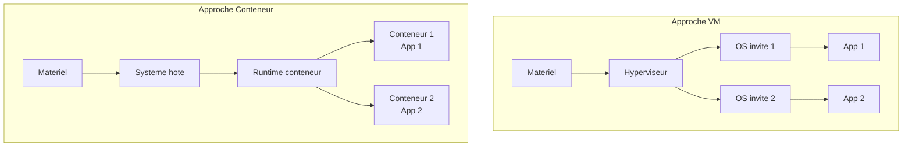
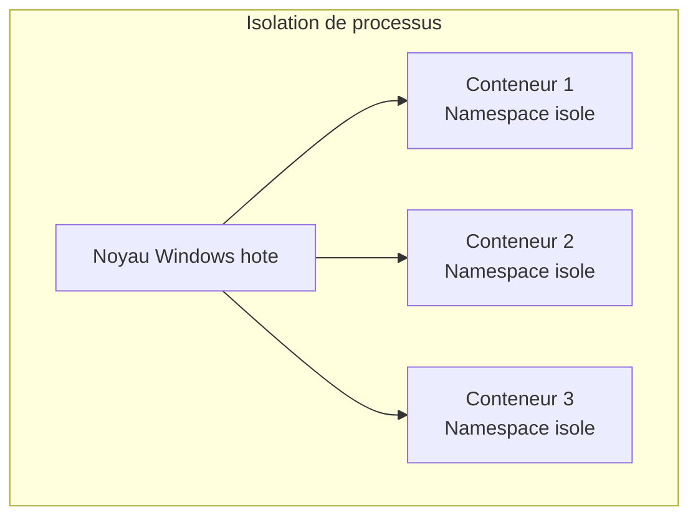
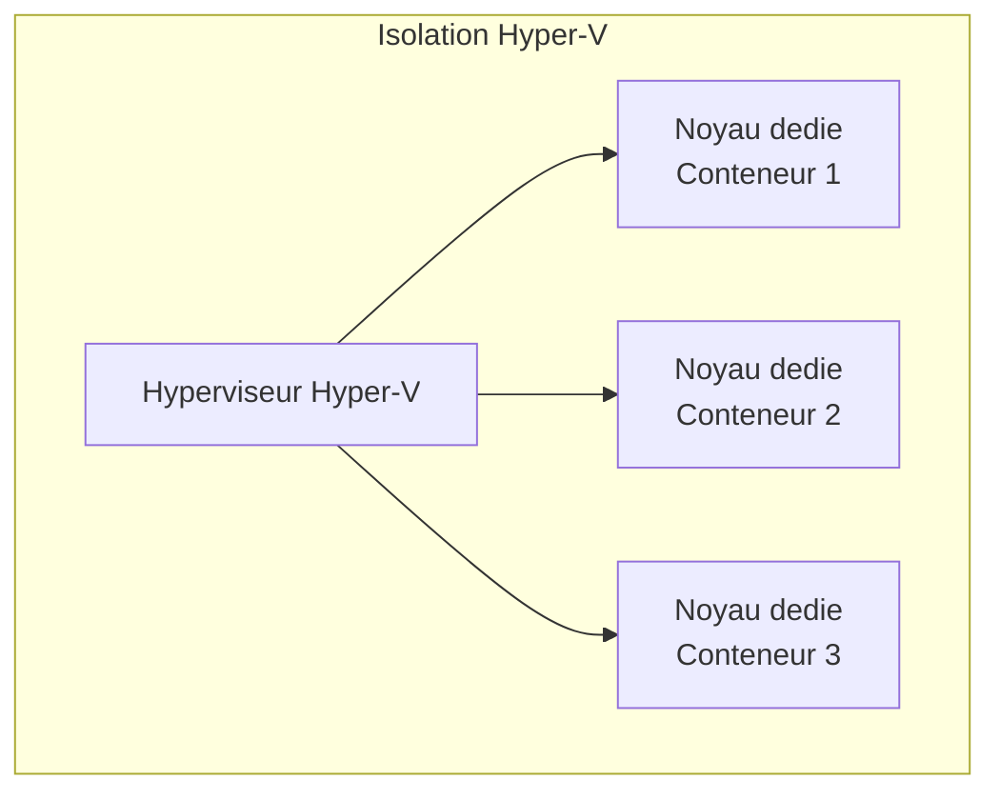
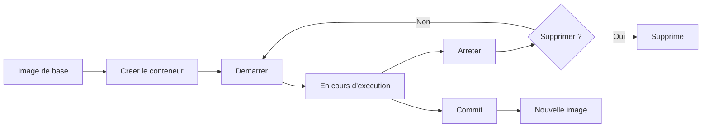

<!--
  Copyright 2026 Julien Bombled

  Licensed under the Apache License, Version 2.0 (the "License");
  you may not use this file except in compliance with the License.
  You may obtain a copy of the License at

      http://www.apache.org/licenses/LICENSE-2.0

  Unless required by applicable law or agreed to in writing, software
  distributed under the License is distributed on an "AS IS" BASIS,
  WITHOUT WARRANTIES OR CONDITIONS OF ANY KIND, either express or implied.
  See the License for the specific language governing permissions and
  limitations under the License.
-->

# Conteneurs Windows

<span class="level-intermediate">Intermediaire</span> · Temps estime : 30 minutes

Les conteneurs Windows permettent d'executer des applications dans des environnements isoles et legers, sans la surcharge d'une machine virtuelle complete. Windows Server 2022 supporte les conteneurs nativement avec deux modes d'isolation.

---

!!! example "Analogie"

    Un conteneur, c'est comme une chambre dans un hotel. Chaque chambre est isolee, avec sa propre cle, sa propre decoration et ses propres affaires — mais elles partagent toutes le meme batiment, le meme ascenseur, la meme electricite. Si vous avez besoin d'un isolement total (une maison entiere), vous prenez une VM — mais cela coute plus cher et prend plus de temps a preparer. Le conteneur, c'est la chambre d'hotel : rapide a preparer, efficace pour l'usage prevu, et des dizaines peuvent coexister dans le meme immeuble.

## Qu'est-ce qu'un conteneur ?

Un conteneur est une instance isolee d'un systeme d'exploitation qui partage le noyau de l'hote. Contrairement a une VM, il ne virtualise pas le materiel mais isole les processus, le systeme de fichiers et le reseau.



| Aspect | Machine virtuelle | Conteneur |
|--------|-------------------|-----------|
| **Isolation** | Complete (materiel virtualise) | Processus et systeme de fichiers |
| **Taille** | Gigaoctets | Megaoctets a quelques Go |
| **Demarrage** | Minutes | Secondes |
| **Overhead** | Eleve (OS complet) | Faible (partage du noyau) |
| **Densite** | Dizaines par hote | Centaines par hote |

---

## Modes d'isolation

### Isolation de processus (Process Isolation)

Le conteneur partage le noyau Windows de l'hote. C'est le mode par defaut sur Windows Server.



| Avantage | Inconvenient |
|----------|-------------|
| Demarrage tres rapide | Moins isole (noyau partage) |
| Faible consommation de ressources | La version du noyau doit correspondre |
| Haute densite de conteneurs | Securite moindre qu'Hyper-V isolation |

### Isolation Hyper-V (Hyper-V Isolation)

Chaque conteneur s'execute dans une VM ultra-legere avec son propre noyau.



| Avantage | Inconvenient |
|----------|-------------|
| Isolation complete (noyau dedie) | Plus de ressources consommees |
| Compatible toutes versions de noyau | Demarrage plus lent |
| Securite renforcee | Densite reduite |

!!! tip "Quand utiliser Hyper-V Isolation"

    - Multi-tenancy (conteneurs de differents clients sur le meme hote)
    - Code non approuve ou non fiable
    - Conteneurs necessitant une version de noyau differente de l'hote
    - Exigences de securite elevees

---

## Images de base Windows

Les conteneurs Windows se construisent a partir d'images de base fournies par Microsoft :

| Image | Taille | Utilisation |
|-------|--------|-------------|
| **Windows Server Core** | ~2-3 Go | Applications .NET Framework, services Windows |
| **Nano Server** | ~250 Mo | Applications .NET Core/6+, microservices |
| **Windows** | ~6+ Go | Applications necessitant l'interface graphique (rare) |
| **Windows Server** | ~4+ Go | Compatibilite maximale avec les applications legacy |

```powershell
# Pull base images from Microsoft Container Registry
docker pull mcr.microsoft.com/windows/servercore:ltsc2022
docker pull mcr.microsoft.com/windows/nanoserver:ltsc2022

# List available images locally
docker images
```

Resultat :

```text
ltsc2022: Pulling from windows/servercore
Digest: sha256:4a7d2d7e8f3c1b9a6e5f0d2c8b3a4e7f...
Status: Downloaded newer image for mcr.microsoft.com/windows/servercore:ltsc2022

REPOSITORY                                    TAG       IMAGE ID       CREATED        SIZE
mcr.microsoft.com/windows/servercore          ltsc2022  a1b2c3d4e5f6   3 weeks ago    2.79GB
mcr.microsoft.com/windows/nanoserver          ltsc2022  b2c3d4e5f6a7   3 weeks ago    277MB
```

!!! tip "Nano Server"

    Privilegiez **Nano Server** pour les nouvelles applications (.NET 6+, Node.js, Python). Sa taille reduite offre une surface d'attaque minimale et des temps de deploiement rapides.

---

## Cycle de vie d'un conteneur



### Commandes de base

```powershell
# Create and start a container
docker run -d --name web-app -p 8080:80 mcr.microsoft.com/windows/servercore:ltsc2022

# List running containers
docker ps

# List all containers (including stopped)
docker ps -a

# Stop a container
docker stop web-app

# Start a stopped container
docker start web-app

# Execute a command inside a running container
docker exec -it web-app powershell

# View container logs
docker logs web-app

# Remove a container
docker rm web-app

# Remove a container forcefully (even if running)
docker rm -f web-app
```

### Isolation Hyper-V

```powershell
# Run a container with Hyper-V isolation
docker run -d --name secure-app --isolation=hyperv `
    mcr.microsoft.com/windows/servercore:ltsc2022

# Check isolation mode of a running container
docker inspect --format='{{.HostConfig.Isolation}}' secure-app
```

Resultat :

```text
c7d8e9f0a1b2c3d4e5f6a7b8c9d0e1f2a3b4c5d6e7f8a9b0c1d2e3f4a5b6c7d8

hyperv
```

---

## Reseau de conteneurs

Windows Server supporte plusieurs pilotes reseau pour les conteneurs :

| Pilote | Description |
|--------|-------------|
| **nat** | NAT par defaut, conteneurs acces Internet via l'hote |
| **transparent** | Conteneur sur le meme sous-reseau que l'hote |
| **overlay** | Reseau entre conteneurs sur differents hotes (Docker Swarm) |
| **l2bridge** | Pontage L2, meme sous-reseau que l'hote |

```powershell
# List container networks
docker network ls

# Create a custom NAT network
docker network create -d nat --subnet=172.20.0.0/24 --gateway=172.20.0.1 custom-nat

# Run a container on the custom network
docker run -d --name app1 --network custom-nat `
    mcr.microsoft.com/windows/servercore:ltsc2022

# Inspect a network
docker network inspect nat
```

---

## Volumes et persistance

Les donnees dans un conteneur sont ephemeres : elles disparaissent a la suppression du conteneur. Les volumes permettent de persister les donnees.

```powershell
# Create a named volume
docker volume create app-data

# Run a container with a volume mount
docker run -d --name db-app `
    -v app-data:C:\data `
    mcr.microsoft.com/windows/servercore:ltsc2022

# Bind mount (mount a host directory)
docker run -d --name web-app `
    -v "D:\WebContent:C:\inetpub\wwwroot" `
    mcr.microsoft.com/windows/servercore:ltsc2022

# List volumes
docker volume ls
```

---

## Gestion des ressources

```powershell
# Run a container with resource limits
docker run -d --name limited-app `
    --cpus=2 `
    --memory=2g `
    mcr.microsoft.com/windows/servercore:ltsc2022

# View resource usage
docker stats --no-stream
```

---

!!! example "Scenario pratique"

    **Contexte :** Lucas est developpeur .NET dans une equipe qui livre deux applications web : une ancienne application `.NET Framework 4.8` (qui necessite Windows Server Core) et une nouvelle API `.NET 8` (qui tourne sur Nano Server). Les deux doivent coexister sur le meme serveur `SRV-01` (Windows Server 2022).

    **Probleme :** Sans conteneurs, les deux applications partagent les memes pools IIS et peuvent interferer. Avec des VMs, le cout en ressources est trop eleve pour ce besoin.

    **Solution :** Lucas deploie chaque application dans son propre conteneur :

    ```powershell
    # Step 1: Run the legacy .NET Framework app (Server Core, process isolation)
    docker run -d --name legacy-app `
        -p 8080:80 `
        --isolation=process `
        mcr.microsoft.com/dotnet/framework/aspnet:4.8-windowsservercore-ltsc2022
    ```

    ```text
    Unable to find image 'mcr.microsoft.com/dotnet/framework/aspnet:4.8-windowsservercore-ltsc2022' locally
    4.8-windowsservercore-ltsc2022: Pulling from dotnet/framework/aspnet
    ...
    Status: Downloaded newer image
    d1e2f3a4b5c6d7e8f9a0b1c2d3e4f5a6b7c8d9e0f1a2b3c4
    ```

    ```powershell
    # Step 2: Run the .NET 8 API (Nano Server, process isolation)
    docker run -d --name modern-api `
        -p 5000:5000 `
        --isolation=process `
        mcr.microsoft.com/dotnet/aspnet:8.0-nanoserver-ltsc2022
    ```

    ```powershell
    # Step 3: Verify both containers are running
    docker ps --format "table {{.Names}}\t{{.Image}}\t{{.Status}}\t{{.Ports}}"
    ```

    ```text
    NAMES         IMAGE                                                    STATUS          PORTS
    modern-api    mcr.microsoft.com/dotnet/aspnet:8.0-nanoserver-ltsc2022  Up 2 minutes    0.0.0.0:5000->5000/tcp
    legacy-app    mcr.microsoft.com/dotnet/framework/aspnet:4.8-...        Up 3 minutes    0.0.0.0:8080->80/tcp
    ```

    ```powershell
    # Step 4: Check resource usage
    docker stats --no-stream
    ```

    ```text
    CONTAINER     CPU %   MEM USAGE / LIMIT   MEM %
    modern-api    0.02%   182MiB / 16GiB      1.11%
    legacy-app    0.05%   412MiB / 16GiB      2.51%
    ```

    Les deux applications coexistent sur le meme hote, completement isolees, en consommant ensemble moins de 600 Mo de RAM — soit bien moins qu'une VM supplementaire.

!!! danger "Erreurs courantes"

    **Incompatibilite de version du noyau** — En mode Process Isolation, la version du noyau Windows de l'image doit correspondre a celle de l'hote (meme build ou version compatible). Si vous tirez une image `ltsc2019` sur un hote `ltsc2022` en mode process, le conteneur peut refuser de demarrer. Utilisez Hyper-V Isolation pour contourner cette contrainte.

    **Donnees dans le conteneur sans volume** — Toutes les donnees ecrites dans le systeme de fichiers d'un conteneur sont perdues a sa suppression. Pour toute donnee persistante (logs, bases de donnees, uploads), montez toujours un volume ou un bind mount.

    **Port deja utilise sur l'hote** — Si le port hote est deja occupe (par IIS, un autre conteneur ou un service), le `docker run` echoue avec "port already in use". Verifiez avec `netstat -ano | findstr :8080` avant de lancer.

    **Conteneur arrete vs conteneur supprime** — `docker stop` arrete le conteneur mais le conserve. `docker rm` le supprime definitivement. `docker ps` ne montre que les conteneurs en cours d'execution. Utilisez `docker ps -a` pour voir tous les conteneurs, y compris les arretes.

    **Image trop volumineuse** — Windows Server Core pese pres de 3 Go et l'image complète Windows depasse 6 Go. Pour les nouvelles applications, privilegiez Nano Server (277 Mo). La taille de l'image impacte directement le temps de deploiement et l'espace disque du registre.

## Points cles a retenir

- Les conteneurs Windows offrent une **isolation legere** avec un demarrage en secondes
- **Process Isolation** : partage du noyau hote, haute performance, mode par defaut sur Windows Server
- **Hyper-V Isolation** : noyau dedie par conteneur, securite renforcee, necessaire pour le multi-tenancy
- **Nano Server** est l'image de base recommandee pour les nouvelles applications (.NET 6+)
- **Server Core** est necessaire pour les applications .NET Framework et les services Windows classiques
- Les volumes sont indispensables pour la **persistance des donnees**
- Le mode d'isolation se choisit au moment du `docker run` avec `--isolation`

---

## Pour aller plus loin

- Docker sur Windows Server (voir la page [Docker sur Windows](docker-sur-windows.md))
- Microsoft : Windows container documentation
- Microsoft : Container base images

