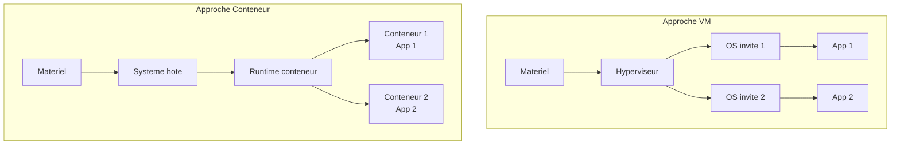
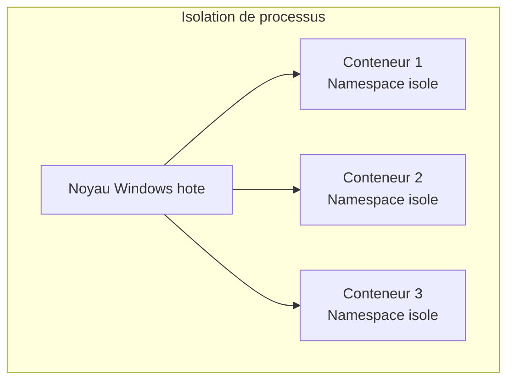
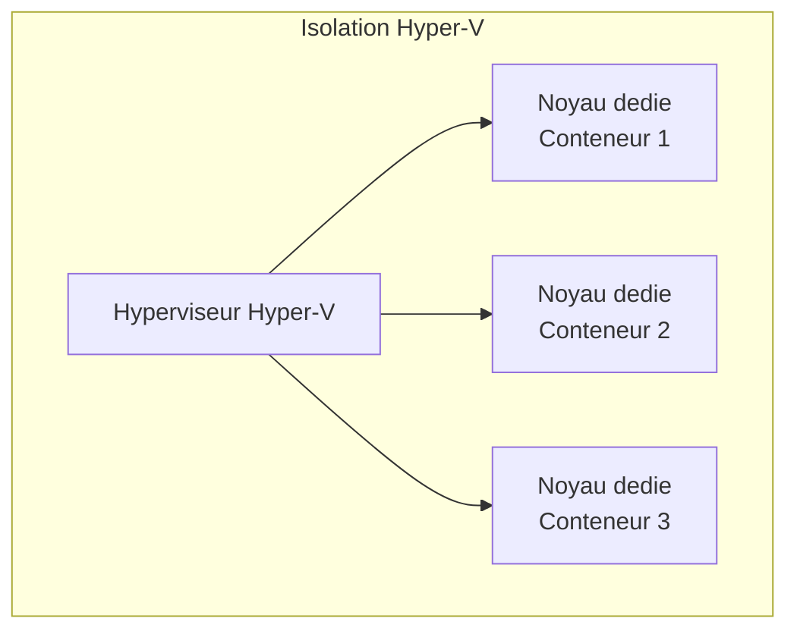
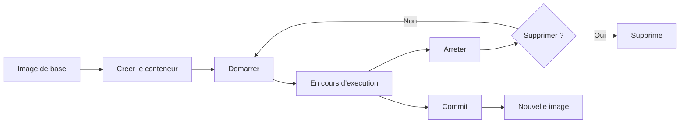

# Conteneurs Windows

<span class="level-intermediate">Intermediaire</span> · Temps estime : 30 minutes

Les conteneurs Windows permettent d'executer des applications dans des environnements isoles et legers, sans la surcharge d'une machine virtuelle complete. Windows Server 2022 supporte les conteneurs nativement avec deux modes d'isolation.

---

## Qu'est-ce qu'un conteneur ?

Un conteneur est une instance isolee d'un systeme d'exploitation qui partage le noyau de l'hote. Contrairement a une VM, il ne virtualise pas le materiel mais isole les processus, le systeme de fichiers et le reseau.



| Aspect | Machine virtuelle | Conteneur |
|--------|-------------------|-----------|
| **Isolation** | Complete (materiel virtualise) | Processus et systeme de fichiers |
| **Taille** | Gigaoctets | Megaoctets a quelques Go |
| **Demarrage** | Minutes | Secondes |
| **Overhead** | Eleve (OS complet) | Faible (partage du noyau) |
| **Densite** | Dizaines par hote | Centaines par hote |

---

## Modes d'isolation

### Isolation de processus (Process Isolation)

Le conteneur partage le noyau Windows de l'hote. C'est le mode par defaut sur Windows Server.



| Avantage | Inconvenient |
|----------|-------------|
| Demarrage tres rapide | Moins isole (noyau partage) |
| Faible consommation de ressources | La version du noyau doit correspondre |
| Haute densite de conteneurs | Securite moindre qu'Hyper-V isolation |

### Isolation Hyper-V (Hyper-V Isolation)

Chaque conteneur s'execute dans une VM ultra-legere avec son propre noyau.



| Avantage | Inconvenient |
|----------|-------------|
| Isolation complete (noyau dedie) | Plus de ressources consommees |
| Compatible toutes versions de noyau | Demarrage plus lent |
| Securite renforcee | Densite reduite |

!!! tip "Quand utiliser Hyper-V Isolation"

    - Multi-tenancy (conteneurs de differents clients sur le meme hote)
    - Code non approuve ou non fiable
    - Conteneurs necessitant une version de noyau differente de l'hote
    - Exigences de securite elevees

---

## Images de base Windows

Les conteneurs Windows se construisent a partir d'images de base fournies par Microsoft :

| Image | Taille | Utilisation |
|-------|--------|-------------|
| **Windows Server Core** | ~2-3 Go | Applications .NET Framework, services Windows |
| **Nano Server** | ~250 Mo | Applications .NET Core/6+, microservices |
| **Windows** | ~6+ Go | Applications necessitant l'interface graphique (rare) |
| **Windows Server** | ~4+ Go | Compatibilite maximale avec les applications legacy |

```powershell
# Pull base images from Microsoft Container Registry
docker pull mcr.microsoft.com/windows/servercore:ltsc2022
docker pull mcr.microsoft.com/windows/nanoserver:ltsc2022

# List available images locally
docker images
```

!!! tip "Nano Server"

    Privilegiez **Nano Server** pour les nouvelles applications (.NET 6+, Node.js, Python). Sa taille reduite offre une surface d'attaque minimale et des temps de deploiement rapides.

---

## Cycle de vie d'un conteneur



### Commandes de base

```powershell
# Create and start a container
docker run -d --name web-app -p 8080:80 mcr.microsoft.com/windows/servercore:ltsc2022

# List running containers
docker ps

# List all containers (including stopped)
docker ps -a

# Stop a container
docker stop web-app

# Start a stopped container
docker start web-app

# Execute a command inside a running container
docker exec -it web-app powershell

# View container logs
docker logs web-app

# Remove a container
docker rm web-app

# Remove a container forcefully (even if running)
docker rm -f web-app
```

### Isolation Hyper-V

```powershell
# Run a container with Hyper-V isolation
docker run -d --name secure-app --isolation=hyperv `
    mcr.microsoft.com/windows/servercore:ltsc2022

# Check isolation mode of a running container
docker inspect --format='{{.HostConfig.Isolation}}' secure-app
```

---

## Reseau de conteneurs

Windows Server supporte plusieurs pilotes reseau pour les conteneurs :

| Pilote | Description |
|--------|-------------|
| **nat** | NAT par defaut, conteneurs acces Internet via l'hote |
| **transparent** | Conteneur sur le meme sous-reseau que l'hote |
| **overlay** | Reseau entre conteneurs sur differents hotes (Docker Swarm) |
| **l2bridge** | Pontage L2, meme sous-reseau que l'hote |

```powershell
# List container networks
docker network ls

# Create a custom NAT network
docker network create -d nat --subnet=172.20.0.0/24 --gateway=172.20.0.1 custom-nat

# Run a container on the custom network
docker run -d --name app1 --network custom-nat `
    mcr.microsoft.com/windows/servercore:ltsc2022

# Inspect a network
docker network inspect nat
```

---

## Volumes et persistance

Les donnees dans un conteneur sont ephemeres : elles disparaissent a la suppression du conteneur. Les volumes permettent de persister les donnees.

```powershell
# Create a named volume
docker volume create app-data

# Run a container with a volume mount
docker run -d --name db-app `
    -v app-data:C:\data `
    mcr.microsoft.com/windows/servercore:ltsc2022

# Bind mount (mount a host directory)
docker run -d --name web-app `
    -v "D:\WebContent:C:\inetpub\wwwroot" `
    mcr.microsoft.com/windows/servercore:ltsc2022

# List volumes
docker volume ls
```

---

## Gestion des ressources

```powershell
# Run a container with resource limits
docker run -d --name limited-app `
    --cpus=2 `
    --memory=2g `
    mcr.microsoft.com/windows/servercore:ltsc2022

# View resource usage
docker stats --no-stream
```

---

## Points cles a retenir

- Les conteneurs Windows offrent une **isolation legere** avec un demarrage en secondes
- **Process Isolation** : partage du noyau hote, haute performance, mode par defaut sur Windows Server
- **Hyper-V Isolation** : noyau dedie par conteneur, securite renforcee, necessaire pour le multi-tenancy
- **Nano Server** est l'image de base recommandee pour les nouvelles applications (.NET 6+)
- **Server Core** est necessaire pour les applications .NET Framework et les services Windows classiques
- Les volumes sont indispensables pour la **persistance des donnees**
- Le mode d'isolation se choisit au moment du `docker run` avec `--isolation`

---

## Pour aller plus loin

- Docker sur Windows Server (voir la page [Docker sur Windows](docker-sur-windows.md))
- Microsoft : Windows container documentation
- Microsoft : Container base images
