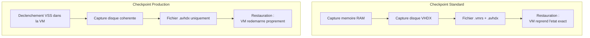
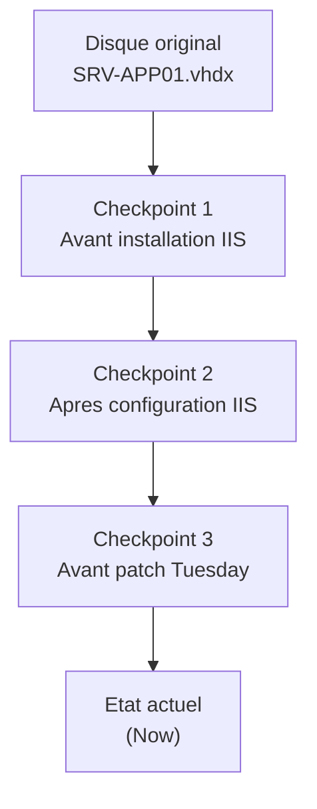

# Checkpoints

<span class="level-intermediate">Intermediaire</span> · Temps estime : 25 minutes

Les checkpoints (anciennement appeles snapshots) capturent l'etat d'une machine virtuelle a un instant donne. Ils permettent de revenir rapidement a un etat anterieur, ce qui est particulierement utile avant des modifications risquees.

---

## Standard vs Production

Hyper-V propose deux types de checkpoints :

| Critere | Standard | Production |
|---------|----------|------------|
| **Contenu sauvegarde** | Etat memoire + disque + configuration | Disque + configuration (pas la memoire) |
| **Coherence** | Etat exact de la memoire (saved state) | Coherence applicative via VSS |
| **Sauvegarde** | Capture instantanee | Utilise VSS dans la VM invitee |
| **Reprise** | VM reprend exactement ou elle etait | VM redemarrre comme apres un arret propre |
| **Usage recommande** | Developpement, test | **Production** |



!!! tip "Recommandation"

    Utilisez toujours les checkpoints **Production** en environnement de production. Les checkpoints Standard sont reserves aux environnements de developpement et de test.

### Configurer le type de checkpoint

```powershell
# Set checkpoint type to Production (recommended)
Set-VM -Name "SRV-APP01" -CheckpointType Production

# Set checkpoint type to Standard (dev/test only)
Set-VM -Name "SRV-TEST01" -CheckpointType Standard

# Disable checkpoints entirely
Set-VM -Name "SRV-SQL01" -CheckpointType Disabled

# Verify configuration
Get-VM -Name "SRV-APP01" | Select-Object Name, CheckpointType
```

---

## Creer un checkpoint

```powershell
# Create a checkpoint with a descriptive name
Checkpoint-VM -Name "SRV-APP01" -SnapshotName "Avant mise a jour KB5034567"

# Create a checkpoint on multiple VMs
$vms = @("SRV-APP01", "SRV-APP02", "SRV-WEB01")
foreach ($vm in $vms) {
    Checkpoint-VM -Name $vm -SnapshotName "Pre-patch $(Get-Date -Format 'yyyy-MM-dd')"
}
```

### Ce qui est cree sur le disque

Lors de la creation d'un checkpoint, Hyper-V :

1. **Gele le VHDX** d'origine en lecture seule
2. Cree un **fichier AVHDX** (Automatic VHD) qui recoit toutes les nouvelles ecritures
3. Sauvegarde la **configuration** de la VM
4. Pour les checkpoints Standard : sauvegarde aussi l'**etat memoire** (fichier .vmrs)

```powershell
# View checkpoint files on disk
Get-ChildItem "D:\Hyper-V\Virtual Hard Disks" -Filter "*.avhdx" |
    Select-Object Name, Length, LastWriteTime
```

---

## Appliquer (restaurer) un checkpoint

```powershell
# List all checkpoints for a VM
Get-VMCheckpoint -VMName "SRV-APP01" |
    Select-Object Name, CreationTime, ParentCheckpointName |
    Format-Table -AutoSize

# Apply (restore) a specific checkpoint
$checkpoint = Get-VMCheckpoint -VMName "SRV-APP01" -Name "Avant mise a jour KB5034567"
Restore-VMCheckpoint -VMCheckpoint $checkpoint -Confirm:$false

# Start the VM after restoration
Start-VM -Name "SRV-APP01"
```

!!! danger "Perte de donnees"

    L'application d'un checkpoint **ecrase toutes les modifications** effectuees depuis la creation du checkpoint. Toutes les donnees, configurations et mises a jour realisees apres le checkpoint seront perdues.

---

## Supprimer un checkpoint

La suppression d'un checkpoint fusionne les fichiers AVHDX avec le disque parent, liberant l'espace de stockage.

```powershell
# Delete a specific checkpoint
Remove-VMCheckpoint -VMName "SRV-APP01" -Name "Avant mise a jour KB5034567"

# Delete all checkpoints for a VM
Get-VMCheckpoint -VMName "SRV-APP01" | Remove-VMCheckpoint

# Note: the merge operation happens in the background
# Monitor the merge with:
Get-VM -Name "SRV-APP01" | Select-Object Name, Status
# Status will show "Merging Disks" during the operation
```

!!! warning "Impact de la fusion"

    La fusion des AVHDX peut prendre du temps et generer des I/O significatives, surtout si le checkpoint a accumule beaucoup de modifications. Planifiez la suppression en dehors des heures de pointe.

---

## Arborescence de checkpoints

Les checkpoints peuvent etre imbriques, formant une arborescence :



```powershell
# View the checkpoint tree
Get-VMCheckpoint -VMName "SRV-APP01" |
    Select-Object Name, CreationTime, ParentCheckpointName |
    Format-Table -AutoSize

# Each checkpoint creates an AVHDX file in the chain
# Reading a file requires traversing the entire chain
# -> More checkpoints = more latency I/O
```

---

## Quand utiliser les checkpoints

### Cas d'usage adaptes

| Scenario | Type recommande |
|----------|----------------|
| Avant une mise a jour Windows | Production |
| Avant un changement de configuration | Production |
| Test d'un script en environnement de test | Standard |
| Avant une migration applicative | Production |
| Developpement et experimentation | Standard |

### Cas ou NE PAS utiliser de checkpoints

| Scenario | Raison | Alternative |
|----------|--------|-------------|
| **Sauvegarde reguliere** | Pas de protection hors-site, pas de retention | Solution de backup dediee |
| **Stockage long terme** | Degradation des performances I/O | Export de VM |
| **Controleurs de domaine** | Risque de USN rollback et corruption AD | Backup Windows Server Backup |
| **Serveurs SQL en production** | Incoherence des bases de donnees | Backup SQL natif |

!!! danger "Controleurs de domaine"

    N'utilisez **jamais** de checkpoints Standard sur un controleur de domaine. La restauration d'un etat memoire anterieur provoque un **USN rollback** qui corrompt la replication Active Directory. Les checkpoints Production (VSS-aware) sont toleres mais un backup AD dedie reste preferable.

---

## Bonnes pratiques

```powershell
# Audit: find VMs with old checkpoints (more than 7 days)
$threshold = (Get-Date).AddDays(-7)

Get-VM | ForEach-Object {
    Get-VMCheckpoint -VMName $_.Name -ErrorAction SilentlyContinue
} | Where-Object { $_.CreationTime -lt $threshold } |
    Select-Object VMName, Name, CreationTime,
        @{N='Age (days)';E={((Get-Date) - $_.CreationTime).Days}} |
    Format-Table -AutoSize
```

- **Nommez** les checkpoints de maniere descriptive (pas "Checkpoint 1")
- **Supprimez** les checkpoints des que la modification est validee
- **Limitez** le nombre de checkpoints a 2-3 maximum par VM
- **Ne conservez jamais** un checkpoint plus de quelques jours
- **Surveillez** l'espace disque consomme par les fichiers AVHDX

---

## Points cles a retenir

- Les checkpoints **Production** (VSS) sont recommandes pour tous les environnements hors developpement
- Les checkpoints **Standard** capturent la memoire et sont reserves au test/dev
- Les checkpoints ne sont **pas** une solution de sauvegarde : utilisez un outil de backup dedie
- Chaque checkpoint cree un fichier **AVHDX** qui degrade les performances I/O proportionnellement au nombre de checkpoints
- **Ne jamais** utiliser de checkpoints Standard sur des controleurs de domaine
- Supprimer un checkpoint declenche une **fusion** des fichiers AVHDX (planifier en heures creuses)

---

## Pour aller plus loin

- Stockage virtuel et formats VHDX (voir la page [Stockage virtuel](stockage-virtuel.md))
- Live Migration (voir la page [Live Migration](live-migration.md))
- Microsoft : Hyper-V checkpoints overview
