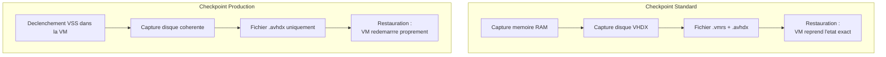
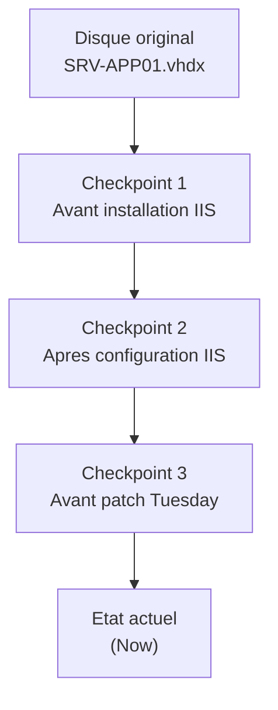

<!--
  Copyright 2026 Julien Bombled

  Licensed under the Apache License, Version 2.0 (the "License");
  you may not use this file except in compliance with the License.
  You may obtain a copy of the License at

      http://www.apache.org/licenses/LICENSE-2.0

  Unless required by applicable law or agreed to in writing, software
  distributed under the License is distributed on an "AS IS" BASIS,
  WITHOUT WARRANTIES OR CONDITIONS OF ANY KIND, either express or implied.
  See the License for the specific language governing permissions and
  limitations under the License.
-->

# Checkpoints

<span class="level-intermediate">Intermediaire</span> · Temps estime : 25 minutes

Les checkpoints (anciennement appeles snapshots) capturent l'etat d'une machine virtuelle a un instant donne. Ils permettent de revenir rapidement a un etat anterieur, ce qui est particulierement utile avant des modifications risquees.

---

## Standard vs Production

!!! example "Analogie"

    Un checkpoint est comme une **photo instantanee** d'un document de travail avant d'y apporter des modifications. Si les modifications ne conviennent pas, vous pouvez revenir a la photo et repartir de cet etat. Le checkpoint **Standard** photographie tout, y compris ce qui est affiche a l'ecran (la memoire). Le checkpoint **Production** est plus malin : il demande au document de se sauvegarder proprement (via VSS) avant la photo, comme si vous faisiez "Fichier > Enregistrer" avant de tenter des modifications.

Hyper-V propose deux types de checkpoints :

| Critere | Standard | Production |
|---------|----------|------------|
| **Contenu sauvegarde** | Etat memoire + disque + configuration | Disque + configuration (pas la memoire) |
| **Coherence** | Etat exact de la memoire (saved state) | Coherence applicative via VSS |
| **Sauvegarde** | Capture instantanee | Utilise VSS dans la VM invitee |
| **Reprise** | VM reprend exactement ou elle etait | VM redemarrre comme apres un arret propre |
| **Usage recommande** | Developpement, test | **Production** |



!!! tip "Recommandation"

    Utilisez toujours les checkpoints **Production** en environnement de production. Les checkpoints Standard sont reserves aux environnements de developpement et de test.

### Configurer le type de checkpoint

```powershell
# Set checkpoint type to Production (recommended)
Set-VM -Name "SRV-APP01" -CheckpointType Production

# Set checkpoint type to Standard (dev/test only)
Set-VM -Name "SRV-TEST01" -CheckpointType Standard

# Disable checkpoints entirely
Set-VM -Name "SRV-SQL01" -CheckpointType Disabled

# Verify configuration
Get-VM -Name "SRV-APP01" | Select-Object Name, CheckpointType
```

Resultat :

```text
Name      CheckpointType
----      --------------
SRV-APP01 Production
SRV-TEST01 Standard
SRV-SQL01 Disabled
```

---

## Creer un checkpoint

```powershell
# Create a checkpoint with a descriptive name
Checkpoint-VM -Name "SRV-APP01" -SnapshotName "Avant mise a jour KB5034567"

# Create a checkpoint on multiple VMs
$vms = @("SRV-APP01", "SRV-APP02", "SRV-WEB01")
foreach ($vm in $vms) {
    Checkpoint-VM -Name $vm -SnapshotName "Pre-patch $(Get-Date -Format 'yyyy-MM-dd')"
}
```

Resultat :

```text
VMName    Name                                   CreationTime
------    ----                                   ------------
SRV-APP01 Avant mise a jour KB5034567             2026-02-15 09:30:00
SRV-APP01 Pre-patch 2026-02-20                    2026-02-20 08:00:00
SRV-APP02 Pre-patch 2026-02-20                    2026-02-20 08:00:05
SRV-WEB01 Pre-patch 2026-02-20                    2026-02-20 08:00:10
```

### Ce qui est cree sur le disque

Lors de la creation d'un checkpoint, Hyper-V :

1. **Gele le VHDX** d'origine en lecture seule
2. Cree un **fichier AVHDX** (Automatic VHD) qui recoit toutes les nouvelles ecritures
3. Sauvegarde la **configuration** de la VM
4. Pour les checkpoints Standard : sauvegarde aussi l'**etat memoire** (fichier .vmrs)

```powershell
# View checkpoint files on disk
Get-ChildItem "D:\Hyper-V\Virtual Hard Disks" -Filter "*.avhdx" |
    Select-Object Name, Length, LastWriteTime
```

Resultat :

```text
Name                                              Length     LastWriteTime
----                                              ------     -------------
SRV-APP01_7A2B3C4D-5E6F-7890-AB12-CD34EF56GH78.avhdx 2147483648 2026-02-20 10:15:32
SRV-APP02_1B2C3D4E-5F6A-7890-BC23-DE45FG67HI89.avhdx  536870912 2026-02-20 08:05:10
```

---

## Appliquer (restaurer) un checkpoint

```powershell
# List all checkpoints for a VM
Get-VMCheckpoint -VMName "SRV-APP01" |
    Select-Object Name, CreationTime, ParentCheckpointName |
    Format-Table -AutoSize
```

Resultat :

```text
Name                          CreationTime         ParentCheckpointName
----                          ------------         --------------------
Avant mise a jour KB5034567   2026-02-15 09:30:00
Pre-patch 2026-02-20          2026-02-20 08:00:00  Avant mise a jour KB5034567
```

```powershell
# Apply (restore) a specific checkpoint
$checkpoint = Get-VMCheckpoint -VMName "SRV-APP01" -Name "Avant mise a jour KB5034567"
Restore-VMCheckpoint -VMCheckpoint $checkpoint -Confirm:$false

# Start the VM after restoration
Start-VM -Name "SRV-APP01"
```

!!! danger "Perte de donnees"

    L'application d'un checkpoint **ecrase toutes les modifications** effectuees depuis la creation du checkpoint. Toutes les donnees, configurations et mises a jour realisees apres le checkpoint seront perdues.

---

## Supprimer un checkpoint

La suppression d'un checkpoint fusionne les fichiers AVHDX avec le disque parent, liberant l'espace de stockage.

```powershell
# Delete a specific checkpoint
Remove-VMCheckpoint -VMName "SRV-APP01" -Name "Avant mise a jour KB5034567"

# Delete all checkpoints for a VM
Get-VMCheckpoint -VMName "SRV-APP01" | Remove-VMCheckpoint

# Note: the merge operation happens in the background
# Monitor the merge with:
Get-VM -Name "SRV-APP01" | Select-Object Name, Status
# Status will show "Merging Disks" during the operation
```

Resultat :

```text
Name      Status
----      ------
SRV-APP01 Merging Disks
```

!!! warning "Impact de la fusion"

    La fusion des AVHDX peut prendre du temps et generer des I/O significatives, surtout si le checkpoint a accumule beaucoup de modifications. Planifiez la suppression en dehors des heures de pointe.

---

## Arborescence de checkpoints

Les checkpoints peuvent etre imbriques, formant une arborescence :



```powershell
# View the checkpoint tree
Get-VMCheckpoint -VMName "SRV-APP01" |
    Select-Object Name, CreationTime, ParentCheckpointName |
    Format-Table -AutoSize

# Each checkpoint creates an AVHDX file in the chain
# Reading a file requires traversing the entire chain
# -> More checkpoints = more latency I/O
```

---

## Quand utiliser les checkpoints

### Cas d'usage adaptes

| Scenario | Type recommande |
|----------|----------------|
| Avant une mise a jour Windows | Production |
| Avant un changement de configuration | Production |
| Test d'un script en environnement de test | Standard |
| Avant une migration applicative | Production |
| Developpement et experimentation | Standard |

### Cas ou NE PAS utiliser de checkpoints

| Scenario | Raison | Alternative |
|----------|--------|-------------|
| **Sauvegarde reguliere** | Pas de protection hors-site, pas de retention | Solution de backup dediee |
| **Stockage long terme** | Degradation des performances I/O | Export de VM |
| **Controleurs de domaine** | Risque de USN rollback et corruption AD | Backup Windows Server Backup |
| **Serveurs SQL en production** | Incoherence des bases de donnees | Backup SQL natif |

!!! danger "Controleurs de domaine"

    N'utilisez **jamais** de checkpoints Standard sur un controleur de domaine. La restauration d'un etat memoire anterieur provoque un **USN rollback** qui corrompt la replication Active Directory. Les checkpoints Production (VSS-aware) sont toleres mais un backup AD dedie reste preferable.

---

## Bonnes pratiques

```powershell
# Audit: find VMs with old checkpoints (more than 7 days)
$threshold = (Get-Date).AddDays(-7)

Get-VM | ForEach-Object {
    Get-VMCheckpoint -VMName $_.Name -ErrorAction SilentlyContinue
} | Where-Object { $_.CreationTime -lt $threshold } |
    Select-Object VMName, Name, CreationTime,
        @{N='Age (days)';E={((Get-Date) - $_.CreationTime).Days}} |
    Format-Table -AutoSize
```

Resultat :

```text
VMName    Name                          CreationTime         Age (days)
------    ----                          ------------         ----------
SRV-APP01 Avant mise a jour KB5034567   2026-02-05 09:30:00         15
SRV-WEB01 Test config IIS               2026-01-28 14:22:00         23
SRV-TEST  Installation .NET             2026-01-10 11:00:00         41
```

- **Nommez** les checkpoints de maniere descriptive (pas "Checkpoint 1")
- **Supprimez** les checkpoints des que la modification est validee
- **Limitez** le nombre de checkpoints a 2-3 maximum par VM
- **Ne conservez jamais** un checkpoint plus de quelques jours
- **Surveillez** l'espace disque consomme par les fichiers AVHDX

---

## Points cles a retenir

- Les checkpoints **Production** (VSS) sont recommandes pour tous les environnements hors developpement
- Les checkpoints **Standard** capturent la memoire et sont reserves au test/dev
- Les checkpoints ne sont **pas** une solution de sauvegarde : utilisez un outil de backup dedie
- Chaque checkpoint cree un fichier **AVHDX** qui degrade les performances I/O proportionnellement au nombre de checkpoints
- **Ne jamais** utiliser de checkpoints Standard sur des controleurs de domaine
- Supprimer un checkpoint declenche une **fusion** des fichiers AVHDX (planifier en heures creuses)

---

!!! example "Scenario pratique"

    **Contexte :** Thomas, administrateur systeme dans une societe de distribution, doit appliquer un correctif critique (KB5034567) sur le serveur applicatif `SRV-APP01`. L'application metier est critique et ne doit pas subir d'interruption prolongee.

    **Probleme :** Apres l'installation du correctif, l'application metier ne demarre plus. Thomas doit revenir en arriere rapidement.

    **Diagnostic et solution :**

    ```powershell
    # Before the patch, Thomas had created a Production checkpoint
    Checkpoint-VM -Name "SRV-APP01" -SnapshotName "Avant KB5034567"

    # After the patch failed, he lists available checkpoints
    Get-VMCheckpoint -VMName "SRV-APP01" |
        Select-Object Name, CreationTime
    ```

    ```text
    Name                  CreationTime
    ----                  ------------
    Avant KB5034567       2026-02-20 08:45:00
    ```

    ```powershell
    # Restore the checkpoint
    $cp = Get-VMCheckpoint -VMName "SRV-APP01" -Name "Avant KB5034567"
    Restore-VMCheckpoint -VMCheckpoint $cp -Confirm:$false

    # Restart the VM
    Start-VM -Name "SRV-APP01"
    ```

    ```text
    Name      State   Status
    ----      -----   ------
    SRV-APP01 Running Operating normally
    ```

    La VM a redemarre dans l'etat d'avant le correctif. L'application metier fonctionnait a nouveau. Thomas a ensuite ouvert un ticket aupres de l'editeur pour obtenir un correctif compatible avant de retenter l'operation.

    **Bonne pratique appliquee :** Thomas a supprime le checkpoint une semaine plus tard, apres avoir confirme que le nouveau correctif fonctionnait.

    ```powershell
    Remove-VMCheckpoint -VMName "SRV-APP01" -Name "Avant KB5034567"
    ```

!!! danger "Erreurs courantes"

    1. **Utiliser les checkpoints comme solution de sauvegarde** : Les checkpoints sont stockes sur le meme volume que la VM. Si le disque tombe en panne, vous perdez la VM ET ses checkpoints. Utilisez une solution de backup dediee (Windows Server Backup, Veeam, etc.).

    2. **Appliquer un checkpoint Standard sur un controleur de domaine** : La restauration d'un etat memoire anterieur provoque un USN rollback, corrompant la replication Active Directory de maniere potentiellement irreversible.

    3. **Accumuler des checkpoints sans les supprimer** : Chaque checkpoint cree un fichier AVHDX. Une chaine de 5 checkpoints signifie que chaque lecture doit traverser 5 fichiers, degradant significativement les performances I/O.

    4. **Supprimer un checkpoint pendant les heures de pointe** : La fusion AVHDX genere des I/O intensives sur le stockage. Planifiez la suppression en heures creuses pour eviter d'impacter les autres VMs sur le meme volume.

    5. **Creer un checkpoint sur une VM avec des disques pass-through** : Les disques pass-through ne supportent pas les checkpoints. L'operation echoue et la VM peut se retrouver dans un etat incoherent.

---

## Pour aller plus loin

- Stockage virtuel et formats VHDX (voir la page [Stockage virtuel](stockage-virtuel.md))
- Live Migration (voir la page [Live Migration](live-migration.md))
- Microsoft : Hyper-V checkpoints overview

