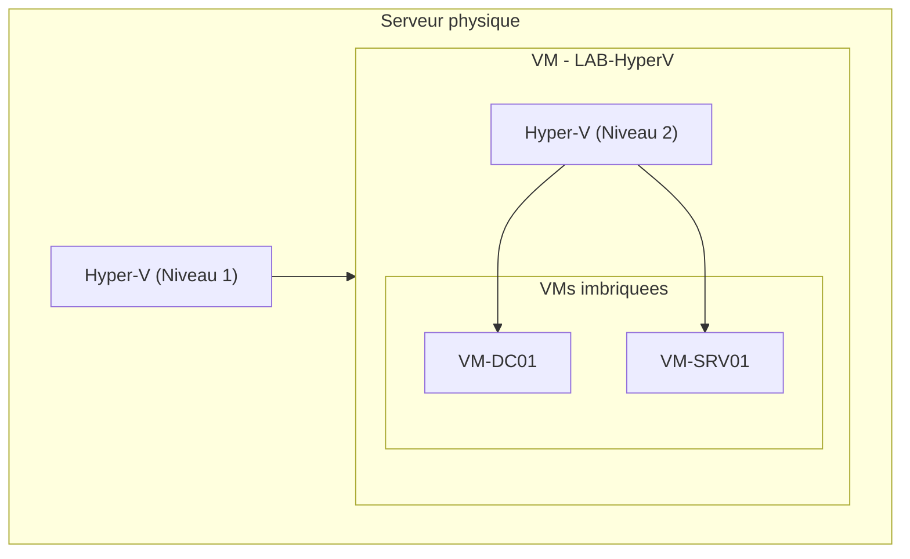

# Installation du role Hyper-V

<span class="level-intermediate">Intermediaire</span> · Temps estime : 25 minutes

Hyper-V est l'hyperviseur de type 1 integre a Windows Server. Il permet de creer et gerer des machines virtuelles (VM) avec des performances proches du materiel natif.

---

## Prerequis materiels

### Configuration minimale

| Composant | Exigence |
|-----------|----------|
| **Processeur** | 64 bits avec SLAT (Second Level Address Translation) |
| **Virtualisation materielle** | Intel VT-x ou AMD-V active dans le BIOS/UEFI |
| **DEP** | Data Execution Prevention (NX bit) active |
| **RAM** | 4 Go minimum (+ la memoire allouee aux VMs) |
| **Espace disque** | Variable selon le nombre et la taille des VMs |

### Verifier la compatibilite

```powershell
# Check if the processor supports virtualization
Get-ComputerInfo | Select-Object HyperVisorPresent, HyperVRequirementVMMonitorModeExtensions,
    HyperVRequirementSecondLevelAddressTranslation, HyperVRequirementDataExecutionPreventionAvailable

# Alternative: detailed check with systeminfo
systeminfo | Select-String "Hyper-V"
```

!!! warning "BIOS/UEFI"

    Si les extensions de virtualisation (VT-x/AMD-V) sont desactivees dans le BIOS, l'installation du role echouera. Verifiez et activez ces options avant de commencer.

---

## Installation du role

### Via PowerShell

```powershell
# Install Hyper-V role with management tools
Install-WindowsFeature -Name Hyper-V -IncludeManagementTools -Restart

# Verify installation after reboot
Get-WindowsFeature Hyper-V
```

### Via Server Manager

1. **Server Manager** > **Add Roles and Features**
2. Selectionner **Role-based or feature-based installation**
3. Selectionner le serveur cible
4. Cocher **Hyper-V**
5. Configurer les commutateurs virtuels (peut etre fait plus tard)
6. Configurer la migration dynamique (optionnel)
7. Definir les emplacements par defaut des disques et fichiers de configuration
8. Confirmer et redemarrer

### Apres l'installation

```powershell
# Verify Hyper-V services are running
Get-Service vmms, vmcompute | Select-Object Name, Status, StartType

# Verify Hyper-V module is available
Get-Module -ListAvailable Hyper-V

# Check Hyper-V host properties
Get-VMHost | Select-Object Name, LogicalProcessorCount, MemoryCapacity,
    VirtualHardDiskPath, VirtualMachinePath
```

---

## Configuration post-installation

### Emplacements par defaut

```powershell
# Set default paths for VM files and virtual hard disks
Set-VMHost -VirtualHardDiskPath "D:\Hyper-V\Virtual Hard Disks"
Set-VMHost -VirtualMachinePath "D:\Hyper-V\Virtual Machines"

# Create the directories if they don't exist
New-Item -Path "D:\Hyper-V\Virtual Hard Disks" -ItemType Directory -Force
New-Item -Path "D:\Hyper-V\Virtual Machines" -ItemType Directory -Force

# Verify the configuration
Get-VMHost | Select-Object VirtualHardDiskPath, VirtualMachinePath
```

!!! tip "Bonne pratique"

    Stockez les fichiers de VMs sur un volume **dedie** (pas sur le volume systeme C:). Utilisez un disque SSD ou NVMe pour de meilleures performances I/O.

### Configuration du NUMA

```powershell
# View NUMA topology
Get-VMHostNumaNode | Select-Object NodeId, MemoryAvailable, ProcessorsAvailability

# NUMA spanning allows VMs to use memory across NUMA nodes
# Disable if you want strict NUMA affinity for performance
Set-VMHost -NumaSpanningEnabled $true
```

---

## Virtualisation imbriquee (Nested Virtualization)

La virtualisation imbriquee permet d'executer Hyper-V a l'interieur d'une VM Hyper-V. Utile pour les labs de formation et de test.

### Prerequis

- Windows Server 2016 ou superieur
- Processeur Intel (la virtualisation imbriquee AMD est supportee depuis Windows Server 2022)
- La VM hote doit etre **eteinte** pour activer la fonctionnalite

### Activation

```powershell
# Enable nested virtualization on a VM (VM must be stopped)
Stop-VM -Name "LAB-HyperV"

Set-VMProcessor -VMName "LAB-HyperV" -ExposeVirtualizationExtensions $true

# Disable MAC address spoofing protection (required for nested virtual switches)
Set-VMNetworkAdapter -VMName "LAB-HyperV" -MacAddressSpoofing On

# Allocate sufficient memory (disable dynamic memory for nested scenarios)
Set-VMMemory -VMName "LAB-HyperV" -DynamicMemoryEnabled $false -StartupBytes 8GB

Start-VM -Name "LAB-HyperV"
```

!!! warning "Performances"

    La virtualisation imbriquee entraine une baisse de performances significative. Elle est adaptee aux **labs de test** mais pas a la production.



---

## Gestion a distance

### Hyper-V Manager

Le Gestionnaire Hyper-V peut se connecter a des hotes distants :

```powershell
# Enable Hyper-V remote management (on the Hyper-V host)
Enable-WSManCredSSP -Role Server -Force

# On the management machine
Enable-WSManCredSSP -Role Client -DelegateComputer "HV-SRV01.lab.local" -Force
```

### PowerShell a distance

```powershell
# Manage a remote Hyper-V host
$session = New-PSSession -ComputerName "HV-SRV01"

Invoke-Command -Session $session -ScriptBlock {
    Get-VM | Select-Object Name, State, CPUUsage, MemoryAssigned
}
```

### Windows Admin Center

Windows Admin Center offre une interface web moderne pour gerer Hyper-V, incluant :

- Vue d'ensemble des VMs et de l'hote
- Gestion du cycle de vie des VMs (demarrer, arreter, checkpoint)
- Monitoring des performances
- Acces console aux VMs

---

## Hyper-V Server (edition gratuite)

!!! tip "Alternative gratuite"

    **Hyper-V Server** est une edition gratuite de Windows Server contenant uniquement l'hyperviseur et les outils de gestion en ligne de commande. Pas d'interface graphique, pas de licence Windows Server requise pour l'hote.

    Note : Microsoft a annonce que Hyper-V Server 2022 n'existe pas. L'alternative est Azure Stack HCI.

---

## Points cles a retenir

- Hyper-V necessite un processeur 64 bits avec **VT-x/AMD-V** et **SLAT** actives dans le BIOS
- L'installation se fait via `Install-WindowsFeature Hyper-V` suivi d'un redemarrage
- Stocker les fichiers VMs sur un **volume dedie** avec des disques performants
- La **virtualisation imbriquee** permet de creer des labs Hyper-V dans Hyper-V (test uniquement)
- La gestion peut se faire via Hyper-V Manager, PowerShell ou Windows Admin Center

---

## Pour aller plus loin

- Creation de VMs (voir la page [Creer une VM](creer-vm.md))
- Reseaux virtuels (voir la page [Reseaux virtuels](reseaux-virtuels.md))
- Microsoft : Hyper-V on Windows Server documentation
