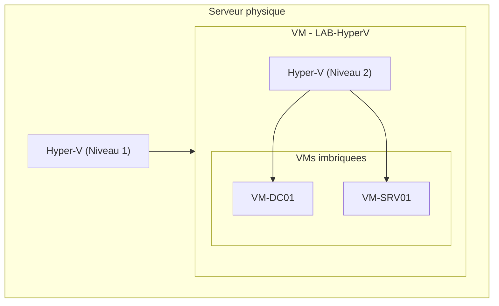

<!--
  Copyright 2026 Julien Bombled

  Licensed under the Apache License, Version 2.0 (the "License");
  you may not use this file except in compliance with the License.
  You may obtain a copy of the License at

      http://www.apache.org/licenses/LICENSE-2.0

  Unless required by applicable law or agreed to in writing, software
  distributed under the License is distributed on an "AS IS" BASIS,
  WITHOUT WARRANTIES OR CONDITIONS OF ANY KIND, either express or implied.
  See the License for the specific language governing permissions and
  limitations under the License.
-->
---
title: "Installation du role Hyper-V"
description: "Installation et configuration du role Hyper-V sur Windows Server 2022 : prerequis materiels, virtualisation imbriquee et verification post-installation."
tags:
  - virtualisation
  - hyper-v
  - installation
  - windows-server
---

# Installation du role Hyper-V

<span class="level-intermediate">Intermediaire</span> · Temps estime : 25 minutes

Hyper-V est l'hyperviseur de type 1 integre a Windows Server. Il permet de creer et gerer des machines virtuelles (VM) avec des performances proches du materiel natif.

---

## Prerequis materiels

!!! example "Analogie"

    Imaginez un immeuble de bureaux. Le **serveur physique** est le batiment lui-meme, et **Hyper-V** est le systeme de cloisons modulables qui permet de diviser chaque etage en bureaux independants (les VMs). Avant d'installer ces cloisons, il faut verifier que la structure du batiment (le processeur et le BIOS) supporte bien ce type d'amenagement.

### Configuration minimale

| Composant | Exigence |
|-----------|----------|
| **Processeur** | 64 bits avec SLAT (Second Level Address Translation) |
| **Virtualisation materielle** | Intel VT-x ou AMD-V active dans le BIOS/UEFI |
| **DEP** | Data Execution Prevention (NX bit) active |
| **RAM** | 4 Go minimum (+ la memoire allouee aux VMs) |
| **Espace disque** | Variable selon le nombre et la taille des VMs |

### Verifier la compatibilite

```powershell
# Check if the processor supports virtualization
Get-ComputerInfo | Select-Object HyperVisorPresent, HyperVRequirementVMMonitorModeExtensions,
    HyperVRequirementSecondLevelAddressTranslation, HyperVRequirementDataExecutionPreventionAvailable

# Alternative: detailed check with systeminfo
systeminfo | Select-String "Hyper-V"
```

Resultat :

```text
HyperVisorPresent                                   : True
HyperVRequirementVMMonitorModeExtensions            : True
HyperVRequirementSecondLevelAddressTranslation       : True
HyperVRequirementDataExecutionPreventionAvailable    : True

Hyper-V Requirements:      A hypervisor has been detected. Features required for Hyper-V will not be displayed.
```

!!! warning "BIOS/UEFI"

    Si les extensions de virtualisation (VT-x/AMD-V) sont desactivees dans le BIOS, l'installation du role echouera. Verifiez et activez ces options avant de commencer.

---

## Installation du role

### Via PowerShell

```powershell
# Install Hyper-V role with management tools
Install-WindowsFeature -Name Hyper-V -IncludeManagementTools -Restart

# Verify installation after reboot
Get-WindowsFeature Hyper-V
```

Resultat :

```text
Success Restart Needed Exit Code      Feature Result
------- -------------- ---------      --------------
True    Yes            SuccessRest... {Hyper-V}

WARNING: You must restart this server to finish the installation process.

Display Name                                            Name       Install State
------------                                            ----       -------------
[X] Hyper-V                                             Hyper-V    Installed
```

### Via Server Manager

1. **Server Manager** > **Add Roles and Features**
2. Selectionner **Role-based or feature-based installation**
3. Selectionner le serveur cible
4. Cocher **Hyper-V**
5. Configurer les commutateurs virtuels (peut etre fait plus tard)
6. Configurer la migration dynamique (optionnel)
7. Definir les emplacements par defaut des disques et fichiers de configuration
8. Confirmer et redemarrer

### Apres l'installation

```powershell
# Verify Hyper-V services are running
Get-Service vmms, vmcompute | Select-Object Name, Status, StartType

# Verify Hyper-V module is available
Get-Module -ListAvailable Hyper-V

# Check Hyper-V host properties
Get-VMHost | Select-Object Name, LogicalProcessorCount, MemoryCapacity,
    VirtualHardDiskPath, VirtualMachinePath
```

Resultat :

```text
Name   Status  StartType
----   ------  ---------
vmms   Running Automatic
vmcompute Running Automatic

ModuleType Version    Name
---------- -------    ----
Binary     2.0.0.0    Hyper-V

Name          : SRV-HV01
LogicalProcessorCount : 8
MemoryCapacity        : 34359738368
VirtualHardDiskPath   : C:\ProgramData\Microsoft\Windows\Hyper-V\Virtual Hard Disks
VirtualMachinePath    : C:\ProgramData\Microsoft\Windows\Hyper-V
```

---

## Configuration post-installation

### Emplacements par defaut

```powershell
# Set default paths for VM files and virtual hard disks
Set-VMHost -VirtualHardDiskPath "D:\Hyper-V\Virtual Hard Disks"
Set-VMHost -VirtualMachinePath "D:\Hyper-V\Virtual Machines"

# Create the directories if they don't exist
New-Item -Path "D:\Hyper-V\Virtual Hard Disks" -ItemType Directory -Force
New-Item -Path "D:\Hyper-V\Virtual Machines" -ItemType Directory -Force

# Verify the configuration
Get-VMHost | Select-Object VirtualHardDiskPath, VirtualMachinePath
```

Resultat :

```text
VirtualHardDiskPath                      VirtualMachinePath
-------------------                      ------------------
D:\Hyper-V\Virtual Hard Disks            D:\Hyper-V\Virtual Machines
```

!!! tip "Bonne pratique"

    Stockez les fichiers de VMs sur un volume **dedie** (pas sur le volume systeme C:). Utilisez un disque SSD ou NVMe pour de meilleures performances I/O.

### Configuration du NUMA

```powershell
# View NUMA topology
Get-VMHostNumaNode | Select-Object NodeId, MemoryAvailable, ProcessorsAvailability

# NUMA spanning allows VMs to use memory across NUMA nodes
# Disable if you want strict NUMA affinity for performance
Set-VMHost -NumaSpanningEnabled $true
```

Resultat :

```text
NodeId MemoryAvailable ProcessorsAvailability
------ --------------- ----------------------
0      12288           {0, 1, 2, 3}
1      12288           {4, 5, 6, 7}
```

---

## Virtualisation imbriquee (Nested Virtualization)

La virtualisation imbriquee permet d'executer Hyper-V a l'interieur d'une VM Hyper-V. Utile pour les labs de formation et de test.

!!! example "Analogie"

    La virtualisation imbriquee, c'est comme une **valise a l'interieur d'une valise**. Votre serveur physique est la grande valise, la VM est une valise moyenne a l'interieur, et les VMs imbriquees sont de petites trousses de voyage dans la valise moyenne. Pratique pour organiser un lab de test, mais pas ideal pour un voyage en production.

### Prerequis

- Windows Server 2016 ou superieur
- Processeur Intel (la virtualisation imbriquee AMD est supportee depuis Windows Server 2022)
- La VM hote doit etre **eteinte** pour activer la fonctionnalite

### Activation

```powershell
# Enable nested virtualization on a VM (VM must be stopped)
Stop-VM -Name "LAB-HyperV"

Set-VMProcessor -VMName "LAB-HyperV" -ExposeVirtualizationExtensions $true

# Disable MAC address spoofing protection (required for nested virtual switches)
Set-VMNetworkAdapter -VMName "LAB-HyperV" -MacAddressSpoofing On

# Allocate sufficient memory (disable dynamic memory for nested scenarios)
Set-VMMemory -VMName "LAB-HyperV" -DynamicMemoryEnabled $false -StartupBytes 8GB

Start-VM -Name "LAB-HyperV"
```

!!! warning "Performances"

    La virtualisation imbriquee entraine une baisse de performances significative. Elle est adaptee aux **labs de test** mais pas a la production.



---

## Gestion a distance

### Hyper-V Manager

Le Gestionnaire Hyper-V peut se connecter a des hotes distants :

```powershell
# Enable Hyper-V remote management (on the Hyper-V host)
Enable-WSManCredSSP -Role Server -Force

# On the management machine
Enable-WSManCredSSP -Role Client -DelegateComputer "HV-SRV01.lab.local" -Force
```

### PowerShell a distance

```powershell
# Manage a remote Hyper-V host
$session = New-PSSession -ComputerName "HV-SRV01"

Invoke-Command -Session $session -ScriptBlock {
    Get-VM | Select-Object Name, State, CPUUsage, MemoryAssigned
}
```

Resultat :

```text
Name         State   CPUUsage MemoryAssigned
----         -----   -------- --------------
SRV-APP01    Running        3     4294967296
SRV-DC01     Running        1     2147483648
SRV-SQL01    Running       12     8589934592
SRV-WEB01    Off            0              0
```

### Windows Admin Center

Windows Admin Center offre une interface web moderne pour gerer Hyper-V, incluant :

- Vue d'ensemble des VMs et de l'hote
- Gestion du cycle de vie des VMs (demarrer, arreter, checkpoint)
- Monitoring des performances
- Acces console aux VMs

---

## Hyper-V Server (edition gratuite)

!!! tip "Alternative gratuite"

    **Hyper-V Server** est une edition gratuite de Windows Server contenant uniquement l'hyperviseur et les outils de gestion en ligne de commande. Pas d'interface graphique, pas de licence Windows Server requise pour l'hote.

    Note : Microsoft a annonce que Hyper-V Server 2022 n'existe pas. L'alternative est Azure Stack HCI.

---

## Points cles a retenir

- Hyper-V necessite un processeur 64 bits avec **VT-x/AMD-V** et **SLAT** actives dans le BIOS
- L'installation se fait via `Install-WindowsFeature Hyper-V` suivi d'un redemarrage
- Stocker les fichiers VMs sur un **volume dedie** avec des disques performants
- La **virtualisation imbriquee** permet de creer des labs Hyper-V dans Hyper-V (test uniquement)
- La gestion peut se faire via Hyper-V Manager, PowerShell ou Windows Admin Center

---

!!! example "Scenario pratique"

    **Contexte :** Sophie, administratrice systeme dans une PME, doit installer Hyper-V sur un nouveau serveur Dell PowerEdge pour heberger 5 VMs de production. Le serveur est installe avec Windows Server 2022 Standard.

    **Probleme :** Apres l'installation du role via `Install-WindowsFeature`, le serveur redemarrait mais le service `vmms` ne demarrait pas. La commande `Get-VM` retournait une erreur.

    **Diagnostic :**

    ```powershell
    # Check if virtualization extensions are active
    Get-ComputerInfo | Select-Object HyperVRequirementVMMonitorModeExtensions
    ```

    ```text
    HyperVRequirementVMMonitorModeExtensions : False
    ```

    Les extensions de virtualisation Intel VT-x n'etaient pas activees dans le BIOS UEFI du serveur.

    **Solution :**

    1. Redemarrer le serveur et acceder au BIOS UEFI (touche F2 au demarrage)
    2. Naviguer vers **Processor Settings** > **Virtualization Technology** > **Enabled**
    3. Activer egalement **VT-d** (Intel Virtualization Technology for Directed I/O)
    4. Sauvegarder et redemarrer

    ```powershell
    # Verify after BIOS change
    Get-ComputerInfo | Select-Object HyperVRequirementVMMonitorModeExtensions
    ```

    ```text
    HyperVRequirementVMMonitorModeExtensions : True
    ```

    ```powershell
    # Reinstall the role
    Install-WindowsFeature -Name Hyper-V -IncludeManagementTools -Restart
    ```

    Apres le redemarrage, le service `vmms` etait actif et Sophie a pu configurer les emplacements par defaut sur le volume D: avant de creer ses VMs.

!!! danger "Erreurs courantes"

    1. **Oublier d'activer VT-x/AMD-V dans le BIOS** : L'installation du role semble reussir mais le service Hyper-V ne demarre pas. Verifiez toujours les extensions de virtualisation avant l'installation.

    2. **Stocker les VMs sur le volume systeme C:** : Les I/O des VMs entrent en concurrence avec celles du systeme d'exploitation. Utilisez toujours un volume dedie (D:, E:) avec des disques performants (SSD/NVMe).

    3. **Ne pas prevoir la memoire pour les VMs** : Un serveur avec 16 Go de RAM ne peut pas heberger 4 VMs de 8 Go chacune. Calculez la memoire totale necessaire : RAM hote (4 Go minimum) + somme de la RAM de toutes les VMs.

    4. **Ignorer la virtualisation imbriquee en lab** : Tenter d'installer Hyper-V dans une VM sans activer `ExposeVirtualizationExtensions` echoue silencieusement. La VM doit etre eteinte pour activer cette option.

    5. **Ne pas configurer la gestion a distance** : Sans CredSSP ou Kerberos correctement configure, le Gestionnaire Hyper-V ne peut pas se connecter aux hotes distants. Configurez WinRM et la delegation des que possible.

---

## Pour aller plus loin

- Creation de VMs (voir la page [Creer une VM](creer-vm.md))
- Reseaux virtuels (voir la page [Reseaux virtuels](reseaux-virtuels.md))
- Microsoft : Hyper-V on Windows Server documentation

