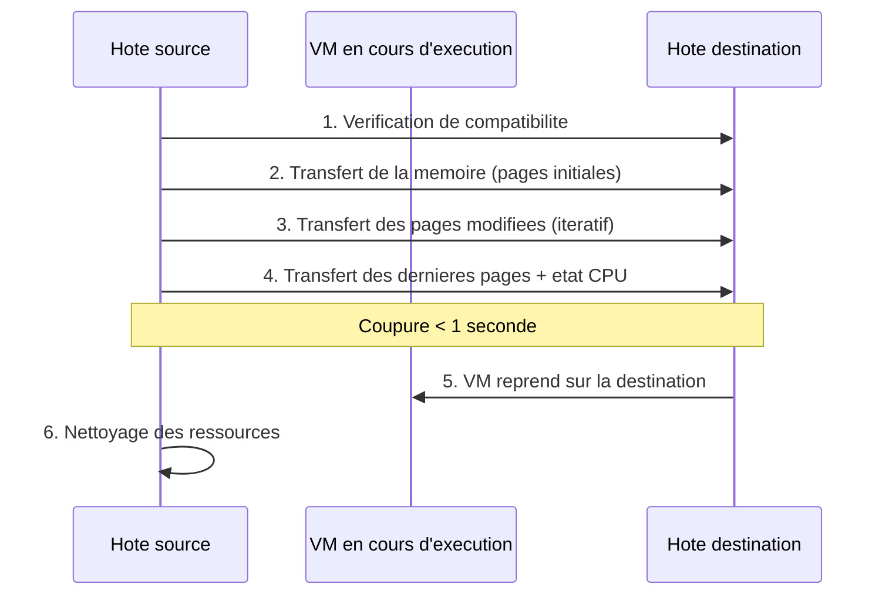

<!--
  Copyright 2026 Julien Bombled

  Licensed under the Apache License, Version 2.0 (the "License");
  you may not use this file except in compliance with the License.
  You may obtain a copy of the License at

      http://www.apache.org/licenses/LICENSE-2.0

  Unless required by applicable law or agreed to in writing, software
  distributed under the License is distributed on an "AS IS" BASIS,
  WITHOUT WARRANTIES OR CONDITIONS OF ANY KIND, either express or implied.
  See the License for the specific language governing permissions and
  limitations under the License.
-->
---
title: "Live Migration"
description: "Migration dynamique de VMs Hyper-V : prerequis, configuration, Shared Nothing Migration et options de performance sur Windows Server 2022."
tags:
  - virtualisation
  - hyper-v
  - live-migration
  - haute-disponibilite
---

# Live Migration

<span class="level-intermediate">Intermediaire</span> · Temps estime : 35 minutes

La Live Migration permet de deplacer une machine virtuelle en cours d'execution d'un hote Hyper-V a un autre **sans interruption de service**. C'est une fonctionnalite cle pour la maintenance des hotes et l'equilibrage de charge.

---

## Principe de fonctionnement

!!! example "Analogie"

    La Live Migration est comparable au **transfert d'un appel telephonique** entre deux operateurs sans que l'interlocuteur ne s'en rende compte. Pendant que vous parlez (la VM fonctionne), le systeme copie progressivement votre conversation vers un second operateur (l'hote destination). A la fin, la bascule est si rapide (moins d'une seconde) que votre interlocuteur ne remarque rien.



### Types de Live Migration

| Type | Stockage | Reseau | Utilisation |
|------|----------|--------|-------------|
| **Live Migration (cluster)** | Partage (CSV/SAN) | Reseau de migration dedie | Cluster de basculement |
| **Shared Nothing Migration** | Local sur chaque hote | Reseau standard | Hotes independants |
| **Storage Migration** | Deplace le stockage sans deplacer la VM | Reseau de stockage | Reorganisation du stockage |

---

## Prerequis

### Configuration commune

| Prerequis | Detail |
|-----------|--------|
| **Processeurs compatibles** | Meme fabricant (Intel ou AMD) |
| **Domaine Active Directory** | Les deux hotes doivent etre dans le meme domaine (ou domaines approuves) |
| **Hyper-V identique ou compatible** | Meme version ou version superieure sur la destination |
| **Reseau dedie** | Un reseau dedie a la migration est recommande |
| **Delegation de contrainte** | Kerberos constrained delegation ou CredSSP |

### Verification de compatibilite CPU

```powershell
# Enable processor compatibility mode on the VM (for migration between different CPU generations)
Set-VMProcessor -VMName "SRV-APP01" -CompatibilityForMigrationEnabled $true

# Check processor features on both hosts
Get-VMHost | Select-Object Name, LogicalProcessorCount
```

---

## Configuration de la Live Migration

### Etape 1 : activer la Live Migration sur chaque hote

```powershell
# Enable Live Migration on the host
Enable-VMMigration

# Configure the maximum number of simultaneous migrations
Set-VMHost -MaximumVirtualMachineMigrations 2

# Verify configuration
Get-VMHost | Select-Object VirtualMachineMigrationEnabled,
    MaximumVirtualMachineMigrations, VirtualMachineMigrationAuthenticationType
```

### Etape 2 : configurer le reseau de migration

```powershell
# Specify which networks can be used for Live Migration
# Best practice: use a dedicated network
Add-VMMigrationNetwork -Subnet "10.10.10.0/24" -Priority 1

# List migration networks
Get-VMMigrationNetwork

# Remove a migration network
Remove-VMMigrationNetwork -Subnet "10.10.10.0/24"
```

### Etape 3 : configurer l'authentification

#### Option A : CredSSP (plus simple, moins securise)

```powershell
# Set authentication to CredSSP
Set-VMHost -VirtualMachineMigrationAuthenticationType CredSSP

# CredSSP requires the admin to be logged on the source host
# Not suitable for automated/scheduled migrations
```

#### Option B : Kerberos (recommande pour la production)

```powershell
# Set authentication to Kerberos
Set-VMHost -VirtualMachineMigrationAuthenticationType Kerberos

# Configure constrained delegation in Active Directory
# On each Hyper-V host computer account, delegate to the other hosts:
# - cifs/HV-SRV02.lab.local
# - Microsoft Virtual System Migration Service/HV-SRV02.lab.local

# Via PowerShell (run on a Domain Controller)
$sourceHost = Get-ADComputer "HV-SRV01"
$destHost = Get-ADComputer "HV-SRV02"

# Allow HV-SRV01 to delegate to HV-SRV02 for migration
Set-ADComputer $sourceHost -Add @{
    'msDS-AllowedToDelegateTo' = @(
        "cifs/$($destHost.DNSHostName)",
        "cifs/$($destHost.Name)",
        "Microsoft Virtual System Migration Service/$($destHost.DNSHostName)",
        "Microsoft Virtual System Migration Service/$($destHost.Name)"
    )
}

# And vice versa
Set-ADComputer $destHost -Add @{
    'msDS-AllowedToDelegateTo' = @(
        "cifs/$($sourceHost.DNSHostName)",
        "cifs/$($sourceHost.Name)",
        "Microsoft Virtual System Migration Service/$($sourceHost.DNSHostName)",
        "Microsoft Virtual System Migration Service/$($sourceHost.Name)"
    )
}
```

---

## Executer une Live Migration

### Migration avec stockage partage (cluster)

```powershell
# Move a VM to another host (storage is shared, only memory/state moves)
Move-VM -Name "SRV-APP01" -DestinationHost "HV-SRV02.lab.local"

# Move with specific destination network
Move-VM -Name "SRV-APP01" -DestinationHost "HV-SRV02.lab.local"
```

### Shared Nothing Migration (stockage local)

```powershell
# Move VM including storage to another host (no shared storage required)
Move-VM -Name "SRV-APP01" `
    -DestinationHost "HV-SRV02.lab.local" `
    -DestinationStoragePath "D:\Hyper-V\Virtual Machines" `
    -IncludeStorage

# Move with different paths for VHD and VM configuration
Move-VM -Name "SRV-APP01" `
    -DestinationHost "HV-SRV02.lab.local" `
    -VirtualMachinePath "D:\Hyper-V\Virtual Machines" `
    -DestinationStoragePath "D:\Hyper-V\Virtual Hard Disks" `
    -IncludeStorage
```

### Migration du stockage uniquement

```powershell
# Move VM storage to a different location on the same host
Move-VMStorage -VMName "SRV-APP01" -DestinationStoragePath "E:\Hyper-V\Virtual Hard Disks"

# Move specific VHDs to different locations
Move-VMStorage -VMName "SRV-APP01" `
    -VHDs @(
        @{
            SourceFilePath = "D:\VMs\SRV-APP01-OS.vhdx"
            DestinationFilePath = "E:\VMs\SRV-APP01-OS.vhdx"
        },
        @{
            SourceFilePath = "D:\VMs\SRV-APP01-Data.vhdx"
            DestinationFilePath = "F:\VMs\SRV-APP01-Data.vhdx"
        }
    )
```

---

## Options de performance

### Protocole de transfert

```powershell
# Set the performance option for Live Migration
# Compression : compresses memory before transfer (better for slow networks)
Set-VMHost -VirtualMachineMigrationPerformanceOption Compression

# SMB : uses SMB Direct/RDMA for high-speed transfer (requires compatible NICs)
Set-VMHost -VirtualMachineMigrationPerformanceOption SMB

# TCP/IP : standard transfer (default)
Set-VMHost -VirtualMachineMigrationPerformanceOption TCPIP

# Check current setting
Get-VMHost | Select-Object VirtualMachineMigrationPerformanceOption
```

| Option | Bande passante | Latence | Usage recommande |
|--------|---------------|---------|-----------------|
| **Compression** | Reduite | Moyenne | Reseau 1 Gbps |
| **SMB (RDMA)** | Maximale | Minimale | Reseau 10+ Gbps avec RDMA |
| **TCP/IP** | Standard | Standard | Configuration par defaut |

!!! tip "RDMA / SMB Direct"

    Si vos serveurs disposent de cartes reseau compatibles **RDMA** (Remote Direct Memory Access), utilisez l'option **SMB** pour des migrations extremement rapides avec un impact CPU minimal.

---

## Supervision de la migration

```powershell
# Monitor an ongoing migration
# The Move-VM cmdlet is synchronous by default
# For async monitoring, use jobs:
$job = Start-Job -ScriptBlock {
    Move-VM -Name "SRV-APP01" -DestinationHost "HV-SRV02.lab.local" -IncludeStorage `
        -DestinationStoragePath "D:\Hyper-V"
}

# Check job progress
Get-Job $job.Id | Select-Object State, Progress

# View migration status via WMI
Get-CimInstance -Namespace root\virtualization\v2 `
    -ClassName Msvm_MigrationJob |
    Select-Object Name, JobState, PercentComplete, Description
```

---

## Depannage

### Problemes courants

| Probleme | Cause probable | Solution |
|----------|---------------|----------|
| Migration echoue immediatement | Delegation Kerberos incorrecte | Verifier les SPN et la delegation |
| Migration tres lente | Reseau sature ou compression desactivee | Utiliser un reseau dedie, activer la compression |
| VM ne demarre pas sur la destination | Commutateur virtuel manquant | Creer le meme vSwitch sur la destination |
| Erreur de compatibilite CPU | Generations de CPU differentes | Activer `CompatibilityForMigrationEnabled` |
| Stockage inaccessible | Chemin de destination inexistant | Verifier les chemins sur l'hote destination |

### Commandes de diagnostic

```powershell
# Test migration feasibility (dry run)
# Compare virtual switches on source and destination
$sourceSwitch = Invoke-Command -ComputerName "HV-SRV01" { Get-VMSwitch | Select-Object Name }
$destSwitch = Invoke-Command -ComputerName "HV-SRV02" { Get-VMSwitch | Select-Object Name }
Compare-Object $sourceSwitch $destSwitch -Property Name

# Verify WinRM connectivity
Test-WSMan -ComputerName "HV-SRV02"

# Check migration events in event log
Get-WinEvent -LogName "Microsoft-Windows-Hyper-V-VMMS-Admin" -MaxEvents 20 |
    Where-Object { $_.Message -match "migration" } |
    Select-Object TimeCreated, Message
```

---

## Points cles a retenir

- La Live Migration deplace une VM **sans interruption** (coupure inferieure a 1 seconde)
- La **Shared Nothing Migration** ne necessite pas de stockage partage : elle deplace le stockage et la memoire
- L'authentification **Kerberos** avec delegation de contrainte est recommandee en production
- Un **reseau dedie** pour la migration est une bonne pratique pour ne pas impacter le trafic de production
- L'option **SMB/RDMA** offre les meilleures performances sur les reseaux 10 Gbps+
- Activez la **compatibilite CPU** si les hotes n'ont pas exactement le meme processeur

---

## Pour aller plus loin

- Hyper-V Replica pour la reprise d'activite (voir la page [Hyper-V Replica](replica.md))
- Reseaux virtuels (voir la page [Reseaux virtuels](reseaux-virtuels.md))
- Microsoft : Live Migration overview
- Microsoft : Configure constrained delegation for Hyper-V

