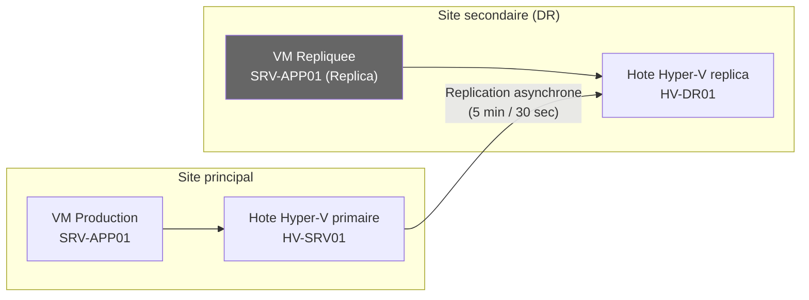
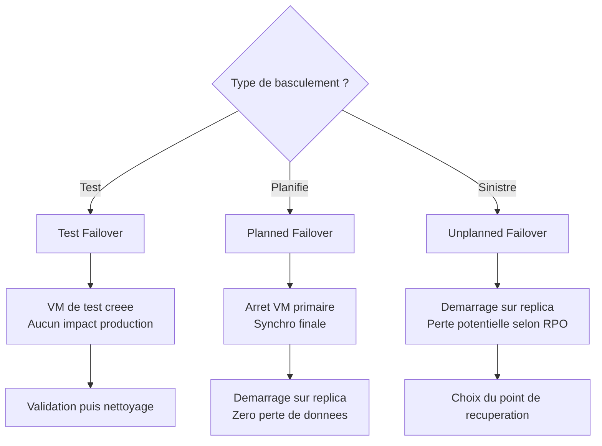

# Hyper-V Replica

!!! info "Niveau : intermediaire | Temps estime : 35 minutes"

Hyper-V Replica replique une machine virtuelle d'un hote principal vers un hote secondaire de maniere asynchrone. En cas de panne du site principal, la VM repliquee peut etre activee sur le site secondaire, assurant la continuite d'activite.

---

## Principe de fonctionnement



### Caracteristiques

| Aspect | Detail |
|--------|--------|
| **Type de replication** | Asynchrone (pas de perte zero garantie) |
| **Frequences** | 30 secondes, 5 minutes ou 15 minutes |
| **Transport** | HTTP (port 80) ou HTTPS (port 443) |
| **Points de recuperation** | Jusqu'a 24 points de recuperation supplementaires |
| **Replication etendue** | Chaine primaire > replica > replica etendu |
| **Cout** | Aucune licence supplementaire |

---

## Prerequis

- Deux hotes Hyper-V (meme domaine ou domaines approuves, ou certificats pour les hotes standalone)
- Connectivite reseau entre les deux sites
- Espace de stockage suffisant sur le site secondaire
- Pare-feu ouvert sur les ports HTTP (80) ou HTTPS (443)

---

## Configuration

### Etape 1 : activer le serveur Replica (hote destination)

```powershell
# On the REPLICA server (destination)
# Enable Hyper-V Replica as a Replica server

# Option A: HTTP authentication (lab / same domain)
Set-VMReplicationServer -ReplicationEnabled $true `
    -AllowedAuthenticationType Kerberos `
    -ReplicationAllowedFromAnyServer $true `
    -DefaultStorageLocation "D:\Hyper-V\Replica"

# Option B: HTTPS authentication (production / cross-domain)
Set-VMReplicationServer -ReplicationEnabled $true `
    -AllowedAuthenticationType Certificate `
    -CertificateThumbprint "<certificate-thumbprint>" `
    -DefaultStorageLocation "D:\Hyper-V\Replica"

# Verify Replica server configuration
Get-VMReplicationServer
```

### Etape 2 : configurer le pare-feu

```powershell
# On the REPLICA server: allow incoming replication
# For HTTP (Kerberos authentication)
Enable-NetFirewallRule -DisplayName "Hyper-V Replica HTTP Listener (TCP-In)"

# For HTTPS (Certificate authentication)
Enable-NetFirewallRule -DisplayName "Hyper-V Replica HTTPS Listener (TCP-In)"

# Verify firewall rules
Get-NetFirewallRule -DisplayName "Hyper-V Replica*" |
    Select-Object DisplayName, Enabled, Direction
```

### Etape 3 : activer la replication sur la VM (hote source)

```powershell
# On the PRIMARY server: enable replication for a VM
Enable-VMReplication -VMName "SRV-APP01" `
    -ReplicaServerName "HV-DR01.lab.local" `
    -ReplicaServerPort 80 `
    -AuthenticationType Kerberos `
    -ReplicationFrequencySec 300 `
    -RecoveryHistory 4 `
    -CompressionEnabled $true

# Start the initial replication
Start-VMInitialReplication -VMName "SRV-APP01"

# Options for initial replication:
# - Over network (default)
# - Export to external media
# - Use existing copy on the replica server
```

### Replication initiale via media externe

Pour les VMs volumineuses ou les liaisons lentes :

```powershell
# Export initial replication to external media
Start-VMInitialReplication -VMName "SRV-APP01" `
    -DestinationPath "E:\InitialReplica" `
    -InitialReplicationStartTime "2025-01-15 22:00:00"

# On the Replica server: import the initial replication
# Copy the export to the replica server, then:
Import-VMInitialReplication -VMName "SRV-APP01" `
    -Path "E:\InitialReplica\SRV-APP01"
```

---

## Supervision de la replication

```powershell
# Check replication health for a VM
Get-VMReplication -VMName "SRV-APP01" |
    Select-Object VMName, State, Health, Mode,
        PrimaryServerName, ReplicaServerName,
        ReplicationFrequencySec,
        LastReplicationTime

# Detailed replication statistics
Measure-VMReplication -VMName "SRV-APP01" |
    Select-Object VMName,
        AverageReplicationSize,
        AverageReplicationLatency,
        ReplicationHealth,
        LastReplicationTime,
        @{N='MissedCount';E={$_.MissedReplicationCount}}

# Check replication health for ALL VMs
Get-VMReplication | Select-Object VMName, State, Health, LastReplicationTime |
    Format-Table -AutoSize
```

### Etats de sante

| Etat | Signification | Action |
|------|---------------|--------|
| **Normal** | Replication fonctionne correctement | Aucune |
| **Warning** | Retards de replication | Verifier la bande passante |
| **Critical** | Replication echouee | Verifier la connectivite et les journaux |

---

## Types de basculement (Failover)

### Test Failover (sans impact)

Le test failover cree une copie temporaire de la VM repliquee pour valider la replication. La VM de production continue de fonctionner normalement.

```powershell
# Start a test failover (creates a temporary test VM)
Start-VMFailover -VMName "SRV-APP01" -AsTest

# The test VM is named "SRV-APP01 - Test"
# Verify it works, then clean up:
Stop-VMFailover -VMName "SRV-APP01"
```

### Planned Failover (maintenance planifiee)

Le basculement planifie assure zero perte de donnees en synchronisant les dernieres modifications avant le basculement.

```powershell
# 1. On the PRIMARY: stop the VM and send final replication
Stop-VM -Name "SRV-APP01"
Start-VMFailover -VMName "SRV-APP01" -Prepare

# 2. On the REPLICA: complete the planned failover
Start-VMFailover -VMName "SRV-APP01"

# 3. Start the VM on the replica site
Start-VM -Name "SRV-APP01"

# 4. Reverse the replication direction
Set-VMReplication -VMName "SRV-APP01" -Reverse
```

### Unplanned Failover (sinistre)

Le basculement non planifie est utilise en cas de panne du site principal. Il peut entrainer une perte de donnees correspondant au dernier intervalle de replication.

```powershell
# On the REPLICA server (primary is unavailable)
Start-VMFailover -VMName "SRV-APP01"

# Choose a recovery point if multiple are available
$recoveryPoints = Get-VMSnapshot -VMName "SRV-APP01" -SnapshotType Replica
$recoveryPoints | Select-Object Name, CreationTime

# Use a specific recovery point
Start-VMFailover -VMName "SRV-APP01" -VMRecoverySnapshot $recoveryPoints[0]

# Complete and start the VM
Complete-VMFailover -VMName "SRV-APP01"
Start-VM -Name "SRV-APP01"
```



---

## Replication etendue

La replication etendue permet de chainer un troisieme site :

```
Site A (Primaire) --> Site B (Replica) --> Site C (Extended Replica)
```

```powershell
# On Site B: enable extended replication to Site C
Enable-VMReplication -VMName "SRV-APP01" `
    -ReplicaServerName "HV-DR02.lab.local" `
    -ReplicaServerPort 80 `
    -AuthenticationType Kerberos `
    -ReplicationFrequencySec 900

Start-VMInitialReplication -VMName "SRV-APP01"
```

!!! warning "Limites de la replication etendue"

    - Frequence minimale : 5 minutes (pas de 30 secondes)
    - Pas de points de recuperation supplementaires
    - Replication etendue uniquement depuis le replica, pas depuis le primaire

---

## Bonnes pratiques

- **Tester regulierement** le failover (Test Failover mensuel)
- Utiliser **HTTPS** pour la replication entre sites distants
- Activer la **compression** pour reduire la bande passante
- Configurer des **alertes** sur l'etat de sante de la replication
- Documenter la **procedure de failover** et la tester
- Prevoir le **dimensionnement reseau** : bande passante suffisante pour le volume de donnees modifiees

---

## Points cles a retenir

- Hyper-V Replica fournit une **replication asynchrone** de VMs pour la reprise d'activite
- Trois frequences de replication : **30 secondes**, **5 minutes** ou **15 minutes**
- Le **Test Failover** valide la replication sans impacter la production
- Le **Planned Failover** garantit zero perte de donnees (maintenance planifiee)
- Le **Unplanned Failover** est utilise en cas de sinistre (perte possible selon le RPO)
- La replication etendue permet de proteger sur un **troisieme site**
- Hyper-V Replica est **gratuit** (inclus dans la licence Windows Server)

---

## Pour aller plus loin

- Live Migration pour la mobilite sans interruption (voir la page [Live Migration](live-migration.md))
- Microsoft : Hyper-V Replica deployment guide
- Microsoft : Set up disaster recovery with Hyper-V Replica
