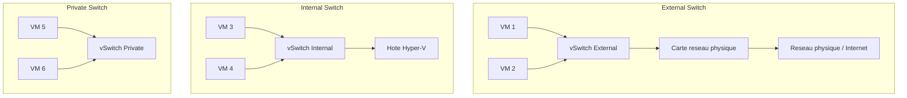
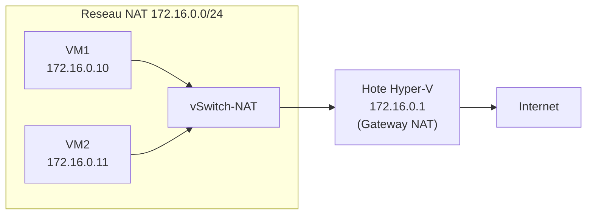

# Reseaux virtuels

!!! info "Niveau : intermediaire | Temps estime : 30 minutes"

Les reseaux virtuels Hyper-V s'appuient sur des commutateurs virtuels (virtual switches) qui connectent les machines virtuelles entre elles et avec le reseau physique. Le choix du type de commutateur determine l'isolation et la connectivite des VMs.

---

## Types de commutateurs virtuels



| Type | VM <-> VM | VM <-> Hote | VM <-> Reseau physique |
|------|-----------|-------------|----------------------|
| **External** | Oui | Oui | Oui |
| **Internal** | Oui | Oui | Non |
| **Private** | Oui | Non | Non |

---

## Commutateur External

Le commutateur External lie une carte reseau physique pour fournir aux VMs un acces au reseau physique et a Internet.

```powershell
# List physical network adapters available
Get-NetAdapter | Where-Object { $_.Status -eq "Up" } |
    Select-Object Name, InterfaceDescription, LinkSpeed

# Create an External virtual switch
New-VMSwitch -Name "vSwitch-External" `
    -NetAdapterName "Ethernet0" `
    -AllowManagementOS $true

# AllowManagementOS = $true : the host can also use this adapter for networking
# AllowManagementOS = $false : the adapter is dedicated to VMs only
```

!!! warning "Perte de connectivite"

    La creation d'un commutateur External **rebind** la carte physique. La connexion reseau de l'hote est temporairement interrompue. Avec `AllowManagementOS = $true`, l'hote recupere sa connectivite via le vSwitch.

---

## Commutateur Internal

Le commutateur Internal permet la communication entre les VMs et l'hote, mais sans acces au reseau physique.

```powershell
# Create an Internal virtual switch
New-VMSwitch -Name "vSwitch-Internal" -SwitchType Internal

# The host gets a virtual adapter for this switch
Get-NetAdapter | Where-Object { $_.Name -match "vSwitch-Internal" }

# Assign an IP address to the host's virtual adapter
New-NetIPAddress -InterfaceAlias "vEthernet (vSwitch-Internal)" `
    -IPAddress 10.0.0.1 `
    -PrefixLength 24
```

### Cas d'usage

- Reseau d'administration isole entre l'hote et les VMs
- Reseau de test necessitant un acces depuis l'hote

---

## Commutateur Private

Le commutateur Private isole completement les VMs : elles ne communiquent qu'entre elles, sans acces a l'hote ni au reseau physique.

```powershell
# Create a Private virtual switch
New-VMSwitch -Name "vSwitch-Private" -SwitchType Private
```

### Cas d'usage

- Lab de test completement isole
- Simulation de reseau sans impact sur la production
- Environnement de formation

---

## NAT (Network Address Translation)

Un commutateur NAT permet aux VMs d'acceder a Internet via l'hote, sans carte reseau physique dediee. Les VMs utilisent des adresses IP privees traduites par l'hote.

```powershell
# Create an Internal switch for NAT
New-VMSwitch -Name "vSwitch-NAT" -SwitchType Internal

# Assign an IP address to the host adapter (gateway for the VMs)
New-NetIPAddress -InterfaceAlias "vEthernet (vSwitch-NAT)" `
    -IPAddress 172.16.0.1 `
    -PrefixLength 24

# Create the NAT network
New-NetNat -Name "NATNetwork" `
    -InternalIPInterfaceAddressPrefix "172.16.0.0/24"

# In each VM, configure:
# - IP: 172.16.0.x/24
# - Gateway: 172.16.0.1
# - DNS: according to your environment
```



### Supprimer un reseau NAT

```powershell
# Remove the NAT configuration
Remove-NetNat -Name "NATNetwork" -Confirm:$false

# Remove the switch
Remove-VMSwitch -Name "vSwitch-NAT" -Force
```

---

## Configuration VLAN

Les VLANs permettent de segmenter le trafic reseau sur un meme commutateur virtuel.

### VLAN sur l'adaptateur de la VM

```powershell
# Set VLAN ID on a VM network adapter
Set-VMNetworkAdapterVlan -VMName "SRV-APP01" `
    -Access `
    -VlanId 100

# Verify VLAN configuration
Get-VMNetworkAdapterVlan -VMName "SRV-APP01"

# Remove VLAN tagging
Set-VMNetworkAdapterVlan -VMName "SRV-APP01" -Untagged
```

### VLAN Trunk (plusieurs VLANs)

```powershell
# Configure trunk mode (the VM handles VLAN tagging internally)
Set-VMNetworkAdapterVlan -VMName "SRV-ROUTER01" `
    -Trunk `
    -NativeVlanId 1 `
    -AllowedVlanIdList "100,200,300"
```

### VLAN sur le management OS

```powershell
# Set VLAN on the host's management adapter
Set-VMNetworkAdapterVlan -ManagementOS `
    -VMNetworkAdapterName "vSwitch-External" `
    -Access `
    -VlanId 10
```

---

## Gestion des adaptateurs reseau VM

### Ajouter et configurer des adaptateurs

```powershell
# Add a second network adapter to a VM
Add-VMNetworkAdapter -VMName "SRV-APP01" -SwitchName "vSwitch-Internal" -Name "LAN-Internal"

# List all network adapters of a VM
Get-VMNetworkAdapter -VMName "SRV-APP01" |
    Select-Object VMName, Name, SwitchName, MacAddress, IPAddresses

# Set a static MAC address
Set-VMNetworkAdapter -VMName "SRV-APP01" -Name "LAN-Internal" `
    -StaticMacAddress "00-15-5D-AA-BB-01"

# Remove a network adapter
Remove-VMNetworkAdapter -VMName "SRV-APP01" -Name "LAN-Internal"
```

### Fonctionnalites avancees des adaptateurs

```powershell
# Enable DHCP Guard (prevents rogue DHCP servers in VMs)
Set-VMNetworkAdapter -VMName "SRV-APP01" -DhcpGuard On

# Enable Router Guard (prevents unauthorized routing)
Set-VMNetworkAdapter -VMName "SRV-APP01" -RouterGuard On

# Enable MAC Address Spoofing (required for NLB, nested virtualization)
Set-VMNetworkAdapter -VMName "SRV-APP01" -MacAddressSpoofing On

# Set bandwidth limits
Set-VMNetworkAdapter -VMName "SRV-APP01" `
    -MinimumBandwidthAbsolute 100000000  # 100 Mbps minimum guaranteed
    -MaximumBandwidth 1000000000         # 1 Gbps maximum
```

---

## Inventaire des commutateurs

```powershell
# List all virtual switches
Get-VMSwitch | Select-Object Name, SwitchType, NetAdapterInterfaceDescription,
    AllowManagementOS | Format-Table -AutoSize

# List which VMs are connected to which switches
Get-VM | ForEach-Object {
    $vm = $_
    Get-VMNetworkAdapter -VMName $vm.Name | ForEach-Object {
        [PSCustomObject]@{
            VM       = $vm.Name
            Adapter  = $_.Name
            Switch   = $_.SwitchName
            VLAN     = (Get-VMNetworkAdapterVlan -VMNetworkAdapter $_).AccessVlanId
            IP       = ($_.IPAddresses -join ", ")
        }
    }
} | Format-Table -AutoSize
```

---

## Points cles a retenir

- **External** : acces complet au reseau physique (production)
- **Internal** : communication VM <-> hote sans acces physique (administration)
- **Private** : isolation complete entre VMs (lab, tests)
- Le **NAT** permet aux VMs d'acceder a Internet via l'hote sans carte physique dediee
- Les **VLANs** segmentent le trafic sur un meme commutateur virtuel
- Activez **DHCP Guard** et **Router Guard** pour securiser le reseau virtuel

---

## Pour aller plus loin

- Stockage virtuel (voir la page [Stockage virtuel](stockage-virtuel.md))
- Live Migration et prerequis reseau (voir la page [Live Migration](live-migration.md))
- Microsoft : Hyper-V Virtual Switch documentation
