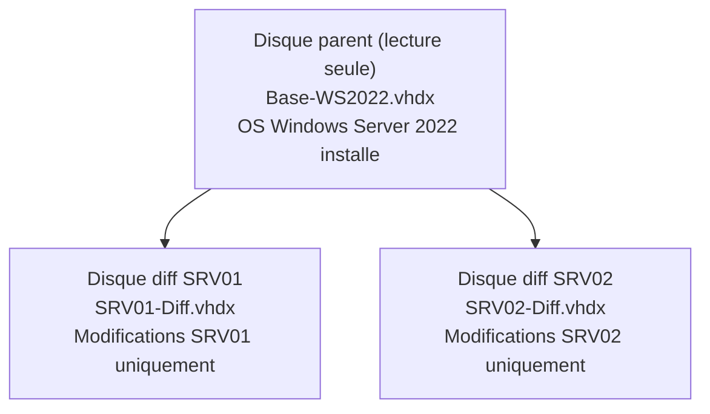

<!--
  Copyright 2026 Julien Bombled

  Licensed under the Apache License, Version 2.0 (the "License");
  you may not use this file except in compliance with the License.
  You may obtain a copy of the License at

      http://www.apache.org/licenses/LICENSE-2.0

  Unless required by applicable law or agreed to in writing, software
  distributed under the License is distributed on an "AS IS" BASIS,
  WITHOUT WARRANTIES OR CONDITIONS OF ANY KIND, either express or implied.
  See the License for the specific language governing permissions and
  limitations under the License.
-->
---
title: "Stockage virtuel"
description: "Disques virtuels Hyper-V : VHD vs VHDX, disques dynamiques, fixes et de differenciation, disques pass-through."
tags:
  - virtualisation
  - hyper-v
  - stockage
  - vhdx
  - disques-virtuels
---

# Stockage virtuel

<span class="level-intermediate">Intermediaire</span> · Temps estime : 25 minutes

Le stockage virtuel Hyper-V s'appuie principalement sur des fichiers de disques virtuels (VHD/VHDX). Le choix du format et du type de disque impacte directement les performances, la flexibilite et l'utilisation de l'espace disque.

---

## VHD vs VHDX

!!! example "Analogie"

    Pensez au format VHD comme un **vieux classeur a tiroirs** : il fonctionne, mais il est limite en capacite et fragile. Le format VHDX est une **armoire forte moderne** : elle peut contenir beaucoup plus de documents (64 To), possede un journal de bord integre (protection contre la corruption) et permet d'ajouter des etageres sans fermer la porte (redimensionnement en ligne).

| Critere | VHD | VHDX |
|---------|-----|------|
| **Taille maximale** | 2 To | 64 To |
| **Taille de secteur** | 512 octets | 4 Ko (aligne sur les disques modernes) |
| **Protection contre la corruption** | Non | Oui (journalisation interne) |
| **Redimensionnement online** | Non | Oui (Generation 2 uniquement) |
| **Compatibilite** | Windows Server 2008+ | Windows Server 2012+ |

!!! tip "Recommandation"

    Utilisez **VHDX** pour toutes les nouvelles VMs. VHD n'est utile que pour la compatibilite avec d'anciennes plateformes.

### Conversion VHD vers VHDX

```powershell
# Convert a VHD to VHDX
Convert-VHD -Path "D:\VMs\disk.vhd" `
    -DestinationPath "D:\VMs\disk.vhdx" `
    -VHDType Dynamic
```

Resultat :

```text
Path          : D:\VMs\disk.vhdx
VhdFormat     : VHDX
VhdType       : Dynamic
Size          : 64424509440
FileSize      : 4194304
```

---

## Types de disques virtuels

!!! example "Analogie"

    Un disque **dynamique** est comme un **sac a dos extensible** : il ne prend que l'espace necessaire et s'agrandit au besoin, mais il peut finir par deborder. Un disque **fixe** est comme une **valise rigide** : tout l'espace est reserve des le depart, rien ne bouge, performances garanties. Un disque de **differenciation** est comme un **calque transparent** pose sur un dessin original : le dessin reste intact, et toutes les modifications sont sur le calque.

### Disque dynamique (Dynamic)

L'espace disque croit au fur et a mesure de l'ecriture de donnees, jusqu'a la taille maximale definie.

```powershell
# Create a dynamic VHDX (starts small, grows as needed)
New-VHD -Path "D:\VMs\Data-Dynamic.vhdx" -SizeBytes 200GB -Dynamic

# Check actual size on disk
Get-VHD -Path "D:\VMs\Data-Dynamic.vhdx" |
    Select-Object Path, VhdType, Size, FileSize,
        @{N='AllocatedGB';E={[math]::Round($_.FileSize/1GB, 2)}},
        @{N='MaxGB';E={[math]::Round($_.Size/1GB, 2)}}
```

Resultat :

```text
Path        : D:\VMs\Data-Dynamic.vhdx
VhdType     : Dynamic
Size        : 214748364800
FileSize    : 4194304
AllocatedGB : 0.00
MaxGB       : 200.00
```

| Avantage | Inconvenient |
|----------|-------------|
| Economie d'espace disque initial | Performances I/O legerement inferieures |
| Surallocaton possible | Risque de saturation du stockage hote |

### Disque fixe (Fixed)

L'espace disque complet est alloue immediatement lors de la creation.

```powershell
# Create a fixed VHDX (all space allocated immediately)
New-VHD -Path "D:\VMs\Data-Fixed.vhdx" -SizeBytes 100GB -Fixed
```

Resultat :

```text
ComputerName : SRV-HV01
Path         : D:\VMs\Data-Fixed.vhdx
VhdFormat    : VHDX
VhdType      : Fixed
FileSize     : 107374182912
Size         : 107374182400
```

| Avantage | Inconvenient |
|----------|-------------|
| Performances optimales | Consomme tout l'espace immediatement |
| Pas de fragmentation | Pas de flexibilite d'allocation |

!!! tip "En production"

    Privilegiez les disques **fixes** pour les charges critiques (SQL Server, Exchange). Utilisez les disques **dynamiques** pour les labs et les environnements non-critiques.

### Disque de differenciation (Differencing)

Un disque de differenciation stocke uniquement les modifications par rapport a un disque parent. Le disque parent reste en lecture seule.

```powershell
# Create a parent disk (base image)
New-VHD -Path "D:\VMs\Base-WS2022.vhdx" -SizeBytes 60GB -Dynamic

# Create differencing disks based on the parent
New-VHD -Path "D:\VMs\SRV01-Diff.vhdx" -ParentPath "D:\VMs\Base-WS2022.vhdx" -Differencing
New-VHD -Path "D:\VMs\SRV02-Diff.vhdx" -ParentPath "D:\VMs\Base-WS2022.vhdx" -Differencing
```



| Avantage | Inconvenient |
|----------|-------------|
| Economies d'espace considerables | Degradation de performance (chaine de lecture) |
| Deploiement rapide de VMs | Le disque parent ne doit JAMAIS etre modifie |
| Ideal pour les labs | Non recommande en production |

!!! danger "Integrite du parent"

    Si le disque parent est modifie ou supprime, **tous les disques de differenciation deviennent inutilisables**. Protegez le parent en lecture seule et ne le modifiez jamais.

---

## Pass-through disk

Un disque pass-through donne a une VM un acces direct a un disque physique, sans couche VHDX intermediaire.

```powershell
# Set the physical disk offline (required for pass-through)
Set-Disk -Number 2 -IsOffline $true

# Attach pass-through disk to a VM
Add-VMHardDiskDrive -VMName "SRV-SQL01" -DiskNumber 2

# Verify
Get-VMHardDiskDrive -VMName "SRV-SQL01"
```

Resultat :

```text
VMName    ControllerType ControllerNumber ControllerLocation DiskNumber Path
------    -------------- ---------------- ------------------ ---------- ----
SRV-SQL01 SCSI           0                0                             D:\VMs\SRV-SQL01-OS.vhdx
SRV-SQL01 SCSI           0                1                  2
```

| Avantage | Inconvenient |
|----------|-------------|
| Performances maximales | Pas de snapshot/checkpoint |
| Acces direct au materiel | Pas de migration dynamique (VHD-based) |
| | Un seul disque par VM |

!!! warning "Usage rare"

    Avec les performances des VHDX fixes sur SSD/NVMe, le pass-through est rarement necessaire. Il est generalement reserve a des cas tres specifiques (stockage SAN, performances extremes).

---

## Operations courantes sur les VHDX

### Redimensionner un disque

```powershell
# Resize a VHDX (expand) - VM must be shut down for Gen1, can be online for Gen2
Resize-VHD -Path "D:\VMs\SRV-APP01.vhdx" -SizeBytes 120GB

# After resizing, extend the partition inside the VM
# (run inside the VM)
# $partition = Get-Partition -DiskNumber 0 -PartitionNumber 2
# $maxSize = (Get-PartitionSupportedSize -DiskNumber 0 -PartitionNumber 2).SizeMax
# Resize-Partition -DiskNumber 0 -PartitionNumber 2 -Size $maxSize
```

### Compacter un disque dynamique

```powershell
# Compact a dynamic VHDX (reclaim unused space)
# VM must be shut down
Optimize-VHD -Path "D:\VMs\SRV-APP01.vhdx" -Mode Full
```

Resultat :

```text
# Before compacting: FileSize = 45.2 GB
# After compacting:  FileSize = 31.8 GB
# Space reclaimed:   13.4 GB
```

### Fusionner un disque de differenciation

```powershell
# Merge differencing disk into its parent
Merge-VHD -Path "D:\VMs\SRV01-Diff.vhdx" -DestinationPath "D:\VMs\SRV01-Merged.vhdx"
```

### Monter un VHDX sur l'hote

```powershell
# Mount a VHDX on the host to access its contents
Mount-VHD -Path "D:\VMs\SRV-APP01.vhdx" -ReadOnly

# The disk appears as a new volume in Explorer
Get-Disk | Where-Object { $_.FriendlyName -match "Virtual" }

# Unmount when done
Dismount-VHD -Path "D:\VMs\SRV-APP01.vhdx"
```

---

## Inventaire du stockage

```powershell
# List all VHDs attached to VMs
Get-VM | ForEach-Object {
    $vm = $_
    Get-VMHardDiskDrive -VMName $vm.Name | ForEach-Object {
        $vhd = Get-VHD -Path $_.Path -ErrorAction SilentlyContinue
        [PSCustomObject]@{
            VM          = $vm.Name
            Path        = $_.Path
            Type        = $vhd.VhdType
            MaxSizeGB   = [math]::Round($vhd.Size / 1GB, 2)
            ActualSizeGB = [math]::Round($vhd.FileSize / 1GB, 2)
            Fragmentation = "$($vhd.FragmentationPercentage)%"
        }
    }
} | Format-Table -AutoSize
```

Resultat :

```text
VM        Path                                    Type    MaxSizeGB ActualSizeGB Fragmentation
--        ----                                    ----    --------- ------------ -------------
DC-01     D:\VMs\DC-01-OS.vhdx                    Dynamic 60.00     22.45        8%
SRV-APP01 D:\VMs\SRV-APP01-OS.vhdx                Dynamic 80.00     35.12        12%
SRV-APP01 D:\VMs\SRV-APP01-Data.vhdx              Dynamic 200.00    48.30        5%
SRV-SQL01 D:\VMs\SRV-SQL01-OS.vhdx                Fixed   80.00     80.00        0%
SRV-SQL01 D:\VMs\SRV-SQL01-Data.vhdx              Fixed   500.00    500.00       0%
```

---

## Points cles a retenir

- **VHDX** est le format recommande : jusqu'a 64 To, resilient a la corruption, redimensionnable en ligne
- Les disques **fixes** offrent les meilleures performances (production), les **dynamiques** economisent l'espace (labs)
- Les disques de **differenciation** permettent un deploiement rapide mais ne sont pas adaptes a la production
- Le **pass-through** est rarement necessaire avec les performances des VHDX sur SSD/NVMe
- Le redimensionnement en ligne est possible pour les VMs **Generation 2** avec des disques VHDX
- Surveillez l'**espace reel consomme** par les disques dynamiques pour eviter la saturation

---

!!! example "Scenario pratique"

    **Contexte :** Caroline, administratrice systeme dans un cabinet comptable, gere un serveur Hyper-V hebergeant 8 VMs avec des disques dynamiques. Le serveur dispose de 500 Go d'espace sur le volume D: dedie aux VMs.

    **Probleme :** Un lundi matin, plusieurs VMs se mettent en pause automatiquement. Les utilisateurs ne peuvent plus acceder aux applications.

    **Diagnostic :**

    ```powershell
    # Check VM status
    Get-VM | Select-Object Name, State, Status
    ```

    ```text
    Name      State            Status
    ----      -----            ------
    DC-01     Running          Operating normally
    SRV-APP01 Paused-Critical  The virtual machine is paused because the host is low on disk space
    SRV-SQL01 Paused-Critical  The virtual machine is paused because the host is low on disk space
    SRV-WEB01 Running          Operating normally
    ```

    ```powershell
    # Check disk space on the host
    Get-Volume -DriveLetter D | Select-Object DriveLetter, SizeRemaining, Size
    ```

    ```text
    DriveLetter SizeRemaining         Size
    ----------- -------------         ----
    D           524288000    536870912000
    ```

    Il ne restait que 500 Mo libres sur 500 Go. Les disques dynamiques des VMs avaient grossi au-dela de l'espace physique disponible.

    **Solution :**

    ```powershell
    # Identify the largest VHDX files
    Get-VM | ForEach-Object {
        Get-VMHardDiskDrive -VMName $_.Name | ForEach-Object {
            $vhd = Get-VHD -Path $_.Path
            [PSCustomObject]@{
                VM = $_.VMName
                AllocatedGB = [math]::Round($vhd.FileSize / 1GB, 2)
                MaxGB = [math]::Round($vhd.Size / 1GB, 2)
            }
        }
    } | Sort-Object AllocatedGB -Descending | Format-Table
    ```

    Caroline a identifie une VM de test avec un disque dynamique de 200 Go qui avait grossi inutilement. Elle a arrete cette VM, compacte son disque avec `Optimize-VHD`, puis converti les disques des VMs critiques (SQL Server) en disques fixes pour eviter la saturation future.

!!! danger "Erreurs courantes"

    1. **Surallouer les disques dynamiques sans surveillance** : 5 VMs avec des disques dynamiques de 200 Go chacune sur un volume de 500 Go semblent tenir... jusqu'a ce que l'espace physique soit sature. Les VMs se mettent alors en pause critique.

    2. **Modifier le disque parent d'un disque de differenciation** : Si le disque parent est modifie, demarrer ou mettre a jour la VM, tous les disques de differenciation deviennent inutilisables. Le parent doit etre strictement en lecture seule.

    3. **Redimensionner un VHDX sans etendre la partition interne** : Apres `Resize-VHD`, l'espace supplementaire apparait comme non alloue dans la VM. Il faut ensuite etendre la partition avec `Resize-Partition` depuis l'interieur de la VM.

    4. **Utiliser des disques fixes sur un stockage insuffisant** : Creer un disque fixe de 500 Go exige immediatement 500 Go d'espace libre. Verifiez l'espace disponible avant la creation.

    5. **Ne jamais compacter les disques dynamiques** : Les disques dynamiques ne liberent pas automatiquement l'espace des fichiers supprimes dans la VM. Planifiez des operations `Optimize-VHD` regulieres pendant les heures creuses.

---

## Pour aller plus loin

- Checkpoints et leur impact sur le stockage (voir la page [Checkpoints](checkpoints.md))
- Creation de VMs (voir la page [Creer une VM](creer-vm.md))
- Microsoft : Hyper-V virtual hard disk format overview

