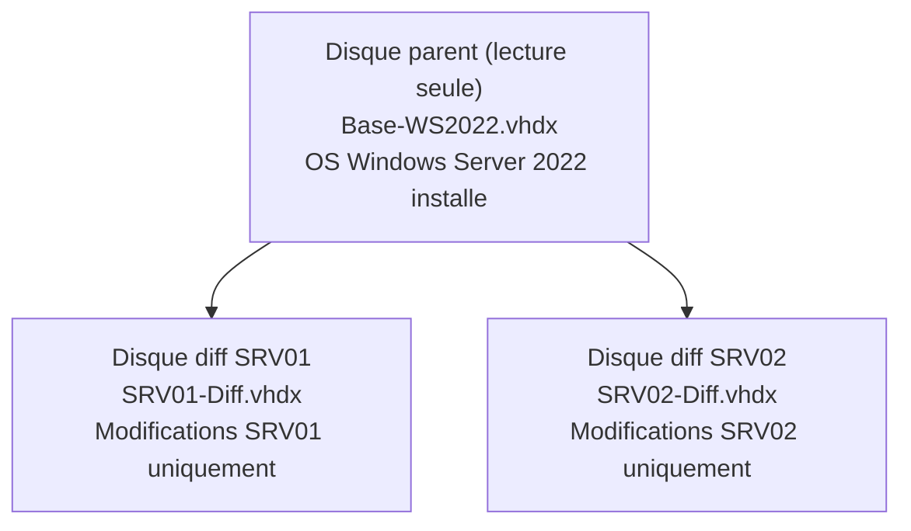

# Stockage virtuel

<span class="level-intermediate">Intermediaire</span> · Temps estime : 25 minutes

Le stockage virtuel Hyper-V s'appuie principalement sur des fichiers de disques virtuels (VHD/VHDX). Le choix du format et du type de disque impacte directement les performances, la flexibilite et l'utilisation de l'espace disque.

---

## VHD vs VHDX

| Critere | VHD | VHDX |
|---------|-----|------|
| **Taille maximale** | 2 To | 64 To |
| **Taille de secteur** | 512 octets | 4 Ko (aligne sur les disques modernes) |
| **Protection contre la corruption** | Non | Oui (journalisation interne) |
| **Redimensionnement online** | Non | Oui (Generation 2 uniquement) |
| **Compatibilite** | Windows Server 2008+ | Windows Server 2012+ |

!!! tip "Recommandation"

    Utilisez **VHDX** pour toutes les nouvelles VMs. VHD n'est utile que pour la compatibilite avec d'anciennes plateformes.

### Conversion VHD vers VHDX

```powershell
# Convert a VHD to VHDX
Convert-VHD -Path "D:\VMs\disk.vhd" `
    -DestinationPath "D:\VMs\disk.vhdx" `
    -VHDType Dynamic
```

---

## Types de disques virtuels

### Disque dynamique (Dynamic)

L'espace disque croit au fur et a mesure de l'ecriture de donnees, jusqu'a la taille maximale definie.

```powershell
# Create a dynamic VHDX (starts small, grows as needed)
New-VHD -Path "D:\VMs\Data-Dynamic.vhdx" -SizeBytes 200GB -Dynamic

# Check actual size on disk
Get-VHD -Path "D:\VMs\Data-Dynamic.vhdx" |
    Select-Object Path, VhdType, Size, FileSize,
        @{N='AllocatedGB';E={[math]::Round($_.FileSize/1GB, 2)}},
        @{N='MaxGB';E={[math]::Round($_.Size/1GB, 2)}}
```

| Avantage | Inconvenient |
|----------|-------------|
| Economie d'espace disque initial | Performances I/O legerement inferieures |
| Surallocaton possible | Risque de saturation du stockage hote |

### Disque fixe (Fixed)

L'espace disque complet est alloue immediatement lors de la creation.

```powershell
# Create a fixed VHDX (all space allocated immediately)
New-VHD -Path "D:\VMs\Data-Fixed.vhdx" -SizeBytes 100GB -Fixed
```

| Avantage | Inconvenient |
|----------|-------------|
| Performances optimales | Consomme tout l'espace immediatement |
| Pas de fragmentation | Pas de flexibilite d'allocation |

!!! tip "En production"

    Privilegiez les disques **fixes** pour les charges critiques (SQL Server, Exchange). Utilisez les disques **dynamiques** pour les labs et les environnements non-critiques.

### Disque de differenciation (Differencing)

Un disque de differenciation stocke uniquement les modifications par rapport a un disque parent. Le disque parent reste en lecture seule.

```powershell
# Create a parent disk (base image)
New-VHD -Path "D:\VMs\Base-WS2022.vhdx" -SizeBytes 60GB -Dynamic

# Create differencing disks based on the parent
New-VHD -Path "D:\VMs\SRV01-Diff.vhdx" -ParentPath "D:\VMs\Base-WS2022.vhdx" -Differencing
New-VHD -Path "D:\VMs\SRV02-Diff.vhdx" -ParentPath "D:\VMs\Base-WS2022.vhdx" -Differencing
```



| Avantage | Inconvenient |
|----------|-------------|
| Economies d'espace considerables | Degradation de performance (chaine de lecture) |
| Deploiement rapide de VMs | Le disque parent ne doit JAMAIS etre modifie |
| Ideal pour les labs | Non recommande en production |

!!! danger "Integrite du parent"

    Si le disque parent est modifie ou supprime, **tous les disques de differenciation deviennent inutilisables**. Protegez le parent en lecture seule et ne le modifiez jamais.

---

## Pass-through disk

Un disque pass-through donne a une VM un acces direct a un disque physique, sans couche VHDX intermediaire.

```powershell
# Set the physical disk offline (required for pass-through)
Set-Disk -Number 2 -IsOffline $true

# Attach pass-through disk to a VM
Add-VMHardDiskDrive -VMName "SRV-SQL01" -DiskNumber 2

# Verify
Get-VMHardDiskDrive -VMName "SRV-SQL01"
```

| Avantage | Inconvenient |
|----------|-------------|
| Performances maximales | Pas de snapshot/checkpoint |
| Acces direct au materiel | Pas de migration dynamique (VHD-based) |
| | Un seul disque par VM |

!!! warning "Usage rare"

    Avec les performances des VHDX fixes sur SSD/NVMe, le pass-through est rarement necessaire. Il est generalement reserve a des cas tres specifiques (stockage SAN, performances extremes).

---

## Operations courantes sur les VHDX

### Redimensionner un disque

```powershell
# Resize a VHDX (expand) - VM must be shut down for Gen1, can be online for Gen2
Resize-VHD -Path "D:\VMs\SRV-APP01.vhdx" -SizeBytes 120GB

# After resizing, extend the partition inside the VM
# (run inside the VM)
# $partition = Get-Partition -DiskNumber 0 -PartitionNumber 2
# $maxSize = (Get-PartitionSupportedSize -DiskNumber 0 -PartitionNumber 2).SizeMax
# Resize-Partition -DiskNumber 0 -PartitionNumber 2 -Size $maxSize
```

### Compacter un disque dynamique

```powershell
# Compact a dynamic VHDX (reclaim unused space)
# VM must be shut down
Optimize-VHD -Path "D:\VMs\SRV-APP01.vhdx" -Mode Full
```

### Fusionner un disque de differenciation

```powershell
# Merge differencing disk into its parent
Merge-VHD -Path "D:\VMs\SRV01-Diff.vhdx" -DestinationPath "D:\VMs\SRV01-Merged.vhdx"
```

### Monter un VHDX sur l'hote

```powershell
# Mount a VHDX on the host to access its contents
Mount-VHD -Path "D:\VMs\SRV-APP01.vhdx" -ReadOnly

# The disk appears as a new volume in Explorer
Get-Disk | Where-Object { $_.FriendlyName -match "Virtual" }

# Unmount when done
Dismount-VHD -Path "D:\VMs\SRV-APP01.vhdx"
```

---

## Inventaire du stockage

```powershell
# List all VHDs attached to VMs
Get-VM | ForEach-Object {
    $vm = $_
    Get-VMHardDiskDrive -VMName $vm.Name | ForEach-Object {
        $vhd = Get-VHD -Path $_.Path -ErrorAction SilentlyContinue
        [PSCustomObject]@{
            VM          = $vm.Name
            Path        = $_.Path
            Type        = $vhd.VhdType
            MaxSizeGB   = [math]::Round($vhd.Size / 1GB, 2)
            ActualSizeGB = [math]::Round($vhd.FileSize / 1GB, 2)
            Fragmentation = "$($vhd.FragmentationPercentage)%"
        }
    }
} | Format-Table -AutoSize
```

---

## Points cles a retenir

- **VHDX** est le format recommande : jusqu'a 64 To, resilient a la corruption, redimensionnable en ligne
- Les disques **fixes** offrent les meilleures performances (production), les **dynamiques** economisent l'espace (labs)
- Les disques de **differenciation** permettent un deploiement rapide mais ne sont pas adaptes a la production
- Le **pass-through** est rarement necessaire avec les performances des VHDX sur SSD/NVMe
- Le redimensionnement en ligne est possible pour les VMs **Generation 2** avec des disques VHDX
- Surveillez l'**espace reel consomme** par les disques dynamiques pour eviter la saturation

---

## Pour aller plus loin

- Checkpoints et leur impact sur le stockage (voir la page [Checkpoints](checkpoints.md))
- Creation de VMs (voir la page [Creer une VM](creer-vm.md))
- Microsoft : Hyper-V virtual hard disk format overview
