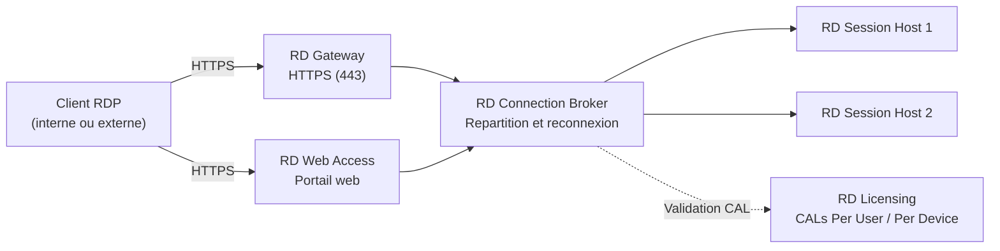
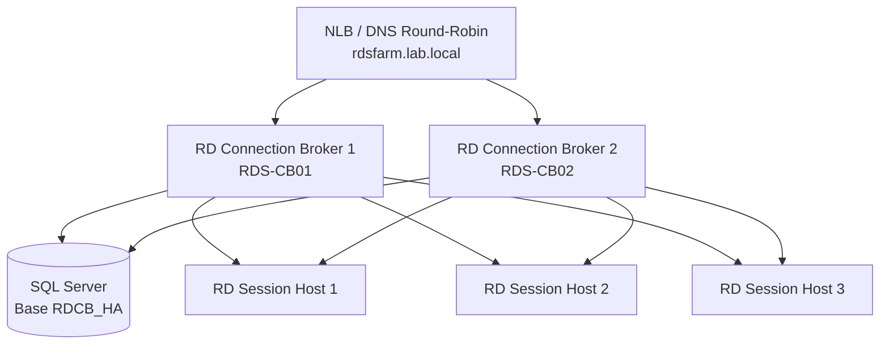

<!--
  Copyright 2026 Julien Bombled

  Licensed under the Apache License, Version 2.0 (the "License");
  you may not use this file except in compliance with the License.
  You may obtain a copy of the License at

      http://www.apache.org/licenses/LICENSE-2.0

  Unless required by applicable law or agreed to in writing, software
  distributed under the License is distributed on an "AS IS" BASIS,
  WITHOUT WARRANTIES OR CONDITIONS OF ANY KIND, either express or implied.
  See the License for the specific language governing permissions and
  limitations under the License.
-->

# Architecture et deploiement RDS

<span class="level-advanced">Avance</span> · Temps estime : 40 minutes

Les Remote Desktop Services (RDS) permettent aux utilisateurs d'acceder a des sessions Windows ou des applications publiees depuis n'importe quel appareil. RDS centralise l'execution des applications sur le serveur, ce qui simplifie la gestion et renforce la securite.

---

## Principe de fonctionnement

!!! example "Analogie"

    RDS fonctionne comme un **espace de coworking**. Plutot que de fournir un bureau personnel equipe (un PC par employe), l'entreprise loue des postes de travail partages dans un espace commun (le Session Host). Chaque employe arrive avec son badge (ses identifiants), s'installe a un poste disponible (une session) et retrouve ses dossiers personnels dans son casier (son profil utilisateur). Le receptionniste (le Connection Broker) oriente chaque arrivant vers un poste libre. La porte securisee a l'entree (le RD Gateway) verifie les badges avant de laisser entrer les visiteurs externes. Certains employes n'ont besoin que d'un outil precis (RemoteApp) : on leur prete l'outil sans leur attribuer un bureau entier.

---

## Services de role RDS

| Service de role | Fonction | Serveur type |
|-----------------|----------|--------------|
| **RD Session Host** | Heberge les sessions utilisateur et les applications RemoteApp | Serveur(s) dedie(s) avec CPU et RAM importants |
| **RD Connection Broker** | Repartit les connexions, gere la reconnexion aux sessions existantes | Serveur de gestion central |
| **RD Web Access** | Portail web pour lancer des sessions ou des RemoteApp via un navigateur | Serveur IIS (peut cohabiter avec le Broker) |
| **RD Gateway** | Tunnel HTTPS pour les connexions RDP depuis Internet | Serveur en DMZ ou expose publiquement |
| **RD Licensing** | Gere les licences d'acces client (CAL) RDS | Serveur dedie ou cohabitation avec le Broker |

---

## Architecture RDS



---

## Session-based vs VDI

| Critere | Session-based (RDSH) | VDI (Virtual Desktop) |
|---------|---------------------|-----------------------|
| **Principe** | Plusieurs utilisateurs partagent un meme serveur Windows | Chaque utilisateur dispose d'une VM Windows dediee |
| **Systeme d'exploitation** | Windows Server avec le role RDSH | Windows 10/11 Enterprise (VM Hyper-V) |
| **Densite** | Elevee (20-50 utilisateurs par serveur) | Faible (1 utilisateur par VM) |
| **Cout** | Inferieur (moins de serveurs) | Superieur (une VM par utilisateur) |
| **Isolation** | Partagee (les utilisateurs coexistent) | Totale (VM dediee) |
| **Cas d'usage** | Applications metier standardisees, bureaux partages | Utilisateurs avances, applications incompatibles en multi-session |
| **Licences** | CAL RDS + licence Windows Server | CAL RDS + licence VDA (ou SA) + Windows Server |

!!! tip "Recommandation"

    Le deploiement **session-based** couvre la majorite des besoins (80 % des cas). Privilegiez cette approche sauf si des contraintes applicatives imposent un poste de travail dedie par utilisateur.

---

## Modele de licences RDS

### Types de CAL

| Type | Description | Quand l'utiliser |
|------|-------------|-----------------|
| **Per User** | Une CAL attribuee a chaque utilisateur, quel que soit le nombre d'appareils | Utilisateurs qui se connectent depuis plusieurs appareils |
| **Per Device** | Une CAL attribuee a chaque appareil, quel que soit le nombre d'utilisateurs | Postes partages (kiosques, salles de formation) |

### Grace Period

!!! warning "Periode de grace"

    Apres l'installation du role RD Session Host, une **periode de grace de 120 jours** permet de fonctionner sans serveur de licences configure. Passe ce delai, les connexions sont refusees si aucun serveur RD Licensing valide n'est detecte.

```powershell
# Check the licensing grace period remaining days
$graceObj = (Invoke-CimMethod -Namespace "root/cimv2/TerminalServices" `
    -ClassName "Win32_TerminalServiceSetting" -MethodName "GetGracePeriodDays")
$graceObj.DaysLeft
```

---

## Deploiement via Server Manager

### Quick Start vs Standard Deployment

| Aspect | Quick Start | Standard Deployment |
|--------|------------|-------------------|
| **Nombre de serveurs** | Un seul serveur (tous les roles) | Plusieurs serveurs (roles distribues) |
| **Usage** | Lab, test, petites equipes | Production |
| **Roles installes** | RDSH + Broker + Web Access sur le meme serveur | Roles repartis sur des serveurs dedies |
| **Configuration** | Automatique | Manuelle etape par etape |

### Deploiement Standard (Server Manager)

1. **Server Manager** > **Remote Desktop Services** > **Add Roles and Features**
2. Selectionner **Standard deployment**
3. Choisir le type : **Session-based desktop deployment**
4. Designer les serveurs pour chaque role :
    - RD Connection Broker
    - RD Web Access
    - RD Session Host(s)
5. Confirmer et lancer le deploiement (redemarrage automatique des Session Hosts)
6. Configurer RD Licensing et RD Gateway apres le deploiement initial

---

## Deploiement PowerShell avec les cmdlets RDMS

### Creer une collection de sessions

```powershell
# Import the RemoteDesktop module
Import-Module RemoteDesktop

# Create a new session deployment (Connection Broker, Web Access, Session Host)
New-RDSessionDeployment `
    -ConnectionBroker "RDS-CB01.lab.local" `
    -WebAccessServer "RDS-WEB01.lab.local" `
    -SessionHost @("RDS-SH01.lab.local", "RDS-SH02.lab.local")
```

```powershell
# Create a session collection
New-RDSessionCollection `
    -CollectionName "Production-Apps" `
    -SessionHost @("RDS-SH01.lab.local", "RDS-SH02.lab.local") `
    -ConnectionBroker "RDS-CB01.lab.local" `
    -CollectionDescription "Production application sessions"

# Verify the collection
Get-RDSessionCollection -ConnectionBroker "RDS-CB01.lab.local"
```

Resultat :

```text
CollectionName  CollectionType  ResourceType  Size
--------------  --------------  ------------  ----
Production-Apps PooledUnmanaged Programs         2
```

### Configurer le serveur de licences

```powershell
# Add the RD Licensing role
Add-RDServer -Server "RDS-LIC01.lab.local" `
    -Role "RDS-LICENSING" `
    -ConnectionBroker "RDS-CB01.lab.local"

# Set the licensing mode (PerUser or PerDevice)
Set-RDLicenseConfiguration `
    -LicenseServer "RDS-LIC01.lab.local" `
    -Mode PerUser `
    -ConnectionBroker "RDS-CB01.lab.local"

# Verify licensing configuration
Get-RDLicenseConfiguration -ConnectionBroker "RDS-CB01.lab.local"
```

Resultat :

```text
Mode    LicenseServer
----    -------------
PerUser {RDS-LIC01.lab.local}
```

---

## RemoteApp : publier des applications

RemoteApp permet de publier des applications individuelles plutot que des bureaux complets. L'application s'affiche dans une fenetre locale comme si elle etait installee sur le poste de l'utilisateur.

```powershell
# Publish an application as RemoteApp
New-RDRemoteApp `
    -CollectionName "Production-Apps" `
    -DisplayName "Comptabilite" `
    -FilePath "C:\Program Files\Compta\compta.exe" `
    -Alias "compta" `
    -ConnectionBroker "RDS-CB01.lab.local"

# List all published RemoteApp programs
Get-RDRemoteApp -ConnectionBroker "RDS-CB01.lab.local"
```

Resultat :

```text
CollectionName  DisplayName   Alias   FilePath                              ShowInWebAccess
--------------  -----------   -----   --------                              ---------------
Production-Apps Comptabilite  compta  C:\Program Files\Compta\compta.exe    True
```

```powershell
# Restrict RemoteApp access to a specific security group
Set-RDRemoteApp `
    -CollectionName "Production-Apps" `
    -Alias "compta" `
    -UserGroups "LAB\GRP-Comptabilite" `
    -ConnectionBroker "RDS-CB01.lab.local"
```

---

## RD Gateway : acces externe securise

Le RD Gateway encapsule le trafic RDP dans un tunnel HTTPS (port 443), permettant aux utilisateurs externes de se connecter sans ouvrir le port 3389 sur Internet.

### Deploiement

```powershell
# Add the RD Gateway role
Add-RDServer -Server "RDS-GW01.lab.local" `
    -Role "RDS-GATEWAY" `
    -ConnectionBroker "RDS-CB01.lab.local" `
    -GatewayExternalFqdn "remote.entreprise.com"

# Configure Gateway properties
Set-RDDeploymentGatewayConfiguration `
    -GatewayMode Custom `
    -GatewayExternalFqdn "remote.entreprise.com" `
    -LogonMethod Password `
    -UseCachedCredentials $true `
    -BypassLocal $true `
    -ConnectionBroker "RDS-CB01.lab.local"
```

### Politiques d'acces

```powershell
# Create a Connection Authorization Policy (CAP)
# Defines WHO can connect through the Gateway
Import-Module RemoteDesktopServices
New-Item -Path "RDS:\GatewayServer\CAP" `
    -Name "CAP-RemoteUsers" `
    -UserGroups "LAB\GRP-Remote-Users" `
    -AuthMethod 1

# Create a Resource Authorization Policy (RAP)
# Defines WHAT resources users can access
New-Item -Path "RDS:\GatewayServer\RAP" `
    -Name "RAP-SessionHosts" `
    -UserGroups "LAB\GRP-Remote-Users" `
    -ComputerGroupType 2 `
    -ComputerGroup "LAB\GRP-RDS-Servers"
```

!!! warning "Certificat SSL"

    Le RD Gateway necessite un certificat SSL valide correspondant au FQDN externe (`remote.entreprise.com`). Un certificat auto-signe provoque des avertissements chez les clients. Utilisez un certificat d'une autorite de confiance ou Let's Encrypt pour la production.

---

## User Profile Disks et FSLogix

### User Profile Disks (UPD)

Les UPD stockent le profil utilisateur dans un fichier VHDX sur un partage reseau. Chaque utilisateur recoit un disque virtuel qui est monte automatiquement a l'ouverture de session.

```powershell
# Enable User Profile Disks on the session collection
Set-RDSessionCollectionConfiguration `
    -CollectionName "Production-Apps" `
    -EnableUserProfileDisk `
    -MaxUserProfileDiskSizeGB 10 `
    -DiskPath "\\NAS01\RDS-Profiles$" `
    -ConnectionBroker "RDS-CB01.lab.local"

# Verify UPD configuration
Get-RDSessionCollectionConfiguration `
    -CollectionName "Production-Apps" `
    -UserProfileDisk `
    -ConnectionBroker "RDS-CB01.lab.local"
```

### FSLogix (recommande)

FSLogix remplace les UPD avec de meilleures performances et davantage de fonctionnalites (conteneurs de profil, gestion d'Office 365, redirection d'applications).

| Aspect | User Profile Disks | FSLogix |
|--------|-------------------|---------|
| **Integration Office 365** | Limitee | Complete (conteneur ODFC) |
| **Temps de connexion** | Variable selon la taille du profil | Rapide (montage VHD direct) |
| **Gestion des exclusions** | Basique | Granulaire (redirections.xml) |
| **Licence** | Inclus dans RDS | Inclus avec Microsoft 365 E3/E5 ou RDS CAL avec SA |

```powershell
# Install FSLogix agent (run on each Session Host)
# Download from https://aka.ms/fslogix-latest
Start-Process -FilePath ".\FSLogixAppsSetup.exe" -ArgumentList "/install /quiet /norestart" -Wait

# Configure FSLogix via registry
$regPath = "HKLM:\SOFTWARE\FSLogix\Profiles"
New-Item -Path $regPath -Force
Set-ItemProperty -Path $regPath -Name "Enabled" -Value 1 -Type DWord
Set-ItemProperty -Path $regPath -Name "VHDLocations" -Value "\\NAS01\FSLogix-Profiles$" -Type MultiString
Set-ItemProperty -Path $regPath -Name "SizeInMBs" -Value 15000 -Type DWord
Set-ItemProperty -Path $regPath -Name "IsDynamic" -Value 1 -Type DWord
Set-ItemProperty -Path $regPath -Name "VolumeType" -Value "VHDX" -Type String
```

---

## Haute disponibilite RDS

Pour un environnement de production, chaque composant RDS doit etre redonde :

| Composant | Strategie HA |
|-----------|-------------|
| **RD Session Host** | Plusieurs serveurs dans la meme collection (le Broker repartit la charge) |
| **RD Connection Broker** | Mode HA avec base de donnees SQL Server partagee |
| **RD Web Access** | Plusieurs serveurs derriere un NLB (Network Load Balancer) |
| **RD Gateway** | Plusieurs serveurs derriere un NLB |
| **RD Licensing** | Deployer deux serveurs de licences (decouverte automatique) |

### Connection Broker en haute disponibilite

```powershell
# Configure the Connection Broker for high availability
# Requires a SQL Server instance and a shared DNS name
Set-RDConnectionBrokerHighAvailability `
    -ConnectionBroker "RDS-CB01.lab.local" `
    -DatabaseConnectionString "DRIVER=SQL Server Native Client 11.0;SERVER=SQL01;Trusted_Connection=Yes;APP=Remote Desktop Services Connection Broker;DATABASE=RDCB_HA" `
    -ClientAccessName "rdsfarm.lab.local" `
    -DatabaseFilePath "C:\SQLData\RDCB_HA.mdf"

# Add a second Connection Broker
Add-RDServer -Server "RDS-CB02.lab.local" `
    -Role "RDS-CONNECTION-BROKER" `
    -ConnectionBroker "RDS-CB01.lab.local"
```



---

## Points cles a retenir

- RDS repose sur **cinq services de role** complementaires : Session Host, Connection Broker, Web Access, Gateway et Licensing
- Le deploiement **session-based** (RDSH) convient a la majorite des scenarios ; le VDI est reserve aux cas d'isolation totale
- Les **CAL RDS** (Per User ou Per Device) sont obligatoires au-dela de la periode de grace de 120 jours
- **RemoteApp** publie des applications individuelles sans exposer un bureau complet
- **RD Gateway** securise l'acces externe via HTTPS sans ouvrir le port 3389
- **FSLogix** est la solution recommandee pour la gestion des profils utilisateur en environnement RDS
- La **haute disponibilite** du Connection Broker necessite une base SQL Server partagee

---

## Scenario pratique

!!! example "Scenario pratique"

    **Contexte :** Marie, administratrice systeme dans une entreprise de 30 utilisateurs, doit deployer RDS pour permettre l'acces a trois applications metier (comptabilite, CRM et outil de tickets) via RemoteApp. Les utilisateurs se connectent depuis le bureau et en teletravail.

    **Objectifs :**

    - Publier les trois applications en RemoteApp
    - Permettre l'acces externe securise via RD Gateway
    - Configurer les licences Per User
    - Gerer les profils avec User Profile Disks

    **Infrastructure prevue :**

    | Serveur | Roles |
    |---------|-------|
    | RDS-CB01 | Connection Broker + Web Access + Licensing |
    | RDS-SH01 | Session Host |
    | RDS-SH02 | Session Host |
    | RDS-GW01 | Gateway |

??? success "Solution"

    **Etape 1 : deploiement initial**

    ```powershell
    # Create the session deployment
    New-RDSessionDeployment `
        -ConnectionBroker "RDS-CB01.lab.local" `
        -WebAccessServer "RDS-CB01.lab.local" `
        -SessionHost @("RDS-SH01.lab.local", "RDS-SH02.lab.local")
    ```

    **Etape 2 : creer la collection de sessions**

    ```powershell
    # Create the session collection for the 30 users
    New-RDSessionCollection `
        -CollectionName "Apps-Metier" `
        -SessionHost @("RDS-SH01.lab.local", "RDS-SH02.lab.local") `
        -ConnectionBroker "RDS-CB01.lab.local" `
        -CollectionDescription "Business applications for 30 users"
    ```

    **Etape 3 : publier les RemoteApp**

    ```powershell
    # Publish the three business applications
    $apps = @(
        @{ Display = "Comptabilite"; Path = "C:\Program Files\Compta\compta.exe"; Alias = "compta" },
        @{ Display = "CRM"; Path = "C:\Program Files\CRM\crm.exe"; Alias = "crm" },
        @{ Display = "Tickets"; Path = "C:\Program Files\Tickets\tickets.exe"; Alias = "tickets" }
    )

    foreach ($app in $apps) {
        New-RDRemoteApp `
            -CollectionName "Apps-Metier" `
            -DisplayName $app.Display `
            -FilePath $app.Path `
            -Alias $app.Alias `
            -ConnectionBroker "RDS-CB01.lab.local"
    }
    ```

    **Etape 4 : configurer les licences**

    ```powershell
    # Add the licensing server role
    Add-RDServer -Server "RDS-CB01.lab.local" `
        -Role "RDS-LICENSING" `
        -ConnectionBroker "RDS-CB01.lab.local"

    # Set Per User licensing mode
    Set-RDLicenseConfiguration `
        -LicenseServer "RDS-CB01.lab.local" `
        -Mode PerUser `
        -ConnectionBroker "RDS-CB01.lab.local"
    ```

    **Etape 5 : configurer RD Gateway**

    ```powershell
    # Add the Gateway role
    Add-RDServer -Server "RDS-GW01.lab.local" `
        -Role "RDS-GATEWAY" `
        -ConnectionBroker "RDS-CB01.lab.local" `
        -GatewayExternalFqdn "remote.entreprise.com"

    # Configure gateway settings
    Set-RDDeploymentGatewayConfiguration `
        -GatewayMode Custom `
        -GatewayExternalFqdn "remote.entreprise.com" `
        -LogonMethod Password `
        -UseCachedCredentials $true `
        -BypassLocal $true `
        -ConnectionBroker "RDS-CB01.lab.local"
    ```

    **Etape 6 : activer les User Profile Disks**

    ```powershell
    # Enable User Profile Disks on the collection
    Set-RDSessionCollectionConfiguration `
        -CollectionName "Apps-Metier" `
        -EnableUserProfileDisk `
        -MaxUserProfileDiskSizeGB 5 `
        -DiskPath "\\NAS01\RDS-Profiles$" `
        -ConnectionBroker "RDS-CB01.lab.local"
    ```

    **Verification finale :**

    ```powershell
    # Verify the full deployment
    Get-RDServer -ConnectionBroker "RDS-CB01.lab.local" | Format-Table Server, Roles -AutoSize
    Get-RDRemoteApp -ConnectionBroker "RDS-CB01.lab.local" | Format-Table DisplayName, Alias -AutoSize
    Get-RDLicenseConfiguration -ConnectionBroker "RDS-CB01.lab.local"
    ```

    Les utilisateurs peuvent maintenant acceder aux trois applications via le portail `https://RDS-CB01.lab.local/RDWeb` en interne, ou via `https://remote.entreprise.com/RDWeb` depuis l'exterieur.

---

## Erreurs courantes

!!! failure "Periode de grace des licences expiree"

    **Symptome :** Les utilisateurs ne peuvent plus se connecter. Le message d'erreur indique que le serveur de bureau a distance ne dispose pas de licences valides.

    **Cause :** Le role RD Session Host a ete installe il y a plus de 120 jours sans configurer de serveur RD Licensing, ou le serveur de licences est injoignable.

    **Solution :**

    ```powershell
    # Verify the licensing configuration
    Get-RDLicenseConfiguration -ConnectionBroker "RDS-CB01.lab.local"

    # If no license server is configured, add one
    Set-RDLicenseConfiguration `
        -LicenseServer "RDS-LIC01.lab.local" `
        -Mode PerUser `
        -ConnectionBroker "RDS-CB01.lab.local"

    # Verify connectivity to the license server
    Test-NetConnection -ComputerName "RDS-LIC01.lab.local" -Port 135
    ```

    Verifier egalement que le serveur de licences est active dans le Licensing Manager et que des CAL RDS valides y sont installees.

!!! failure "Session Host absent du Connection Broker"

    **Symptome :** Les utilisateurs sont toujours diriges vers le meme Session Host ; le second serveur n'accueille aucune session.

    **Cause :** Le second Session Host n'a pas ete ajoute a la collection de sessions, ou il a ete retire accidentellement.

    **Solution :**

    ```powershell
    # List Session Hosts in the collection
    Get-RDSessionHost -CollectionName "Production-Apps" `
        -ConnectionBroker "RDS-CB01.lab.local"

    # Add the missing Session Host
    Add-RDSessionHost -CollectionName "Production-Apps" `
        -SessionHost "RDS-SH02.lab.local" `
        -ConnectionBroker "RDS-CB01.lab.local"

    # Verify both hosts are now in the collection
    Get-RDSessionHost -CollectionName "Production-Apps" `
        -ConnectionBroker "RDS-CB01.lab.local" |
        Select-Object SessionHost, NewConnectionAllowed
    ```

!!! failure "Certificat RD Gateway non concordant"

    **Symptome :** Les clients externes recoivent une erreur de certificat lors de la connexion via RD Gateway. La connexion est refusee ou un avertissement de securite s'affiche.

    **Cause :** Le nom commun (CN) ou le Subject Alternative Name (SAN) du certificat SSL ne correspond pas au FQDN externe configure sur le Gateway (`remote.entreprise.com`).

    **Solution :**

    ```powershell
    # Check the current certificate on the RD Gateway
    Get-RDCertificate -ConnectionBroker "RDS-CB01.lab.local" |
        Where-Object { $_.Role -eq "RDGateway" } |
        Select-Object Role, Subject, ExpiresOn, IssuedBy

    # Replace with a valid certificate matching the external FQDN
    Set-RDCertificate -Role RDGateway `
        -ImportPath "C:\Certs\remote-entreprise-com.pfx" `
        -Password (ConvertTo-SecureString -String "CertP@ssw0rd" -AsPlainText -Force) `
        -ConnectionBroker "RDS-CB01.lab.local" `
        -Force
    ```

    Le certificat doit etre emis pour le FQDN exact utilise par les clients (par exemple `remote.entreprise.com`) par une autorite de certification reconnue.

!!! failure "Disque de profil utilisateur sature"

    **Symptome :** L'utilisateur ne parvient pas a ouvrir de session. L'evenement dans le journal indique que le disque de profil (UPD) a atteint sa taille maximale.

    **Cause :** La taille maximale configuree pour les User Profile Disks est insuffisante pour les donnees de l'utilisateur (cache Outlook, fichiers temporaires, telechargements).

    **Solution :**

    ```powershell
    # Check the current UPD size limit
    Get-RDSessionCollectionConfiguration `
        -CollectionName "Production-Apps" `
        -UserProfileDisk `
        -ConnectionBroker "RDS-CB01.lab.local"

    # Increase the maximum UPD size
    Set-RDSessionCollectionConfiguration `
        -CollectionName "Production-Apps" `
        -MaxUserProfileDiskSizeGB 20 `
        -ConnectionBroker "RDS-CB01.lab.local"

    # Alternatively, expand an individual user's VHDX
    Resize-VHD -Path "\\NAS01\RDS-Profiles$\UVHD-S-1-5-21-xxx.vhdx" -SizeBytes 20GB
    ```

    Pour eviter la saturation, configurez des exclusions de dossiers (telechargements, cache navigateur) dans les parametres de la collection.

!!! failure "RemoteApp non visible dans RD Web Access"

    **Symptome :** L'application publiee en RemoteApp n'apparait pas sur le portail RD Web Access pour certains utilisateurs.

    **Cause :** L'application est restreinte a un groupe de securite dont l'utilisateur ne fait pas partie, ou la propriete `ShowInWebAccess` est desactivee.

    **Solution :**

    ```powershell
    # Check the RemoteApp configuration
    Get-RDRemoteApp -Alias "compta" -ConnectionBroker "RDS-CB01.lab.local" |
        Select-Object DisplayName, Alias, ShowInWebAccess, UserGroups

    # Ensure ShowInWebAccess is enabled
    Set-RDRemoteApp -Alias "compta" `
        -ShowInWebAccess $true `
        -ConnectionBroker "RDS-CB01.lab.local"

    # Verify user group membership if access is restricted
    Get-ADGroupMember -Identity "GRP-Comptabilite" |
        Select-Object Name, SamAccountName
    ```

    Si l'application doit etre visible pour tous les utilisateurs de la collection, retirez la restriction de groupe de securite.

---

## Pour aller plus loin

- Installation du role Hyper-V pour l'infrastructure sous-jacente (voir la page [Installation du role Hyper-V](../hyper-v/installation-role.md))
- Certificats SSL pour securiser RD Gateway et RD Web Access (voir la page [Certificats SSL](../../gestion-moderne/iis/certificats-ssl.md))
- Concepts de cluster pour la haute disponibilite RDS (voir la page [Concepts du cluster](../../haute-disponibilite/cluster/concepts-cluster.md))
